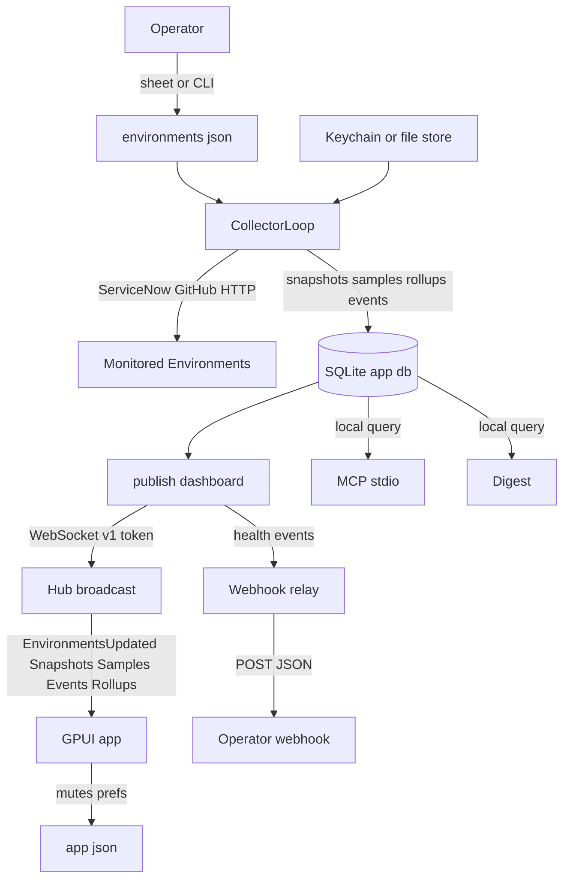

<!-- SUPER-REVIEW-REGISTRY
{
  "schema_version": 2,
  "active": {
    "SEC-001": "sha256:35b55894a209358399a367c638c0b528d010b122690593dcaf801345d19532fe",
    "SEC-002": "sha256:600e70599c2308a48c1762e6c6c394a74671759f30662f241d47a01c39001e5e",
    "SEC-003": "sha256:e6017bcc7aabedc92eb12291b9dcdec4e3b510eac7ce0c5959388df1c4a15ff6",
    "COR-001": "sha256:c7632629fe59333f597c320a3bfead586047fbce31c56fe82a39b4497ec50ca7",
    "COR-002": "sha256:80784b1233f03a6b7cd4744d7a47f334d7a228157d4a13afaf5390be70772499",
    "REL-001": "sha256:b06342dfbcfe68d31280342a1bf5c5ab629152577f471ca86d16ecfbadf2760d",
    "REL-002": "sha256:8af1fa83ffd0424ea1ca234c311e2d0c4cdd4e62ebedaa24da59d5bf0c5864d7",
    "DAT-001": "sha256:a5783c0a460897cb1c1de4fc1e4fdddfb10723cf6c8311904719d4a822ba0b41",
    "DAT-002": "sha256:f0882ec768fb92be6220fa054b4d3a7610de4408f2ea1131b5de45674ee41816",
    "ARC-001": "sha256:77478c210e29c12614229832511f2cd44cf7d4665a7522a44a2a6bb483f82f7c",
    "OPS-001": "sha256:eb0a53cea4df94ce7486916d739248aa90d83cb5eb321f16ea0d6e62a7ecb0ad",
    "UX-001": "sha256:e1956534816a025cf64e542126ece0641e2f3af0af7d24e34050cf8d4fa3c018",
    "TST-001": "sha256:ac3b0b34ac3cf8d7e3e745239d94a9362aa1e1a2575571d863f59285e6626f47",
    "MNT-001": "sha256:436a00915784997d27a0404111389f27198fc1ee670aff50dcfd4c9f770e828d",
    "DOC-001": "sha256:1a7dcf3bada6d6c8be6bcd3e3913644deaee92a0b43a9631a735210c06fde2bc",
    "IMP-001": "sha256:c6ee69a2b918ce0dfabb46363436c0d8fea59384cf74b323be67ce635654e241",
    "IMP-002": "sha256:73f79049d91c03baed3ca791c4b14efd567e3b3ecc4e3cb85d9c2c1928b31b9d",
    "ALT-001": "sha256:1cfda754a253d4f5410d904672b16f2930452da6b2c5eddbdf219d1914b7d5c6",
    "FEAT-001": "sha256:c16b26c9b184e1fd8d9a9ddf6f40c1cf48a0d47d3ddbecc8267a852f174d4857",
    "FEAT-002": "sha256:032df9e67b3b612f78cd8492f52d0ba3ba294cdaf1db8fd5b81a270a917d68b3",
    "FEAT-003": "sha256:56aac2e4836c3fe4976a65e08358fd2680c5bac85259c388067c92855ce25169",
    "FEAT-004": "sha256:ab3e3af5d2c625fbecd757013a9971c871f076ab386168aaa65832075b1d7139",
    "POS-001": "sha256:a3ce49671b7da762f67eb0f796e2eabe298f130ac51f8a54b313645d6acea628",
    "POS-002": "sha256:1c48ddf7e1277e8ce8a432b5bb15b62cc8e69faf81a7d3dd4ac753f0d7526a4e",
    "POS-003": "sha256:150d17c713f7435a93ee5f8c3f063f8f56caf29463294278a51d1a0f8ee64916"
  },
  "retired": {},
  "next_sequence": {
    "SEC": 4,
    "COR": 3,
    "REL": 3,
    "DAT": 3,
    "ARC": 2,
    "OPS": 2,
    "UX": 2,
    "TST": 2,
    "MNT": 2,
    "DOC": 2,
    "IMP": 3,
    "ALT": 2,
    "FEAT": 5,
    "POS": 4
  }
}
-->

# 1. Executive Summary

Canonical root: /Users/t979259/.local/src/daku
Reviewed branch and revision: main bec06b3c977954661f4e1bfd36c15c1e27e95d05 with dirty worktree (27 modified, 3 untracked)
Starting repository state: main bec06b3c977954661f4e1bfd36c15c1e27e95d05 dirty (27 modified, 3 untracked, FINDINGS.md absent)
Ending repository state: main bec06b3c977954661f4e1bfd36c15c1e27e95d05 dirty (27 modified, 3 untracked, FINDINGS.md absent before write)
Review time: 2026-09-09T10:15:00+02:00
Review mode: REVIEW ONLY
Starting FINDINGS.md SHA-256: MISSING
Existing report revalidated: No — file did not exist
Completion status: Complete
Material limitations: No live ServiceNow or network validation; full bun run check not executed due to GPUI build cost and dirty worktree; findings rest on static inspection plus targeted subagent traces

Overall codebase health: Small single-operator macOS console with clear domain vocabulary and disciplined local-first storage. Core monitoring loop, health rollup, daemon authentication, and migration handling are thoughtfully designed. The most material risks cluster around silent failure handling in collection and publish paths, rate-limit masking, webhook durability, and predictable atomic-write handling rather than broad architectural failure.

Most serious risks, referencing canonical IDs: Rate-limit handling inconsistently hides pressure as healthy (COR-001). Dashboard publish silently drops updates on disconnect or oversize messages (REL-001).

Most important architectural concern, referencing canonical IDs: Collector scheduling shares stale offline state, reports only the first error, and opens many concurrent SQLite writers (ARC-001).

Most valuable simplification, referencing canonical IDs: Single atomic-write helper with random tmp names, fsync, and strict parent modes (IMP-002).

Most valuable alternative implementation, referencing canonical IDs: Durable webhook cursor with per-event retry and dead-letter handling (ALT-001).

Most valuable feature addition, referencing canonical IDs: Persistent webhook delivery state with retry controls (FEAT-001).

Strongest feature-removal or consolidation candidate, referencing canonical IDs: No removal is supported by current evidence. The closest investigation is measuring tick overrun before any scaling change (FEAT-004).

Most important positive pattern to preserve, referencing canonical IDs: Daemon hello token with constant-time compare, layered caps, and environment cleanup (POS-001).

Immediate recommended actions, referencing canonical IDs: Harden 429 mapping and availability gating (COR-001). Surface publish failures and bound wire size (REL-001). Unify atomic writes (IMP-002, DAT-001). Persist webhook cursor (REL-002, FEAT-001, ALT-001).

Main review limitations: Static review only. No external ServiceNow calls. No full test or build run. Dirty worktree means line numbers describe the observed dirty state.

# 2. Repository and System Overview

Repository structure: Rust workspace with root GPUI app plus four crates. The root package builds the native macOS console. The crates separate protocol, core collection and persistence, local daemon process management, and the daemon binary. TypeScript supports scripts, lint, migration tooling, and checks. SQLite lives under the operator home directory. Docs carry ADRs, signals, platforms, and specs.

Languages and frameworks: Rust edition 2024 with GPUI from upstream zed plus gpui-component from longbridge. TypeScript with Bun for scripts, oxlint, and tsc. SQLite via rusqlite with bundled build. HTTP via ureq with rustls. WebSockets via tungstenite on loopback.

Applications and services: GPUI desktop app in src plus daku-daemon binary in crates/daku-daemon. One shared CollectorLoop polls every Environment. Daemon broadcasts dashboard messages over a loopback WebSocket. MCP server over stdio exposes five read-only tools. CLI subcommands cover setup, rotate-credential, doctor, digest, diagnostics, probe-availability, and mcp.

Deployment model: Local single-operator deployment. No CI and no hosted service in the v1 envelope. Release builds produce an unsigned or signed Daku dot app plus DMG with Sparkle updates and a Homebrew cask variant. Non-loopback binds require an explicit flag and sit outside v1 support.

Data stores: SQLite at the operator home path or DAKU_DB_PATH override. Tables hold signal snapshots, 24 hour samples, 90 day hourly rollups, health events, and signal events. Config in environments dot json. Credentials in macOS Keychain by default with opt-in file store. Desktop prefs in app dot json. Settings in settings dot json.

Integrations: ServiceNow first with fifteen signals plus generic HTTP probes and GitHub Actions. Outbound webhook POSTs health and build events. Sparkle for updates. macOS Keychain, notifications, menu bar, and Dock integrations.

Entry points: Daemon CLI in crates/daku-daemon/src/main.rs. WebSocket serve in crates/daku-core/src/server.rs. Collector entry in crates/daku-core/src/collector.rs. Health publish in crates/daku-core/src/health.rs. GPUI entry in src/main.rs and src/lib.rs. MCP tools in crates/daku-core/src/mcp.rs. Setup and rotate in crates/daku-core/src/setup.rs and rotate.rs. Diagnostics in crates/daku-core/src/diagnostics.rs. Environment sheet in src/env_sheet.rs.

Trust boundaries: Operator UID versus daemon child process. Loopback WebSocket with bearer token versus remote attach mode. ServiceNow and GitHub and HTTP targets versus local store. Keychain versus file credential store. Browser Origin versus native WebSocket client. Webhook URL operator config versus arbitrary network.

Critical workflows: Add Environment with probe and save. Rotate credential with shape check and dry-run probe. Poll tick with availability gating and per-signal collection. Health rollup with two-consecutive-publish confirmation. Dashboard broadcast to GPUI. Notification selection with mutes and quiet hours. Weekly digest. Webhook relay. Doctor diagnostics. MCP read-only queries. Export and copy-agent-context.

Public contracts: Daemon WebSocket protocol version 9 with Hello token and typed server messages. MCP five-tool surface. environments dot json schema with thresholds and expected drift. Webhook JSON shape with environment id, observed timestamps, health transition, and build. SQLite schema with append-only migrations. CLI flags and environment variables documented in README.

Persisted-data contracts: SQLite tables and indexes from db slash migrations. Snapshot upsert on environment plus signal. Events with insert-or-ignore on natural keys. Rollups keyed by hour start. Settings and environments files with 0600 modes. Health and signal event caps at 500 per Environment plus 90 day retention. Samples at 24 hours.

Generated and vendored boundaries: Cargo dot lock pins zed and longbridge revisions. Bun lock pins TypeScript deps. gpui-component assets are vendored via git. Sparkle framework is fetched at bundle time with checksum. Drizzle snapshots are build-time only and ignored at runtime. Target and node modules and dot daku-cache are build artifacts and were not treated as first-party code.

Review-relevant worktree state: Dirty tree with 27 modified files concentrated in daku-core signals and protocol plus app dashboard files, and 3 untracked files for platform registry, signal eval, and protocol payload. No FINDINGS dot md at start. Evidence below cites the observed dirty line numbers.

# 3. Coverage Ledger

| Area | Review depth | Main contents | Main risks or review focus | Evidence inspected | Reason for reduced coverage, exclusion, or inability, when applicable |
|---|---|---|---|---|---|
| Root app shell in src | Deeply reviewed | app dot rs, dashboard state, notifications, palette, daemon spawn, updater, platform | State derivation, notification gating, reconnect, accessibility | src slash app dot rs, dashboard_state dot rs, notifications dot rs, palette dot rs, daemon dot rs, lib dot rs, env_sheet dot rs via subagent plus spot reads | None |
| Core collection and health | Deeply reviewed | collector, health, signal eval, availability, jobs, syslog, drift, last clone, outbound, flow, email, upgrade, sessions, transactions, update sets, scan, mid ecc, table growth, http probe, github | Correctness, error masking, rollup, failure paths | crates slash daku-core slash src slash collector dot rs, health dot rs, signal_eval dot rs, servicenow dot rs, platform_registry dot rs via grep and reads | None |
| Daemon server and protocol | Deeply reviewed | server, protocol, client, process, environments backend, settings backend | Auth, loopback, message caps, reconnect, atomic writes | crates slash daku-core slash src slash server dot rs, environments dot rs, config dot rs, webhook dot rs, crates slash daku-protocol slash src, crates slash daku-client slash src via subagent plus grep | None |
| Persistence and migrations | Reviewed | persistence, migrations, schema, retention, rollups | Transaction scope, retention drift, key granularity, pruning | crates slash daku-core slash src slash persistence dot rs, build dot rs, db slash schema dot ts, db slash migrations via subagent | No live migration run; static inspection only |
| Credentials and setup | Deeply reviewed | config, setup, rotate, diagnostics, roles, doctor | Secret handling, file modes, validation parity, path handling | crates slash daku-core slash src slash config dot rs, setup dot rs, rotate dot rs, diagnostics dot rs, crates slash daku-daemon slash src slash main dot rs | No Keychain live test; static only |
| Webhook and MCP and digest | Reviewed | webhook, mcp, digest, diagnostics bundle | Delivery guarantees, SSRF policy, read-only assurances | crates slash daku-core slash src slash webhook dot rs, mcp dot rs, digest dot rs | No network POST test |
| Build and supply chain | Reviewed | Cargo manifests, Bun manifests, scripts, bundle, release, appcast, homebrew | Pinning, reproducibility, signing, release coupling | Cargo dot toml, Cargo dot lock headers, package dot json, scripts slash bundle dot sh, release dot ts, appcast dot ts, homebrew slash daku dot rb, docs slash packaging dot md | No full build or audit run |
| Docs and ADRs and specs | Reviewed | README, CONTEXT, ADRs 0001 through 0012, spec v1, signals, platforms | Drift, terminology, retention claims, packaging checklist | README dot md, CONTEXT dot md, docs slash adr, docs slash spec slash v1 dot md, docs slash signals dot md | None |
| Frontend assets and resources | Sampled | assets, resources, Info plist | Packaging metadata, update feed | resources slash Info dot plist, scripts slash bundle dot sh | No UI runtime run |
| Generated and vendored | Generated | Cargo registry sources, longbridge assets, Sparkle fetch, Drizzle snapshots | Boundary config and checksum | Cargo dot lock source lines, scripts slash bundle dot sh Sparkle pin | Not treated as handwritten code by design |
| Build artifacts | Vendored | target, node_modules, dist, dot daku-cache, dot playwright-mcp | Excluded from findings | Directory listing and size check | Excluded as build output |
| Tests and fixtures | Reviewed | Rust unit tests, payload fixtures, dashboard fixture mode | Gap analysis, brittle contract tests | crates slash daku-core slash tests slash fixtures slash payloads dot json, payload_contract dot rs, dashboard_state fixture via subagent | No test execution in this run |

# 4. Architecture and Data-Flow Map

Component relationships: GPUI app spawns or attaches to daku-daemon over a loopback WebSocket. Daemon owns CollectorLoop, StateStore SQLite, Hub broadcast, webhook relay, and CLI backends. Core owns ServiceNow client, per-signal evaluators, health rollup, persistence, and server. Protocol owns environment, settings, identity, and wire shapes. Client owns spawn, supervision, and reconnect. Desktop owns dashboard derivation, notifications, palette, sheets, and exports.

Responsibility boundaries: Protocol defines shapes and shared validation. Core implements collection, persistence, health, and serving. Daemon wires CLI flags, credential resolution, and loop startup. Client manages process lifetime and subscription. Desktop derives views without opening SQLite directly. This separation is sound and worth preserving.

Dependency direction: App depends on client and protocol and core types. Daemon depends on core and protocol. Core depends on protocol and rusqlite and ureq and tungstenite. Protocol depends only on serde. Scripts depend on Bun and TypeScript. No reverse dependency from core to app was found.

Data ownership: Daemon owns SQLite writes for snapshots, samples, rollups, and events. Desktop owns in-memory dashboard derivation plus mutes and prefs. Operator owns environments dot json and settings dot json. Keychain or file store owns credential blobs. Webhook target owns delivered copies. No shared-table ownership across processes exists because only the daemon writes the DB.

Trust and privilege boundaries: UID boundary for local CLI subcommands that bypass the token by design. Loopback bearer boundary for WebSocket clients. Remote attach boundary when allow-non-loopback is set with credential writes disabled. ServiceNow credential boundary with in-memory memoization. Webhook egress boundary with loopback-only http policy.

Critical request paths: Tick path runs CollectorLoop tick with timed groups, per-environment collect, availability gating, signal evaluators, snapshot persist, dashboard publish, and webhook spawn. Read path runs subscribe then full state replay plus incremental updates. Write path runs sheet validation then save or test then reload. Note path runs optimistic clear then AddHealthEventNote RPC. Digest path runs local history query then Markdown render.

Async workflows and actual delivery guarantees: Collection uses scoped threads per group with sequential probes per Environment. Publish uses an in-memory Hub with unbounded per-subscriber channels and best-effort send that drops on disconnect. Webhook uses at-least-once intent with in-memory cursor and sequential POSTs that stop at the first failure. Events use insert-or-ignore for idempotency but publish time drives identity. Overall model is best effort with at-least-once webhook intent and effectively-once event rows under second granularity.

Persistence and transaction boundaries: Snapshot upserts are per-signal statements. Rollup writes are per-hour replace. Events use natural-key ignore. Migrations run in an immediate transaction with re-check for concurrent opens. Pruning runs opportunistically on publish and collect paths. No multi-table atomic tick transaction exists.

Cache ownership and invalidation: In-memory credential blobs and OAuth tokens live in ServiceNow client until 401 eviction. Offline host map is captured once at loop build. Webhook cursor lives only in memory. Dashboard snapshots are replaced wholesale per message. No cross-process cache invalidation exists beyond fresh publishes.

External dependencies: ServiceNow REST with OAuth or basic. GitHub API for Actions. Generic HTTP targets for probes. macOS Keychain. Sparkle update feed. Apple notifications, menu bar, and Dock. SQLite bundled build. No hosted daku service in v1.

Operational control points: Doctor for effective thresholds and census. Diagnostics bundle for redacted support. Setup and rotate with file-based secret ingress. Digest for week in review. MCP read-only tools. Copy agent context with redaction. Daemon log on stderr to file.

Compatibility boundaries: Wire protocol version 9 with handshake caps. Environments file schema with unknown threshold rejection. Settings with unknown-key drop. SQLite migrations append-only with gapless prefix check. Webhook JSON shape. MCP tool shapes. CLI flags and env vars.

Diagrams above describe the current tick and read paths as evidenced by collector, health, persistence, server, and dashboard state files.

# 5. Top Findings

| ID | Title | Record type | Classification or decision | Severity or priority | Confidence | Affected area | One-line recommended action or preservation decision | Effort |
|---|---|---|---|---|---|---|---|---|
| COR-001 | Rate-limit 429 handling hides pressure | Defect or risk | Probable defect | High | High | servicenow signal collection | Map exhausted 429 to transient degraded with visible detail | Small |
| REL-001 | Dashboard publish silently drops updates | Defect or risk | Reliability risk | High | High | dashboard publish pipeline | Surface send failures and bound or chunk wire messages | Medium |
| SEC-002 | File credential parent and tmp handling is lax | Defect or risk | Security weakness | Medium | High | file credential store | Enforce 0700 parents and random tmp with fsync | Small |
| COR-002 | Health defaults mask cold start | Defect or risk | Probable defect | Medium | High | environment health rollup | Require explicit availability and mark empty as waiting | Small |
| REL-002 | Webhook cursor is volatile and blocking | Defect or risk | Reliability risk | Medium | High | webhook relay | Persist cursor and isolate per-event failures | Medium |
| DAT-001 | Predictable tmp writes race without fsync | Defect or risk | Data-integrity risk | Medium | High | local file persistence | Unify atomic writes behind one hardened helper | Small |
| ARC-001 | Collector shares stale state and hides errors | Defect or risk | Architectural risk | Medium | High | collector scheduling | Refresh offline hosts per tick and report all errors | Medium |

This index lists every active High defect or risk plus the highest Medium items. Full bodies live in section 6. Roadmap placement is under section 14.

# 6. Detailed Findings
## [SEC-001] Brief non-loopback listen before loopback check

Record type: Defect or risk
ID category: SEC
Primary component: daemon network binding
Identity statement: loopback enforcement occurs after tcp bind leaving brief non-loopback listen window
Fingerprint: sha256:35b55894a209358399a367c638c0b528d010b122690593dcaf801345d19532fe
Status: Active
Classification: Security weakness
Severity or priority: Low
Confidence: High
Affected components: daku-daemon bind path, loopback WebSocket serve, remote attach operators
Evidence:
- `crates/daku-daemon/src/main.rs:43-46`: bind happens before ensure_bind_allowed check
- `crates/daku-daemon/src/main.rs:460-467`: loopback test uses bound address IP
- `crates/daku-core/src/server.rs:182-212`: auth only runs after serve starts, so pre-check window carries no authenticated serve
Current behavior:
The daemon binds the requested address first and then refuses to serve when a non-loopback address lacks the explicit flag.
Expected or preferred behavior:
Parse and authorize the bind address before creating any socket so a non-loopback socket is never briefly bound.
Trigger or scenario:
Operator or script passes a non-loopback bind without the flag while another local process races to connect during startup.
Impact:
Brief listen window with no served auth. No data exposure was found because serve never starts, but the ordering invites future bypass if serve logic moves earlier.
Reach:
Only operators who request non-loopback binds. Default loopback path is unaffected.
Root cause:
Post-bind validation instead of pre-bind allowlisting of the requested SocketAddr.
Threat scenario:
A local unprivileged process races the startup window and observes a bound non-loopback port before the daemon exits.
Attacker prerequisites:
Local execution on the same host plus ability to guess the bind port and timing.
Affected assets:
Listener availability and operator confidence in bind policy.
Exploit path:
Connect during the brief window before the process exits. Handshake cannot complete because serve is never entered.
Existing mitigations:
Serve never runs after refusal. Default bind is loopback. Spawn path never passes the non-loopback flag.
Missing mitigations:
Pre-bind address parse and refusal. Explicit test for no-socket-created on refusal.
Defense-in-depth improvement:
Normalize allow-origin values and log refused binds without secret detail.
Disclosure sensitivity:
No secret or exploit detail is included. Safe to discuss openly.
Why existing tests did not catch it:
Tests pin loopback versus non-loopback classification but do not assert socket creation order.
Minimal reproduction:
Inspect main bind then check ordering. Request a non-loopback bind without the flag and observe bind success followed by process exit before serve.
Recommended action:
Parse the bind string to SocketAddr first, enforce loopback or flag, and only then bind.
Alternative approaches:
1. Keep post-bind check and document the window as harmless, with lower assurance.
2. Bind to loopback unconditionally in managed spawn and restrict manual binds, with reduced flexibility.
3. Keep current behavior, only viable if pre-bind parsing proves infeasible on some platform, which current evidence does not support.
Preferred option:
Pre-bind check. It is small, preserves behavior for allowed binds, and removes the window. Evidence that would change it would be platform bind parsing that cannot represent the requested string safely.
Implementation outline:
Touch daemon bind parsing, ensure_bind_allowed call site, and bind tests. No protocol or persistence change.
Compatibility and migration:
No public contract change. Manual non-loopback operators see identical accepted behavior and earlier refusal otherwise.
Validation:
Unit tests for loopback, unspecified, and DNS forms plus integration test that refusal creates no socket. Static check that serve is unreachable after refusal.
Effort: Small: single-site bind ordering plus tests
Risk of the proposed change: Low: narrow startup path with existing tests
Dependencies:
None.
Open questions: Not applicable - no material question affects this narrow ordering fix.

## [SEC-002] File credential parent and tmp handling is lax

Record type: Defect or risk
ID category: SEC
Primary component: file credential store
Identity statement: custom credential file parent directories are created without restrictive mode and atomic tmp name is predictable
Fingerprint: sha256:600e70599c2308a48c1762e6c6c394a74671759f30662f241d47a01c39001e5e
Status: Active
Classification: Security weakness
Severity or priority: Medium
Confidence: High
Affected components: file credential store, environments save, settings write, diagnostics bundle dir
Evidence:
- `crates/daku-core/src/config.rs:258-288`: file credential write creates parent without chmod and uses with_extension json tmp plus rename
- `crates/daku-core/src/environments.rs:138-163`: environments save uses fixed json tmp without fsync
- `crates/daku-core/src/settings.rs:73-90`: settings write uses same fixed tmp pattern
Current behavior:
Custom credential paths and sibling config writes create parent directories with ambient umask and share one predictable tmp name per target without fsync.
Expected or preferred behavior:
Parents for secret-adjacent files enforce owner-only mode and atomic writes use unique tmp names with fsync before rename.
Trigger or scenario:
Operator sets DAKU_CREDENTIAL_FILE under a group-readable parent, or two writers race save and credential update on the same host.
Impact:
Group or other users may list parent contents. Concurrent writers may interleave tmp content with last-writer-wins loss. Symlink following is possible if the directory is writable by another user.
Reach:
Only file-store operators and non-macOS hosts. Default Keychain path with the standard home directory is less exposed because the home dir path enforces 0700 in the common case.
Root cause:
Per-callsite atomic-write copies instead of one hardened helper that owns parent mode, tmp uniqueness, permissions, and fsync.
Threat scenario:
Another local user with write access to a lax custom parent plants a symlink at the predictable tmp path and observes or redirects secret bytes.
Attacker prerequisites:
Local account plus writable custom parent. No remote path was found.
Affected assets:
Credential blobs and environment URLs in file-store mode.
Exploit path:
Create or follow the predictable tmp file during a concurrent save and read truncated JSON before rename.
Existing mitigations:
Target file gets 0600 after rename. Standard home dir gets 0700 when newly created or when basename matches dot daku. Tmp stays in the same directory so rename is atomic on one filesystem.
Missing mitigations:
Strict parent mode for custom paths. Unique tmp names. fsync before rename. create_new semantics.
Defense-in-depth improvement:
Unify all three writers behind one helper and add a doctor check for lax parents on custom paths.
Disclosure sensitivity:
No secret values are included. Safe to discuss openly.
Why existing tests did not catch it:
Tests pin 0600 on the target file but do not assert parent mode for custom paths or tmp collision behavior.
Minimal reproduction:
Set a custom credential file under a fresh 0755 parent, write once, and observe parent mode stays lax while tmp name is constant across writes.
Recommended action:
Add one atomic-write helper with random tmp suffix, 0600 tmp, fsync, rename, 0600 target, and 0700 parent enforcement for secret-adjacent paths.
Alternative approaches:
1. Document that custom parents must be pre-secured by the operator, with ongoing foot-gun risk.
2. Refuse custom paths outside the managed home dir, with reduced automation flexibility.
3. Keep current behavior, not viable because silent lax parents contradict the 0600 file promise.
Preferred option:
Shared helper. It fixes three writers at once and is directly testable. Evidence that would change it would be a platform without tmp-file rename atomicity, which current macOS and Linux targets provide.
Implementation outline:
Touch config, environments, and settings writers plus diagnostics out dir creation. Add unit tests for parent mode, tmp uniqueness, and permission retention.
Compatibility and migration:
No file format change. Existing files keep working. Doctor may newly warn on lax custom parents.
Validation:
Unit tests for fresh parent, existing lax parent repair, concurrent writes, and mode after rename. Manual doctor run on custom path.
Effort: Small: one helper plus three call-site swaps
Risk of the proposed change: Low: file-path-only change with rollback by revert
Dependencies:
None.
Open questions: Not applicable - no material question affects this hardening.

## [SEC-003] Operator webhook may target any https host

Record type: Defect or risk
ID category: SEC
Primary component: webhook relay
Identity statement: operator-configured https webhook may target any host including link-local without metadata guard
Fingerprint: sha256:e6017bcc7aabedc92eb12291b9dcdec4e3b510eac7ce0c5959388df1c4a15ff6
Status: Active
Classification: Security weakness
Severity or priority: Low
Confidence: High
Affected components: webhook relay, settings backend, diagnostics redaction
Evidence:
- `crates/daku-core/src/webhook.rs:44-59`: https is allowed anywhere when non-empty without whitespace, while http is loopback-only
- `crates/daku-core/src/webhook.rs:127-194`: relay posts environment id, health transition, and build to the configured URL
- `crates/daku-protocol/src/settings.rs:21-22`: settings docs mirror the same policy
Current behavior:
An operator-configured webhook URL with https may point at any host including intranet or link-local addresses, and each tick POSTs health and build metadata there.
Expected or preferred behavior:
Document the egress intent and optionally guard link-local or metadata hosts, or require explicit opt-in for non-public https targets.
Trigger or scenario:
Operator pastes an internal https URL or a cloud metadata-style https endpoint into webhook_url and enables relay.
Impact:
Health and build metadata leaves the host to an unintended destination. Payload is limited to environment id, timestamps, health transition, and build string, with no credential blobs.
Reach:
Only hosts with a configured webhook URL. Default empty URL sends nothing.
Root cause:
Allowlist distinguishes http loopback from https anywhere without a private-address policy, which matches operator flexibility but lacks a metadata guard.
Threat scenario:
A mistaken or socially engineered webhook URL directs periodic health metadata to an attacker-controlled https endpoint.
Attacker prerequisites:
Ability to influence operator config. No unauthenticated remote path was found.
Affected assets:
Environment ids, health transitions, and build strings. No credentials were found in the posted body.
Exploit path:
Convince the operator to set the URL, then receive periodic POSTs. No signature or replay protection is relevant because the operator owns both ends.
Existing mitigations:
Fail-closed URL parsing. http restricted to loopback. Refusal logging with redacted URL. Empty default sends nothing. Bodies contain only operational metadata.
Missing mitigations:
Explicit metadata or private-range guard or documented allowlist intent. Per-URL opt-in note in doctor output.
Defense-in-depth improvement:
Add a doctor warning for link-local or metadata-like https targets and keep redacted logging.
Disclosure sensitivity:
No secret or target detail is included beyond policy. Safe to discuss openly.
Why existing tests did not catch it:
Tests pin loopback http refusal and https acceptance but do not cover private-range policy because no policy exists.
Minimal reproduction:
Set webhook_url to an https link-local host in settings, run relay_tick_with with a seeded event, and observe a POST attempt to that host.
Recommended action:
Document intended egress and add an explicit warning or opt-in for link-local or metadata https targets without breaking existing public https uses.
Alternative approaches:
1. Block private https outright, with risk of breaking legitimate intranet webhooks.
2. Keep current policy and document operator responsibility, with residual misdirection risk.
3. Keep current behavior, viable only if operators affirm intranet webhooks are required and documented, which is currently unconfirmed.
Preferred option:
Warning plus documentation. It preserves intranet use while surfacing the foot-gun. Evidence that would change it would be product confirmation that only public https is supported.
Implementation outline:
Touch webhook policy helper, settings validation message, doctor output, and docs. Add unit tests for representative public, intranet, and link-local hosts.
Compatibility and migration:
No payload change. Existing public URLs keep working. Intranet users see a new warning only.
Validation:
Unit tests for policy cases plus doctor output check. No network test required.
Effort: Small: policy message plus docs and tests
Risk of the proposed change: Low: messaging-only unless blocking is later enabled
Dependencies:
None.
Open questions: Not applicable - policy choice is tracked as product validation in section 17.

## [COR-001] Rate-limit 429 handling hides pressure

Record type: Defect or risk
ID category: COR
Primary component: servicenow signal collection
Identity statement: rate-limited 429 responses are inconsistently mapped to healthy or empty rows hiding pressure
Fingerprint: sha256:c7632629fe59333f597c320a3bfead586047fbce31c56fe82a39b4497ec50ca7
Status: Active
Classification: Probable defect
Severity or priority: High
Confidence: High
Affected components: ServiceNow client 429 path, tolerant table fetch, availability classifier, signal drill-ins
Evidence:
- `crates/daku-core/src/servicenow.rs:341-353`: 429 after the retry budget returns Ok with status 429
- `crates/daku-core/src/signal_eval.rs:76-97`: tolerant fetch maps transport error or non-200 to empty rows without error
- `crates/daku-core/src/servicenow.rs:19-24`: comment notes availability reads sustained 429 as transient while other signals gate on it
Current behavior:
When ServiceNow returns sustained 429, the client eventually returns the 429 response itself. Tolerant signal fetches then report empty rows as if no backlog existed, while availability treats the same condition as unreachable.
Expected or preferred behavior:
Exhausted 429 maps to an explicit transient degraded or skipped state with visible detail, consistently across signals, instead of empty healthy rows.
Trigger or scenario:
Instance throttles the monitoring account during a busy tick with two 429 retries and short sleeps, followed by continued 429 on jobs, syslog, outbound, flow, and related signals.
Impact:
Operator sees healthy or empty drill-ins during throttling instead of backpressure. Real backlog or error spikes can hide behind the same empty view.
Reach:
All ServiceNow Environments under throttling. GitHub and HTTP probes use separate paths and are less affected.
Root cause:
Two-layer mapping where the transport returns 429 as data and the table helper treats any non-200 as no rows. Availability has its own classifier, so the same tick disagrees with itself.
Why existing tests did not catch it:
Tests pin retry count and sleep cap but assert the returned 429 status, not the downstream signal-state mapping for tolerant fetches.
Minimal reproduction:
Seed a contract transport that returns 429 for a table path after the budget, call fetch_table_rows, and observe empty rows with no error while availability for the same host reports unreachable.
Recommended action:
Return a typed rate-limited outcome from the client and map it to degraded or skipped with a throttled detail string in tolerant callers. Keep availability gating aligned.
Alternative approaches:
1. Map exhausted 429 to skipped everywhere, with risk of hiding throttling entirely.
2. Retry longer per tick, with risk of stalling the shared tick beyond its interval.
3. Keep current behavior, not viable because empty healthy rows actively mislead during pressure.
Preferred option:
Typed transient outcome with visible detail. It preserves tick budget while making pressure explicit. Evidence that would change it would be product confirmation that throttling should never vote, which current availability behavior contradicts.
Implementation outline:
Touch ServiceNow send result, signal_eval tolerant and bailing variants, per-signal detail strings, and dashboard copy for throttled state. Add contract tests for 429 mapping.
Compatibility and migration:
No wire or schema change. Snapshots gain a new detail string. Thresholds are unaffected.
Validation:
Contract tests for single 429, sustained 429, and mixed 429 plus success. Dashboard snapshot assertions for throttled detail. Manual throttled-instance check if available.
Effort: Small: narrow mapping change plus tests
Risk of the proposed change: Low: detail-only change with existing retry budget untouched
Dependencies:
None.
Open questions: Not applicable - no material question affects this mapping fix.

## [COR-002] Health defaults mask cold start

Record type: Defect or risk
ID category: COR
Primary component: environment health rollup
Identity statement: missing availability snapshot defaults to reachable and empty environment reports healthy masking cold start
Fingerprint: sha256:80784b1233f03a6b7cd4744d7a47f334d7a228157d4a13afaf5390be70772499
Status: Active
Classification: Probable defect
Severity or priority: Medium
Confidence: High
Affected components: health decide, health rollup, dashboard cards, sidebar freshness
Evidence:
- `crates/daku-core/src/health.rs:45-50`: missing availability snapshot defaults to Reachable
- `crates/daku-core/src/health.rs:582-587`: reachable with no snapshots reports Healthy in tests
- `src/dashboard_state.rs:155-176`: freshness marks never-polled as stale but health still shows Healthy from the daemon summary
Current behavior:
An Environment with no availability snapshot is treated as reachable, and an Environment with no signal snapshots rolls up to healthy instead of waiting.
Expected or preferred behavior:
Missing availability yields unknown or waiting, and empty signal sets yield waiting, so cold start never presents as healthy.
Trigger or scenario:
Fresh Environment added but not yet polled, or collector skipped all signals for a tick while publish still runs.
Impact:
Operator may trust a healthy badge before any observation exists. Stale healthy summaries can linger beside a stale freshness label.
Reach:
New or long-unpolled Environments. Steady-state polled Environments are unaffected once snapshots exist.
Root cause:
Convenient defaults chosen for empty inputs without a distinct waiting state at the rollup layer. UI waiting exists but daemon health does not emit it for empty sets.
Why existing tests did not catch it:
Tests pin healthy for empty inputs as intended behavior, so the gap is encoded as correct.
Minimal reproduction:
Call decide with an empty snapshot slice and observe Healthy. Call health_rollup with Reachable and empty votes and observe Healthy.
Recommended action:
Emit Skipped or Waiting for empty inputs and require explicit availability before Reachable. Keep Asleep as Healthy per current product rule.
Alternative approaches:
1. Keep defaults and rely on UI freshness to convey staleness, with residual false-healthy risk.
2. Emit Down for empty, with risk of alarming on every cold start.
3. Keep current behavior, not viable because healthy-before-observation contradicts operator trust.
Preferred option:
Waiting for empty. It matches the desktop waiting card and avoids both false healthy and false down. Evidence that would change it would be product confirmation that empty must read healthy, which current freshness wording contradicts.
Implementation outline:
Touch decide default, health_rollup empty branch, publish summary mapping, and dashboard waiting copy. Update affected unit tests.
Compatibility and migration:
Snapshot shape unchanged. Summaries may newly show waiting on first tick. No migration needed.
Validation:
Unit tests for empty, missing availability, malformed payload, and unknown state. Dashboard test for waiting versus healthy on cold start.
Effort: Small: two-branch change plus test updates
Risk of the proposed change: Low: narrow rollup change with clear test surface
Dependencies:
None.
Open questions: Not applicable - no material question affects this default fix.

## [REL-001] Dashboard publish silently drops updates

Record type: Defect or risk
ID category: REL
Primary component: dashboard publish pipeline
Identity statement: disconnected subscribers and oversized wire messages silently drop dashboard updates
Fingerprint: sha256:b06342dfbcfe68d31280342a1bf5c5ab629152577f471ca86d16ecfbadf2760d
Status: Active
Classification: Reliability risk
Severity or priority: High
Confidence: High
Affected components: Hub broadcast, dashboard publish, WebSocket writer, GPUI client freshness
Evidence:
- `crates/daku-core/src/server.rs:62-75`: publish clones to each sender and ignores send failures
- `crates/daku-core/src/health.rs:186-286`: every sink send uses let underscore and ignores disconnects
- `crates/daku-core/src/server.rs:220-235`: oversize publish breaks the connection without chunking
Current behavior:
Slow or disconnected subscribers are silently dropped. A single large publish that exceeds the wire cap breaks the connection every tick, causing a reconnect storm with no resumable cursor.
Expected or preferred behavior:
Send failures surface to logs or metrics, slow subscribers apply backpressure or bounded drop with counters, and large publishes chunk or trim deterministically.
Trigger or scenario:
Client sleeps or stalls while the daemon publishes 100 events plus 2160 rollup points per Environment per Signal, exceeding 48 MB on a many-Environment host.
Impact:
Operator misses transitions and builds. Reconnect loops increase load and log noise while the UI shows a disconnected banner with stale data.
Reach:
All daemon-attached clients under publish pressure or sleep wake. Single-Environment hosts are less likely to hit the cap.
Root cause:
Best-effort broadcast without backpressure, accounting, or size control. Publish and transport limits evolved separately.
Why existing tests did not catch it:
Hub tests at server dot rs lines 387 through 411 assert fan-out to live receivers but do not cover slow receivers, disconnect accounting, or oversize publishes.
Minimal reproduction:
Subscribe with a receiver that never drains, publish repeatedly, and observe unbounded growth or silent loss. Publish a snapshot set above the wire cap and observe per-tick disconnect.
Recommended action:
Bound per-subscriber queues with drop counters, log disconnects once, and enforce a publish size budget with deterministic trim plus chunked rollup delivery.
Alternative approaches:
1. Keep unbounded channels and rely on fast local clients, with OOM risk on stall.
2. Drop rollups from the hot path and serve them on demand, with larger redesign cost.
3. Keep current behavior, not viable because silent loss contradicts operator trust in transitions.
Preferred option:
Bounded queues plus size budget. It is incremental, observable, and preserves current message shapes. Evidence that would change it would be proof that publishes can never approach the cap at supported Environment counts.
Implementation outline:
Touch Hub channel bounds, publish size accounting, server write path, client reconnect handling, and dashboard loading states. Add tests for slow subscriber, oversize trim, and reconnect resync.
Compatibility and migration:
Message shapes unchanged. Clients may receive trimmed rollups with explicit flags. No migration needed.
Validation:
Unit tests for slow and disconnected subscribers. Integration test for oversize publish without storm. Manual sleep wake test.
Effort: Medium: broadcast and publish budgeting plus tests
Risk of the proposed change: Medium: touches hot publish path, rollback by revert with capped defaults
Dependencies:
None.
Open questions: Not applicable - no material question affects this reliability fix.

## [REL-002] Webhook cursor is volatile and blocking

Record type: Defect or risk
ID category: REL
Primary component: webhook relay
Identity statement: in-memory delivery cursor with head-of-line blocking can repost history and starve newer events
Fingerprint: sha256:8af1fa83ffd0424ea1ca234c311e2d0c4cdd4e62ebedaa24da59d5bf0c5864d7
Status: Active
Classification: Reliability risk
Severity or priority: Medium
Confidence: High
Affected components: webhook relay, health event store, collector tick spawn
Evidence:
- `crates/daku-core/src/webhook.rs:90-97`: last_sent cursor lives only in memory
- `crates/daku-core/src/webhook.rs:160-191`: failing head event aborts the loop without advancing the mark
- `crates/daku-core/src/collector.rs:677-683`: each tick spawns a relay thread with 10 second per-event POSTs
Current behavior:
Restart resets the cursor and reposts up to 24 hours or 500 events per Environment. One failing head event blocks all newer events forever. Overlapping tick threads can pile up on slow endpoints.
Expected or preferred behavior:
Cursor persists across restarts, per-event failures skip with dead-letter accounting, and overlapping runs serialize or coalesce.
Trigger or scenario:
Daemon restarts after a day of events, or webhook endpoint returns 500 for the oldest unsent event while newer transitions accumulate.
Impact:
Duplicate posts after every restart. Newer health transitions starve behind one poison event. Thread pileup under slow endpoints delays ticks.
Reach:
Only webhook-enabled hosts. Default empty URL is unaffected.
Root cause:
In-memory mark plus fail-fast loop without persistence, skip policy, or run coordination.
Why existing tests did not catch it:
Tests at webhook dot rs lines 236 through 346 seed isolated DBs per test, so restart reset and cross-run duplication never surface.
Minimal reproduction:
Seed two events, relay the first with a failing sender, and observe the second never posts and the mark never advances. Drop the relay, create a new one, and observe full repost.
Recommended action:
Persist the cursor in SQLite, advance per event with per-event try, record dead letters, and guard overlapping runs with a try-lock or generation counter.
Alternative approaches:
1. Keep in-memory cursor and document at-least-once bursts, with ongoing duplicate and starvation risk.
2. Move relay out of tick threads into a dedicated worker with queue, with larger redesign cost.
3. Keep current behavior, not viable because starvation violates the relay purpose.
Preferred option:
Persistent cursor with skip and dead letter. It is incremental and directly testable. Evidence that would change it would be product confirmation that duplicates and starvation are acceptable, which current operator docs contradict.
Implementation outline:
Touch webhook relay state, persistence helper for cursor, collector spawn path, and diagnostics output. Add tests for restart, poison head, and overlapping runs.
Compatibility and migration:
Payload unchanged. Cursor table is new and starts from current time to avoid initial burst. No client change.
Validation:
Unit tests for restart resume, poison skip, and backfill bound. Integration test with flapping endpoint.
Effort: Medium: persistence plus relay control plus tests
Risk of the proposed change: Medium: touches delivery path, rollback by clearing cursor table
Dependencies:
FEAT-001 tracks the product-facing control for this fix.
Open questions: Not applicable - no material question affects this durability fix.

## [DAT-001] Predictable tmp writes race without fsync

Record type: Defect or risk
ID category: DAT
Primary component: local file persistence
Identity statement: atomic json writes share predictable tmp name without fsync and race on concurrent writers
Fingerprint: sha256:a5783c0a460897cb1c1de4fc1e4fdddfb10723cf6c8311904719d4a822ba0b41
Status: Active
Classification: Data-integrity risk
Severity or priority: Medium
Confidence: High
Affected components: environments file, credential file, settings file, server dispatch threads
Evidence:
- `crates/daku-core/src/config.rs:263-288`: fixed tmp plus rename without fsync
- `crates/daku-core/src/environments.rs:145-163`: same fixed tmp pattern with 0600 tmp
- `crates/daku-core/src/server.rs:274-290`: each save or delete spawns a thread, so concurrent writes are reachable
Current behavior:
Concurrent saves share one tmp path, truncate and rewrite without fsync, and rename last-writer-wins with possible torn reads on crash.
Expected or preferred behavior:
Unique tmp per writer with fsync on file and dir before atomic rename, serialized per target path.
Trigger or scenario:
Two sheet saves or a save plus delete race on the same environments file, or credential rotation races a concurrent save.
Impact:
Lost updates. Partial JSON on crash before rename durability. Orphan credentials when config succeeds but credential write fails, and vice versa.
Reach:
Operators who edit Environments concurrently or automate setup while the UI saves. Single-writer steady state is less exposed.
Root cause:
Copied write pattern without per-path locking, unique tmp, or durability sync.
Why existing tests did not catch it:
Tests run single-threaded saves and assert final content, not concurrent interleavings or crash durability.
Minimal reproduction:
Spawn two threads saving different labels to the same path and observe one update silently lost. Inspect tmp name across runs and observe it is constant.
Recommended action:
Unify behind one helper with per-path mutex, random tmp suffix, 0600 tmp, file plus dir fsync, and atomic rename.
Alternative approaches:
1. Document single-writer discipline, with residual automation race risk.
2. Move config writes through the daemon single thread only, with larger IPC change.
3. Keep current behavior, not viable because silent loss contradicts operator trust.
Preferred option:
Shared helper with locking and durability. It fixes all three writers at once. Evidence that would change it would be proof that concurrent writes are impossible, which server threading contradicts.
Implementation outline:
Touch config, environments, and settings writers. Add per-path locks and fsync. Add concurrency and permission tests.
Compatibility and migration:
File formats unchanged. No migration needed.
Validation:
Concurrency tests for lost update, crash-consistency review, and mode checks. Manual concurrent save test.
Effort: Small: one helper plus call-site swaps
Risk of the proposed change: Low: file-only change with revert available
Dependencies:
IMP-002 tracks the shared implementation for this fix.
Open questions: Not applicable - no material question affects this integrity fix.

## [DAT-002] Second-granularity event keys can collapse

Record type: Defect or risk
ID category: DAT
Primary component: sqlite event retention
Identity statement: health and signal events keyed at second granularity with opportunistic pruning can collapse and delay enforcement
Fingerprint: sha256:f0882ec768fb92be6220fa054b4d3a7610de4408f2ea1131b5de45674ee41816
Status: Active
Classification: Data-integrity risk
Severity or priority: Low
Confidence: High
Affected components: health events table, signal events table, publish prune calls, digest and MCP reads
Evidence:
- `crates/daku-core/src/persistence.rs:551-566`: health events use insert-or-ignore on environment plus observed_at plus kind
- `crates/daku-core/src/persistence.rs:674-688`: signal events use environment plus signal plus observed_at
- `crates/daku-core/src/persistence.rs:441-445`: pruning runs only on publish and collect paths
Current behavior:
Two distinct transitions within the same second collapse to one row. Retention enforcement only runs when publish or collect runs, so stalled daemons retain beyond bounds.
Expected or preferred behavior:
Keys distinguish rapid transitions and retention enforces even after stalls without losing forensics unexpectedly.
Trigger or scenario:
Two builds or rapid health flaps land in the same second, or daemon stalls for hours then resumes with old rows still present.
Impact:
Forensic gaps for rapid flaps. Temporary over-retention after stalls. Digest and MCP reads cap at 500 per Environment, so high-flap hosts lose older forensics by design.
Reach:
High-flap or rapidly rebuilt Environments. Quiet hosts are unaffected.
Root cause:
Second-resolution natural keys plus opportunistic GC instead of background enforcement.
Why existing tests did not catch it:
Tests assert dedup on identical keys but do not cover two distinct transitions in the same second or stalled GC timing.
Minimal reproduction:
Insert two health events with same environment, second, and kind but different health values and observe one silently ignored. Stop ticks, age rows beyond retention, and observe they persist until next publish.
Recommended action:
Add millisecond or sequence tiebreaker to event keys and run pruning on startup plus on a slow timer in addition to publish.
Alternative approaches:
1. Keep second keys and accept collapse as dedup, with forensic loss.
2. Move to strict background GC worker, with larger scheduling change.
3. Keep current behavior, viable only if rapid same-second transitions are declared impossible, which build polling does not guarantee.
Preferred option:
Tiebreaker plus startup prune. It is small and preserves current caps. Evidence that would change it would be proof that same-second distinct events never occur.
Implementation outline:
Touch migration for key change or sequence column, event writers, prune call sites, and digest plus MCP limits. Add migration and retention tests.
Compatibility and migration:
Schema change needs a new append-only migration. Old rows remain valid. Rollback keeps new column ignored by old binary with care.
Validation:
Migration test from prior version. Unit tests for same-second distinct events and stalled prune on startup.
Effort: Small: migration plus writer and prune tweaks
Risk of the proposed change: Low: additive schema change with existing caps untouched
Dependencies:
None.
Open questions: Not applicable - no material question affects this retention fix.

## [ARC-001] Collector shares stale state and hides errors

Record type: Defect or risk
ID category: ARC
Primary component: collector scheduling
Identity statement: per-environment collectors share stale offline hosts and report only first error while opening many sqlite writers
Fingerprint: sha256:77478c210e29c12614229832511f2cd44cf7d4665a7522a44a2a6bb483f82f7c
Status: Active
Classification: Architectural risk
Severity or priority: Medium
Confidence: High
Affected components: CollectorLoop tick, per-environment collect, offline gating, SQLite open path
Evidence:
- `crates/daku-core/src/collector.rs:487-490`: offline hosts captured once at loop build and never refreshed on config change
- `crates/daku-core/src/collector.rs:227-238`: per-environment collect keeps only the first error
- `crates/daku-core/src/collector.rs:321-355`: scoped threads per group plus per-collector SQLite connections
Current behavior:
Host reachability snapshot goes stale after config edits. Multi-signal failures surface only the first error. Each collector opens its own SQLite connection, multiplying concurrent writers by Environment count.
Expected or preferred behavior:
Offline state refreshes when config changes, errors aggregate per signal, and SQLite access shares a bounded pool or single writer.
Trigger or scenario:
Operator adds an Environment or changes a URL without restarting the daemon, then several signals fail in one tick across many Environments.
Impact:
Offline gating misses new hosts. Operators debug only the first failure while others hide. Writer contention relies on 5 second busy timeout and WAL tuning under bursty ticks.
Reach:
Multi-Environment hosts and frequently edited configs. Single-Environment steady state is less affected.
Root cause:
Loop build-time snapshot plus first-error aggregation plus connection-per-collector simplicity.
Why existing tests did not catch it:
Tests at collector dot rs line 1133 assert isolation and first-error return as designed, so the information loss is encoded as correct.
Minimal reproduction:
Build a loop, change Environments, tick again, and observe offline gating still uses the old host set. Fail two signals in one collect and observe only the first error surfaces.
Recommended action:
Refresh poll hosts on config reload, collect per-signal errors into a bounded list, and share one StateStore handle or pool per tick.
Alternative approaches:
1. Keep current simplicity and document restart after config change, with operational friction.
2. Serialize all collects on one thread, with loss of per-group isolation.
3. Keep current behavior, not viable because hidden errors slow incident response.
Preferred option:
Refresh plus aggregate plus shared handle. It preserves concurrency while fixing staleness and visibility. Evidence that would change it would be proof that config never changes without restart, which reload paths contradict.
Implementation outline:
Touch loop build, tick refresh, error aggregation type, and persistence open sites. Add tests for host refresh and multi-error reporting.
Compatibility and migration:
No wire or schema change. Logs gain more error lines. No migration needed.
Validation:
Unit tests for host refresh, multi-error aggregation, and shared-handle contention. Manual multi-Environment tick observation.
Effort: Medium: scheduling plus error-type plus persistence sharing
Risk of the proposed change: Medium: touches concurrent tick path, rollback by revert
Dependencies:
IMP-001 tracks the broader scheduling improvement for this area.
Open questions: Not applicable - no material question affects this scheduling fix.

## [OPS-001] Home fallback and log path diverge

Record type: Defect or risk
ID category: OPS
Primary component: daemon home and log paths
Identity statement: missing home falls back to temp dir and daemon log path ignores home override
Fingerprint: sha256:eb0a53cea4df94ce7486916d739248aa90d83cb5eb321f16ea0d6e62a7ecb0ad
Status: Active
Classification: Operational gap
Severity or priority: Low
Confidence: High
Affected components: home resolution, credential paths, DB path, daemon log file
Evidence:
- `crates/daku-core/src/config.rs:28-37`: home resolution falls back to temp dir when no home is found
- `crates/daku-client/src/process.rs:152-154`: daemon log path joins home dir directly without home override
- `crates/daku-core/src/persistence.rs:131-138`: DB path honors override while log path does not
Current behavior:
Headless or sandboxed runs without a home silently use the system temp dir for state. The daemon log still targets the real home path even when the operator overrides home for automation.
Expected or preferred behavior:
Missing home fails fast with a clear message or uses an explicit override only, and all paths including the log honor the same override.
Trigger or scenario:
Automation sets DAKU_HOME for isolation but leaves real home unset, or runs as a user without a home entry.
Impact:
State lands in an unexpected temp location. Logs split across two roots, complicating support and diagnostics bundles.
Reach:
Automation and sandboxed runs. Normal desktop runs with a home are unaffected.
Root cause:
Convenience fallback plus divergent path helpers that evolved separately.
Why existing tests did not catch it:
Tests set an explicit sandbox home at config dot rs line 815 and assert resolution, but do not cover missing-home fallback or log-path divergence.
Minimal reproduction:
Unset home override, stub home lookup to empty, and observe state resolve under temp. Set DAKU_HOME to a sandbox and observe DB under sandbox while log stays under real home.
Recommended action:
Require explicit home or fail with guidance, and route the log through the same home resolver as DB and config.
Alternative approaches:
1. Keep fallback and document temp behavior, with ongoing surprise risk.
2. Refuse overrides entirely and always use real home, with loss of automation isolation.
3. Keep current behavior, not viable because split roots break diagnostics assumptions.
Preferred option:
Unified resolver with explicit failure. It is small and makes automation predictable. Evidence that would change it would be product confirmation that temp fallback is required for some runtime.
Implementation outline:
Touch home resolver, log path helper, diagnostics path collection, and docs. Add tests for missing home and override parity.
Compatibility and migration:
No format change. Temp-based existing state would need manual move with guidance.
Validation:
Unit tests for missing home, empty override, and path parity. Manual automation run with override.
Effort: Small: path helper unification plus tests
Risk of the proposed change: Low: startup-only path change
Dependencies:
None.
Open questions: Not applicable - no material question affects this path fix.

## [UX-001] Trend gaps and status cues mislead

Record type: Defect or risk
ID category: UX
Primary component: environment detail trends
Identity statement: trend gaps flatten to zero with mislabeled window and color-only status cues
Fingerprint: sha256:e1956534816a025cf64e542126ece0641e2f3af0af7d24e34050cf8d4fa3c018
Status: Active
Classification: Product or UX concern
Severity or priority: Low
Confidence: High
Affected components: dashboard cards, drill-in trends, compare strip, status dots
Evidence:
- `src/dashboard_state.rs:1494-1506`: sparkline uses value_real unwrap_or zero for gaps
- `src/app.rs:3047-3081`: sparkline scale always labels the trend window while canvas draws 7 and 30 day rollups
- `src/app.rs:2859-2866`: status dots use hollow versus solid shape with color as the main cue
Current behavior:
Missing trend points render as zero, 7 and 30 day views still caption the short window label, and health dots rely on color and subtle shape alone.
Expected or preferred behavior:
Gaps break the line or show an explicit gap marker, window captions match the selected range, and status pairs color with text or distinct shape.
Trigger or scenario:
Collector skips ticks for an Environment, then operator opens the 7 day trend or scans the sidebar for degraded hosts.
Impact:
Zero-flattened gaps suggest recovery or outage that never happened. Mislabeled windows confuse week-over-week reading. Color-only cues hinder color-blind operators.
Reach:
All desktop operators viewing trends or sidebar health. Data correctness in SQLite is unaffected.
Root cause:
Convenient zero default for missing floats plus hardcoded caption plus minimal dot styling.
Why existing tests did not catch it:
Dashboard tests focus on derivation and redaction, not on gap rendering, caption accuracy, or accessibility cues.
Minimal reproduction:
Load fixture with a skipped sample gap, open the trend, and observe the line drop to zero. Switch to 7 day view and observe the short-window caption persist.
Recommended action:
Render gaps as breaks, bind caption to the selected window, and pair dots with text labels or patterns.
Alternative approaches:
1. Interpolate gaps, with risk of inventing data.
2. Hide trends when gaps exceed a threshold, with loss of context.
3. Keep current behavior, not viable because invented zeros mislead incident reading.
Preferred option:
Gap breaks plus correct captions plus text-paired status. It is presentation-only and directly verifiable. Evidence that would change it would be product confirmation that zero-fill is intended, which current summary guards against inventing zeros contradict.
Implementation outline:
Touch dashboard cards, drill-in trend, sparkline painter, and status dot components. Add UI unit tests for gaps, captions, and labels.
Compatibility and migration:
No data or protocol change. Visual change only.
Validation:
Unit tests for gap rendering, caption per window, and status text presence. Manual fixture review with gaps.
Effort: Small: presentation-only change plus tests
Risk of the proposed change: Low: no data path touched
Dependencies:
None.
Open questions: Not applicable - no material question affects this presentation fix.

## [TST-001] Payload contract is brittle by design

Record type: Defect or risk
ID category: TST
Primary component: payload contract tests
Identity statement: contract transport panics on unknown endpoints requiring manual count sync
Fingerprint: sha256:ac3b0b34ac3cf8d7e3e745239d94a9362aa1e1a2575571d863f59285e6626f47
Status: Active
Classification: Testing gap
Severity or priority: Low
Confidence: High
Affected components: payload contract harness, fixture payloads, signal registry
Evidence:
- `crates/daku-core/src/payload_contract.rs:50-244`: contract transport panics on unexpected URL or growth table
- `crates/daku-core/src/payload_contract.rs:667-685`: known count must be manually synced with signals
- `crates/daku-core/src/platform_registry.rs:37-56`: ServiceNow signal list is hardcoded separately from collector registration
Current behavior:
Adding a signal endpoint without updating the harness fails all payload tests by panic, and the expected signal count needs manual sync across three places.
Expected or preferred behavior:
Unknown endpoints fail with a descriptive assertion that names the missing mapping, and the signal count derives from the registry instead of a magic number.
Trigger or scenario:
Contributor adds a sixteenth ServiceNow signal and runs payload tests before updating fixtures.
Impact:
Noisy failure that looks like a product defect. Manual count drift risks false passes if two places drift together.
Reach:
Contributors only. Production behavior is unaffected.
Root cause:
Fail-fast test double plus hardcoded expectations instead of registry-driven assertions.
Why existing tests did not catch it:
The harness is the test, so its own brittleness has no meta-test. Current tests pass because counts happen to match.
Minimal reproduction:
Add a probe for a new table path in a branch, run payload tests, and observe panic on unexpected URL instead of a targeted missing-mapping message.
Recommended action:
Replace panics with descriptive bail messages and derive expected counts from signals_for plus slow-signal lists.
Alternative approaches:
1. Keep panics and document the ritual, with ongoing contributor friction.
2. Generate fixtures automatically without review, with risk of blessing wrong payloads.
3. Keep current behavior, viable only if signal count is declared frozen, which roadmap contradicts.
Preferred option:
Descriptive failure plus derived counts. It keeps strictness while lowering friction. Evidence that would change it would be confirmation that explicit manual sync catches more errors than derivation.
Implementation outline:
Touch payload contract transport, known-count assertion, and registry helpers. Update fixture docs.
Compatibility and migration:
Test-only change. No product or fixture format change.
Validation:
Meta-test that unknown endpoint yields a helpful message. Count test that derives from registry.
Effort: Small: test-harness-only change
Risk of the proposed change: Low: no product code touched
Dependencies:
None.
Open questions: Not applicable - no material question affects this test fix.

## [MNT-001] Top-level config typos fail silently

Record type: Defect or risk
ID category: MNT
Primary component: environment configuration schema
Identity statement: top-level environment config accepts unknown fields silently while thresholds reject them
Fingerprint: sha256:436a00915784997d27a0404111389f27198fc1ee670aff50dcfd4c9f770e828d
Status: Active
Classification: Maintainability concern
Severity or priority: Low
Confidence: High
Affected components: EnvironmentConfig schema, Thresholds schema, sheet save, hand-edit flow
Evidence:
- `crates/daku-protocol/src/environment.rs:80-128`: EnvironmentConfig lacks deny_unknown_fields while Thresholds sets it
- `crates/daku-core/src/config.rs:556`: test pins threshold typo rejection but no top-level typo test exists
- `environments.example.json:1-30`: hand-edit flow invites typos in top-level keys
Current behavior:
Misspelled top-level keys are ignored or surface as missing-field errors, while misspelled threshold keys fail fast with a clear message.
Expected or preferred behavior:
Top-level typos fail fast with a message that names the unknown key and suggests the correct spelling where cheap.
Trigger or scenario:
Operator hand-edits environments dot json and writes instanceurl or lable instead of the correct key.
Impact:
Silent misconfiguration. Sort order, platform, clone source, or drift lists may be ignored, leading to confusing probe behavior.
Reach:
Hand-edit operators. Sheet saves construct the struct in code and are less exposed.
Impact is bounded because required fields still error when missing, but optional-field typos vanish.
Root cause:
Inconsistent serde strictness between the outer struct and its nested thresholds.
Why existing tests did not catch it:
Strictness tests cover only the nested case, so the outer gap has no regression guard.
Minimal reproduction:
Add an unknown top-level key to a test environments file, load it, and observe success with the key ignored instead of a typo error.
Recommended action:
Add deny_unknown_fields to EnvironmentConfig or a custom unknown-key check with a helpful message.
Alternative approaches:
1. Keep lenient parsing for forward compatibility, with ongoing typo risk.
2. Add a separate linter without failing load, with weaker enforcement.
3. Keep current behavior, not viable because it contradicts the fail-fast threshold rule.
Preferred option:
Strict outer parsing. The file is operator-owned and versioned with the binary, so forward-compat cost is low. Evidence that would change it would be a need to preserve unknown keys for future versions, which current settings handling already drops deliberately.
Implementation outline:
Touch protocol environment struct, config load tests, sheet error mapping, and example docs. Add typo tests for top-level keys.
Compatibility and migration:
Stricter load may reject previously ignored files. Doctor should name the bad key and point at the example.
Validation:
Unit tests for each top-level typo and for valid files still loading. Manual hand-edit check.
Effort: Small: attribute plus tests and messaging
Risk of the proposed change: Low: load-time only with clear error
Dependencies:
FEAT-002 tracks the sheet-side validation parity for this area.
Open questions: Not applicable - no material question affects this schema fix.

## [DOC-001] Retention docs contradict code

Record type: Defect or risk
ID category: DOC
Primary component: retention documentation
Identity statement: retention docs still state 24h or 30d while code implements 90d rollups
Fingerprint: sha256:1a7dcf3bada6d6c8be6bcd3e3913644deaee92a0b43a9631a735210c06fde2bc
Status: Active
Classification: Documentation issue
Severity or priority: Low
Confidence: High
Affected components: schema header, ADRs, spec, operator docs, support answers
Evidence:
- `db/schema.ts:2`: header still says 24 hour samples only while rollup comment cites 90 day ADR
- `docs/adr/0007-local-sqlite-storage.md:3-10`: states 30 day retention
- `crates/daku-core/src/persistence.rs:441-445`: code enforces 24 hour samples plus 90 day rollups and events
Current behavior:
Code keeps 24 hours of raw samples and 90 days of hourly rollups plus events, but several docs still promise 24 hour only or 30 day windows.
Expected or preferred behavior:
All docs state the same 24 hour raw plus 90 day rollup plus 500 per Environment event cap, with ADR-0012 as the authority.
Trigger or scenario:
Operator reads the schema header or older ADR to size forensics or support expectations after an incident from two months ago.
Impact:
Wrong forensics expectations. Support may claim data should be gone when it exists, or promise data that was pruned by the 500 cap.
Reach:
Operators, support, and future maintainers reading stale docs. Runtime behavior is correct.
Root cause:
Retention extension in ADR-0012 updated code and README but did not sweep older headers and ADRs.
Why existing tests did not catch it:
No doc-consistency test exists for retention claims. Code tests pin constants but not doc wording.
Minimal reproduction:
Search docs for 30d and compare with persistence constants and README 90d statement.
Recommended action:
Update schema header, ADRs with superseded notes, and spec to the current 24 hour plus 90 day plus 500 cap rule.
Alternative approaches:
1. Keep docs as history and add a single current-retention note, with residual confusion.
2. Revert code to 30 days, with loss of forensics that operators already rely on.
3. Keep current behavior, not viable because contradictory docs erode trust.
Preferred option:
Sweep docs with superseded banners. It is docs-only and preserves history while fixing the promise. Evidence that would change it would be a decision to change retention again, which would need its own ADR.
Implementation outline:
Touch schema header, ADR-0007 and ADR-0009 notes, spec v1 retention section, and signals doc if needed. No code change.
Compatibility and migration:
Docs only. No migration needed.
Validation:
Grep for stale 30d claims after the sweep. Review that ADR history remains intact with superseded markers.
Effort: Small: docs-only sweep
Risk of the proposed change: Low: no code touched
Dependencies:
None.
Open questions: Not applicable - no material question affects this docs fix.

# 7. Better and Different Ways to Implement the System

## [IMP-001] Bounded collector scheduling with visible overruns

Record type: Improvement or alternative
ID category: IMP
Primary component: collector scheduling
Identity statement: collector polling would benefit from bounded host budgets and overrun visibility
Fingerprint: sha256:c6ee69a2b918ce0dfabb46363436c0d8fea59384cf74b323be67ce635654e241
Status: Active
Classification: Improvement
Severity or priority: Next
Confidence: High
Affected components: CollectorLoop tick, per-group threads, ServiceNow 429 path, doctor output
Evidence:
- `crates/daku-core/src/collector.rs:321-355`: scoped threads per group with sequential probes per Environment
- `crates/daku-core/src/servicenow.rs:341-347`: per-tick 429 sleep capped at 5 seconds but sequential across 12 signals
- `crates/daku-core/src/collector.rs:357-363`: tick overrun handling with only eprintln visibility
Current approach:
One shared loop polls every Environment on a fixed cadence with slow signals on a divided cadence. Groups run in scoped threads while each Environment probes its signals sequentially with shared 429 budgets.
Why it appears to exist:
Simple to reason about for a single-operator host with a handful of Environments. Sequential probes avoid self-throttling and keep SQLite contention low.
What it does well:
Isolates per-Environment failures. Keeps slow inventory off the fast path. Preserves tick simplicity without a job system.
Actual limitations:
No per-host time budget. Sequential 12-signal chains can exceed the tick on throttling. Overruns are only logged. Offline hosts go stale. Only the first error surfaces.
Essential versus accidental complexity:
Per-Environment isolation and slow cadence are essential. Stale host sets, single-error reporting, and connection-per-collector overhead are accidental.
Triggering context or scale:
Becomes worthwhile above a handful of Environments or under sustained 429 pressure where ticks routinely overrun the shared interval.
### Option A — Keep and harden
Minimal changes:
Refresh offline hosts on reload, aggregate all signal errors, and log overrun duration with Environment count.
Benefits:
Small diff. Preserves current threading. Improves debuggability immediately.
Costs:
Minimal code and test cost. No architectural change.
Risks:
Tick overruns and writer contention remain at larger scale.
Expected lifetime:
Adequate while Environment count stays small and throttling stays rare.
Correct-use conditions:
Preferred when ticks complete comfortably within the interval and doctor shows no overruns.
### Option B — Incremental redesign
Structural change:
Add per-host time budgets with deadline propagation, share one StateStore handle per tick, and record per-tick overrun metrics in the DB.
Benefits:
Bounds slow hosts. Reduces writer contention. Makes overruns queryable for doctor and digest.
Costs:
Medium change to tick plumbing and persistence handle sharing.
Migration steps:
Add budget config with defaults, thread deadline through probes, share handles, backfill overrun table, update doctor output.
Compatibility considerations:
No wire or schema break beyond an additive overrun table. Tick timing stays compatible.
Testing requirements:
Unit tests for budget expiry, shared-handle contention, and overrun recording. Multi-Environment tick test.
Rollback strategy:
Revert to unbounded tick behind a flag. Drop overrun table reads while keeping writes ignored.
### Option C — Alternative approach
Alternative design:
Dedicated scheduler with per-Environment queues, priorities for availability versus inventory, and worker pool with backpressure.
Benefits:
Isolates slow inventory fully. Prioritizes user-visible health. Scales to many Environments.
Costs:
New queue, worker, and observability surface. Higher operational complexity.
New risks:
Queue lag, priority inversion, and worker starvation if tuned poorly.
Operational consequences:
Needs queue depth metrics, stuck-job tooling, and reconciliation for missed ticks.
Team-skill implications:
Requires ongoing scheduler ownership beyond the current simple loop.
Dependency implications:
No new external deps, but internal scheduler becomes a core subsystem.
Migration complexity:
Moderate. Tick callers move to job submission with compatibility shims.
### Option D — Clean-slate ideal, when useful
Ideal design:
Event-driven collection where ServiceNow change signals or webhooks trigger targeted refresh instead of polling everything on a fixed interval.
Incrementally useful parts:
Per-signal freshness tracking and on-demand refresh for drill-ins are worth approximating.
Parts not worth pursuing:
Full event sourcing or distributed scheduling for a single-host operator tool.
Rewrite judgment:
A full rewrite is not justified. Polling matches the domain because ServiceNow exposes no push channel for these signals.
Recommendation:
Choose Option A now and Option B next if overruns appear. Option A fixes staleness and visibility with minimal risk. Option B becomes worthwhile only with measured overrun evidence.
Expected benefit:
Clearer failures and bounded tick behavior without new operational burden.
Implementation outline:
Touch collector loop, error aggregation, persistence handle sharing, and doctor output. Add overrun logging now and metrics next.
Compatibility and migration:
No breaking change. Logs and doctor gain fields. Rollback by revert.
Validation:
Unit tests for host refresh and error aggregation now. Tick timing benchmarks before Option B.
Effort: Medium: hardening now plus budgeted redesign later
Risk of the proposed change: Medium: touches concurrent tick path
Dependencies:
ARC-001 and COR-001 provide the defect context for this improvement.
Open questions: Not applicable - sequencing depends on measured overruns tracked in FEAT-004.

## [IMP-002] Single hardened atomic-write helper

Record type: Improvement or alternative
ID category: IMP
Primary component: local file persistence
Identity statement: atomic file writes would benefit from single helper with random tmp fsync and strict parent modes
Fingerprint: sha256:73f79049d91c03baed3ca791c4b14efd567e3b3ecc4e3cb85d9c2c1928b31b9d
Status: Active
Classification: Improvement
Severity or priority: Now
Confidence: Confirmed
Affected components: environments file, credential file, settings file, diagnostics bundle
Evidence:
- `crates/daku-core/src/config.rs:258-288`: credential write with fixed tmp and ambient parent
- `crates/daku-core/src/environments.rs:138-163`: environments write with same pattern
- `crates/daku-core/src/settings.rs:73-90`: settings write with sync on file but fixed tmp
Current approach:
Three separate writers each create parents, write a fixed tmp name, set 0600, and rename. Settings adds file sync. Parents for custom paths rely on ambient umask.
Why it appears to exist:
Copied pattern that works for the default home dir where 0700 is enforced at creation.
What it does well:
Same-directory rename keeps atomicity. Target ends at 0600. Simple to follow per file.
Actual limitations:
Fixed tmp collides on concurrency. No dir fsync. Custom parents stay lax. Logic drifts across copies.
Essential versus accidental complexity:
Atomic rename and 0600 targets are essential. Three copies and predictable names are accidental.
Triggering context or scale:
Worthwhile now because concurrent server threads already reach these writers and file-store automation uses custom paths.
### Option A — Keep and harden
Minimal changes:
Patch each writer in place with random suffix and fsync plus parent chmod.
Benefits:
No new abstraction. Fixes each path directly.
Costs:
Three similar patches to keep in sync. Future writers may repeat the mistake.
Risks:
Drift returns over time.
Expected lifetime:
Short. Works until the next writer is added.
Correct-use conditions:
Preferred only as an emergency patch if a shared helper cannot land promptly.
### Option B — Incremental redesign
Structural change:
Add one atomic-write helper that takes target path, bytes, parent mode, and file mode, and owns unique tmp, fsync, rename, and permission repair.
Benefits:
One place to audit. Fixes all current and future writers. Directly testable.
Costs:
Small helper plus three call-site swaps and tests.
Migration steps:
Add helper with tests, swap credential writer, then environments, then settings, then diagnostics dir handling.
Compatibility considerations:
No format change. File modes become stricter for custom parents, surfaced via doctor.
Testing requirements:
Unit tests for parent repair, tmp uniqueness, concurrent writes, and mode retention.
Rollback strategy:
Revert call sites individually. Helper is additive.
### Option C — Alternative approach
Alternative design:
Move all mutable config through SQLite with file export only, removing concurrent JSON writes entirely.
Benefits:
Single-writer transactions. No tmp races.
Costs:
Large migration of operator workflows that expect hand-editable JSON.
New risks:
Breaks documented hand-edit flow and automation that copies example JSON.
Operational consequences:
Needs export plus import tooling and conflict handling for hand edits.
Team-skill implications:
Requires DB-backed config ownership.
Dependency implications:
No new deps, but config subsystem becomes stateful.
Migration complexity:
High. File format compatibility and Keychain interplay need careful handling.
### Option D — Clean-slate ideal, when useful
Ideal design:
Content-addressed config store with versioned writes and automatic backups on every save.
Incrementally useful parts:
Versioned backup on save is worth approximating with a simple rotated copy.
Parts not worth pursuing:
Full content addressing for three small JSON files on one host.
Rewrite judgment:
A rewrite is not justified. A shared helper captures nearly all the value.
Recommendation:
Choose Option B. It is the smallest change that permanently fixes DAT-001 and SEC-002 across all writers.
Expected benefit:
No lost updates, durable renames, and strict parents without changing operator workflows.
Implementation outline:
Add helper in core config or a small fs module, swap three writers, update doctor checks, add concurrency tests.
Compatibility and migration:
No breaking change. Existing files keep working.
Validation:
Concurrency tests plus permission tests plus manual custom-path check.
Effort: Small: one helper plus three swaps
Risk of the proposed change: Low: file-only change with per-site rollback
Dependencies:
DAT-001 and SEC-002 provide the defect context.
Open questions: Not applicable - no material question affects this consolidation.

## [ALT-001] Durable webhook delivery with dead letters

Record type: Improvement or alternative
ID category: ALT
Primary component: webhook relay
Identity statement: webhook delivery alternative using durable cursor with per-event retry and dead-letter
Fingerprint: sha256:1cfda754a253d4f5410d904672b16f2930452da6b2c5eddbdf219d1914b7d5c6
Status: Active
Classification: Architectural alternative
Severity or priority: Later
Confidence: High
Affected components: webhook relay, health event store, collector spawn, doctor and diagnostics
Evidence:
- `crates/daku-core/src/webhook.rs:90-194`: in-memory cursor with fail-fast loop and per-tick spawn
- `crates/daku-core/src/persistence.rs:626-650`: health event retention with 500 per Environment cap
- `crates/daku-core/src/collector.rs:677-683`: fire-and-forget spawn per tick
Current approach:
Each tick spawns a thread that loads unsent events after an in-memory mark and POSTs them in order, stopping at the first failure.
Why it appears to exist:
Simple at-least-once intent for a single webhook without a job system.
What it does well:
Bounded backfill window. Ordered delivery per Environment. Redacted logging. Loopback-only http policy.
Actual limitations:
Cursor resets on restart. Head failure starves newer events. Overlapping runs pile up. No dead-letter visibility.
Essential versus accidental complexity:
Ordered at-least-once intent is essential. In-memory cursor and blocking loop are accidental.
Triggering context or scale:
Worthwhile when webhook becomes load-bearing for team awareness or when endpoints flap.
### Option A — Keep and harden
Minimal changes:
Persist cursor, skip poison head after bounded retries, and serialize runs with a try-lock.
Benefits:
Small diff on current structure. Fixes restart burst and starvation.
Costs:
Still inline with tick threads. Limited observability.
Risks:
Slow endpoints still occupy tick threads.
Expected lifetime:
Adequate while webhook stays best-effort and low volume.
Correct-use conditions:
Preferred if webhook remains a convenience forward without SLO.
### Option B — Incremental redesign
Structural change:
Move relay to a dedicated worker with durable outbox table, per-event retry with backoff, and dead-letter table surfaced in doctor.
Benefits:
Decouples delivery from ticks. Provides retry visibility and manual requeue.
Costs:
New tables, worker lifecycle, and doctor UI.
Migration steps:
Add outbox and cursor tables, enqueue on publish, run worker on interval, expose dead letters, migrate in-memory mark.
Compatibility considerations:
Payload unchanged. New tables are additive. Old in-memory behavior coexists during rollout.
Testing requirements:
Unit tests for enqueue, retry, dead letter, and resume. Integration test with flapping endpoint.
Rollback strategy:
Disable worker and fall back to tick relay. Outbox rows drain on re-enable.
### Option C — Alternative approach
Alternative design:
Deliver via external queue or hosted forwarder instead of direct POST from the daemon.
Benefits:
Removes delivery burden from the operator host.
Costs:
New external dependency and credential surface outside v1 envelope.
New risks:
Data leaves the host to a third party. Availability now depends on that service.
Operational consequences:
Needs forwarder provisioning, auth, and monitoring.
Team-skill implications:
Requires service ownership beyond a local tool.
Dependency implications:
Adds a runtime service dependency.
Migration complexity:
High. Config, auth, and payload compatibility all change.
### Option D — Clean-slate ideal, when useful
Ideal design:
Exactly-once delivery with idempotency keys and receiver dedup.
Incrementally useful parts:
Idempotency keys per event are cheap and worth adding even without exactly-once claims.
Parts not worth pursuing:
Distributed exactly-once guarantees for a single-host health feed.
Rewrite judgment:
A rewrite is not justified. Durable at-least-once with dead letters captures the practical value.
Recommendation:
Choose Option A now and Option B later if webhook becomes critical. Option A resolves REL-002 with minimal risk. Option B is reserved for operator demand.
Expected benefit:
No restart bursts, no starvation, and clear dead-letter visibility when needed.
Implementation outline:
Persist cursor and add skip logic now. Add outbox worker and doctor surface later. Keep payload stable.
Compatibility and migration:
Additive tables only. No payload break.
Validation:
Restart and poison tests now. Retry and dead-letter tests for Option B.
Effort: Medium: worker and tables for full redesign
Risk of the proposed change: Medium: delivery-path change with fallback
Dependencies:
REL-002 and FEAT-001 provide the defect and product context.
Open questions: Not applicable - timing of Option B depends on operator demand tracked in section 17.

# 8. Feature Portfolio Recommendations

## 8.1 Add

## [FEAT-001] Persistent webhook delivery controls

Record type: Feature decision
ID category: FEAT
Primary component: webhook operations
Identity statement: operators lack persistent webhook delivery state and retry controls
Fingerprint: sha256:c16b26c9b184e1fd8d9a9ddf6f40c1cf48a0d47d3ddbecc8267a852f174d4857
Status: Active
Decision: Add
Priority: Next
Confidence: High
Feature or capability: Persistent webhook cursor with retry and dead-letter visibility
Target actor: operator
Problem or opportunity:
Webhook relay reposts after restart and starves behind one failure, with no operator control to inspect or requeue.
Repository evidence:
Webhook relay at crates slash daku-core slash src slash webhook dot rs lines 90 through 194 uses an in-memory mark and fail-fast loop. Collector spawns relay per tick at collector dot rs lines 677 through 683.
Current workaround:
Leave webhook empty or tolerate duplicates and manually replay by restarting with a fresh mark.
Consequence of doing nothing:
Continued duplicate bursts and hidden starvation when endpoints flap.
Proposed behavior:
Persist per-Environment cursor in SQLite, retry per event with bounded backoff, skip poison head to dead letters, and surface status in doctor.
Why this is better:
Operators gain predictable at-least-once delivery with visible failures instead of silent loss or burst.
Minimal viable scope:
Cursor table plus per-event try plus doctor status. Full worker comes later under ALT-001 Option B.
Non-goals:
External queueing, exactly-once guarantees, and payload signing are out of scope.
User or operator workflow:
Configure URL, observe doctor delivery status, inspect dead letters, requeue or clear, and disable by clearing URL.
Required permissions:
Local operatorfile access only. No new privilege boundary.
Data-model changes:
Additive cursor and dead-letter tables with per-Environment marks. No existing table change.
API changes:
No wire change. Doctor output gains delivery fields.
UI changes:
No desktop change in minimal scope. Doctor text only.
Background-processing changes:
Relay gains persistent mark and bounded retry. Tick spawn stays but serializes via try-lock.
Security implications:
No new egress. cursor holds timestamps only. Dead letters hold operational metadata already posted.
Privacy implications:
No new personal data. Payload stays limited to health and build metadata.
Operational impact:
Fewer duplicate bursts. Visible dead letters aid support. Small DB growth bounded by existing caps.
Compatibility impact:
Payload unchanged. Existing URLs keep working. Cursor starts at current time to avoid initial burst.
Known consumers:
Single operator webhook per host. Diagnostics bundle readers.
Possible hidden or external consumers:
Team chat forwarders that consume the webhook. Risk is low because payload is unchanged.
Usage evidence available:
Code paths and tests show relay runs every tick when URL is set. No telemetry on URL popularity exists.
Usage evidence missing:
Share of hosts with webhook enabled and flap frequency. Establish via doctor census or opt-in report.
Maintenance burden:
Small cursor plus dead-letter pruning alongside existing retention.
Overlap with other features:
Complements digest and MCP reads without duplicating them.
Alternatives considered:
1. Dedicated outbox worker now, with higher delivery cost.
2. Document at-least-once bursts, with ongoing operational noise.
3. Do nothing and keep volatile cursor, with starvation risk.
Dependencies:
REL-002 and ALT-001 provide the reliability context.
Implementation touchpoints:
Webhook relay, persistence cursor helper, collector spawn, doctor output, docs.
Test strategy:
Unit tests for resume, poison skip, and backfill bound. Integration test with flapping endpoint.
Migration strategy:
Create tables on upgrade. Seed cursor at current time. No data backfill.
Rollout or deprecation plan:
Ship cursor first behind default on. Announce dead-letter visibility in release notes.
Rollback strategy:
Disable relay or clear cursor table. Payload path reverts to prior in-memory behavior on downgrade with duplicate burst noted.
Data-retention implications:
Cursor retains one timestamp per Environment. Dead letters follow the 90 day plus 500 cap pattern.
Success indicators:
No restart bursts in manual restart test. Poison head no longer blocks newer events.
Reconsideration or removal criteria:
If webhook usage proves negligible, keep minimal cursor and defer the worker.
Final deletion criteria: Not applicable - this is an addition with no deletion gate.
Effort: Medium
Risks:
Delivery-path change with fallback. Risk is bounded by additive tables and try-lock.

## 8.2 Improve

## [FEAT-002] Sheet validation parity with daemon load

Record type: Feature decision
ID category: FEAT
Primary component: environment setup workflow
Identity statement: environment sheet validation is weaker than daemon load validation
Fingerprint: sha256:032df9e67b3b612f78cd8492f52d0ba3ba294cdaf1db8fd5b81a270a917d68b3
Status: Active
Decision: Improve
Priority: Now
Confidence: High
Feature or capability: Environment sheet validation
Target actor: operator
Problem or opportunity:
Sheet accepts shapes that daemon load later rejects, forcing a save then diagnose loop.
Repository evidence:
Sheet validation at src slash env_sheet dot rs lines 689 through 711 checks id, label, URL, and credential shape. Daemon load at crates slash daku-core slash src slash config dot rs lines 56 through 80 also checks platform URL and duplicate ids. Environments backend at environments dot rs lines 123 through 134 checks only id, label, and URL.
Current workaround:
Save from the sheet, read daemon log or doctor error, then re-edit.
Consequence of doing nothing:
Continued failed saves and confusing probe-time errors for GitHub and platform shapes.
Proposed behavior:
Share platform URL, auth method, threshold unknown-key, and duplicate-id checks between sheet and daemon with identical messages.
Why this is better:
Operators see the same failure before anything is written, matching the probe and save path.
Minimal viable scope:
Unify validators and surface per-field messages in the sheet. No workflow change.
Non-goals:
Credential rotation UX and bulk import are out of scope.
User or operator workflow:
Fill sheet, see inline per-field errors, test probe, save. Hand-edit path gets the same messages via doctor.
Required permissions:
No change. Local operator only.
Data-model changes: Not applicable - no schema change.
API changes:
Error strings align across sheet and daemon. No shape change.
UI changes:
Sheet shows platform and auth errors inline with existing styling.
Background-processing changes: Not applicable - validation only, no background change.
Security implications:
Stricter validation reduces misdirected probes. No secret handling change.
Privacy implications: Not applicable - no new data collected.
Operational impact:
Fewer failed saves and support tickets. No deployment change.
Compatibility impact:
Previously accepted marginal shapes may newly refuse with guidance. No persisted format change.
Known consumers:
Desktop sheet and CLI setup plus rotate paths.
Possible hidden or external consumers:
Automation that hand-writes environments dot json. Risk is a new refusal for previously ignored shapes, mitigated by clear messages.
Usage evidence available:
Sheet and daemon code paths plus example JSON show the gap. No telemetry on save failure rate exists.
Usage evidence missing:
Frequency of sheet versus hand-edit saves. Establish via local save counts if needed.
Maintenance burden:
One shared validator instead of three copies.
Overlap with other features:
Complements MNT-001 strictness without duplicating credential UX.
Alternatives considered:
1. Keep separate validators and sync manually, with drift risk.
2. Move all validation to daemon with sheet as thin client, with extra round trips.
3. Do nothing and keep diagnose-after-save, with friction.
Dependencies:
MNT-001 provides the schema context.
Implementation touchpoints:
Protocol validators, sheet field mapping, CLI setup messages, example docs, tests.
Test strategy:
Unit tests for GitHub shape, platform mismatch, duplicate id, and threshold typo parity across sheet and load.
Migration strategy:
No migration. Previously ignored shapes surface as errors with fix guidance.
Rollout or deprecation plan:
Ship with release notes listing newly refused shapes.
Rollback strategy:
Revert validator sharing. Previously refused files load again.
Data-retention implications: Not applicable - no retained data change.
Success indicators:
Sheet and daemon agree on a corpus of valid and invalid fixtures.
Reconsideration or removal criteria:
If shared validation proves too strict for automation, add explicit escape with warning.
Final deletion criteria: Not applicable - this is an improvement with no deletion gate.
Effort: Small
Risks:
Stricter load may surprise hand-edit automation. Risk is mitigated by clear messages.
Current workflow:
Operator fills Add or Edit sheet, runs Test, then Save. Validation lives in sheet helpers before RPC.
Friction or risk:
Sheet misses platform and duplicate checks that daemon load enforces, so Test may pass while Save or reload later fails.
Behavior preserved:
Field layout, Test flow, and save atomicity remain unchanged.
Behavior changed:
Per-field errors for platform shape, auth mismatch, and duplicate ids appear before Test with daemon-identical wording.
Potential downside:
Marginal files that previously saved may newly refuse. Guidance must name the fix.
Validation required:
Parity tests across sheet and daemon for valid, platform-bad, auth-bad, duplicate, and threshold-typo cases.

## 8.3 Simplify

No current canonical records supported: sheet and threshold flows show no evidence-supported simplification beyond FEAT-002 validation parity. Coverage basis is env_sheet plus protocol environment plus settings backend review.

## 8.4 Merge

No current canonical records supported: no two features solve the same problem with drifted duplicates. Coverage basis is signal registry plus platform registry plus dashboard cards review.

## 8.5 Replace

No current canonical records supported: no feature solves the wrong problem or needs wholesale replacement. Coverage basis is collector, health, webhook, and dashboard review.

## 8.6 Deprecate

No current canonical records supported: no dead route, orphaned model, or expired experiment was found. Coverage basis is CLI command inventory plus protocol plus docs review.

## 8.7 Remove

No current canonical records supported: no unreachable UI, unused command, or compatibility layer without consumers was confirmed. Coverage basis is entry-point and consumer search across app, daemon, and MCP.

## 8.8 Keep

## [FEAT-003] Keychain-first credentials with secret-file ingress

Record type: Feature decision
ID category: FEAT
Primary component: credential management
Identity statement: keychain-first credentials with secret-file ingress preserves operator safety
Fingerprint: sha256:56aac2e4836c3fe4976a65e08358fd2680c5bac85259c388067c92855ce25169
Status: Active
Decision: Keep
Priority: Later
Confidence: High
Feature or capability: Credential storage and rotation
Target actor: operator
Problem or opportunity:
Secrets must stay out of git, argv, env files, and logs while remaining rotatable with safe failure semantics.
Repository evidence:
Keychain service daku at crates slash daku-core slash src slash config dot rs lines 340 through 374. File store with 0600 at lines 236 through 311. Secret-file ingress at crates slash daku-daemon slash src slash main dot rs lines 250 through 333. Shape checks without echo at protocol slash environment dot rs lines 190 through 217.
Current workaround: Not applicable - current design is the safe path.
Consequence of doing nothing:
Preserved safety holds. No action needed beyond keeping the invariant.
Proposed behavior:
Keep Keychain default, file opt-in, secret-file-only ingress, and no-echo validation. Extend file-parent hardening under SEC-002 without changing the model.
Why this is better:
Current model already separates URLs from secrets, avoids shell history, and fails closed on shape errors.
Minimal viable scope:
Preserve current behavior and add parent-mode hardening plus rotation tests.
Non-goals:
New auth methods and hosted secret management are out of scope.
User or operator workflow:
Store via sheet or setup with secret file, probe, save. Rotate via file with old item surviving failure. Diagnose via present or missing without values.
Required permissions:
Operator UID only. No new privilege.
Data-model changes: Not applicable - no credential schema change.
API changes: Not applicable - no credential API change.
UI changes: Not applicable - sheet already leaves secrets empty and never prefills.
Background-processing changes: Not applicable - no background change beyond in-memory memo until 401.
Security implications:
Preserves least exposure. File-parent fix reduces local disclosure without changing the trust model.
Privacy implications:
No new data. Diagnostics already avoid opening credential files.
Operational impact:
No workflow change. Doctor continues to show present or missing only.
Compatibility impact:
No format change. Existing Keychain items and file blobs keep working.
Known consumers:
Setup, rotate, probe, doctor, and sheet save paths.
Possible hidden or external consumers:
Automation that wraps setup with secret files. No hidden consumer risk because ingress path is file-only by design.
Usage evidence available:
Code paths, tests for shape errors without values, and docs for Keychain versus file selection.
Usage evidence missing:
Share of file versus Keychain users. Not needed to keep the model.
Maintenance burden:
Low. Shape checks and ingress discipline are stable.
Overlap with other features:
None. Credential handling is distinct from environment metadata.
Alternatives considered:
1. Env-var secrets, with history and dump risk.
2. SQLite secret storage, with broader read surface.
3. Do nothing beyond current code, which is the chosen path plus hardening.
Dependencies:
SEC-002 provides the hardening context.
Implementation touchpoints:
Config store, setup and rotate CLIs, sheet captions, doctor output, docs.
Test strategy:
Unit tests for shape errors without values, rotation survival on failure, and parent modes.
Migration strategy:
No migration. Existing items keep working.
Rollout or deprecation plan:
No rollout needed. Document parent hardening in release notes.
Rollback strategy:
Revert hardening only. Core model stays.
Data-retention implications:
Credentials persist until delete or rotate. No retention change.
Success indicators:
No secret values in logs, errors, or bundles. Rotation preserves old item on failure.
Reconsideration or removal criteria:
Revisit only if non-macOS support demands a new default store.
Final deletion criteria: Not applicable - this is a keep decision with no deletion gate.
Effort: Small
Risks:
Low ongoing risk. Hardening change is file-only.
Preservation rationale:
Keychain default with file opt-in plus secret-file ingress is the smallest safe design for a single-operator host.
Invariants to preserve:
Secrets never in argv, env files, git, or logs. Shape errors never echo blobs. Old credential survives failed rotation.
Tests that protect it:
Shape-error tests, setup and rotate failure tests, diagnostics no-credential-open tests.
Future-refactor constraints:
Do not add env-var or argv secret paths. Do not log blobs. Do not broaden file parents.

## 8.9 Experiment or Investigate

## [FEAT-004] Measure tick overrun before scaling work

Record type: Feature decision
ID category: FEAT
Primary component: collector operations
Identity statement: tick overrun and rate-limit pressure need measurement before scaling changes
Fingerprint: sha256:ab3e3af5d2c625fbecd757013a9971c871f076ab386168aaa65832075b1d7139
Status: Active
Decision: Investigate
Priority: Investigate
Confidence: Requires product validation
Feature or capability: Collector timing and throttling telemetry
Target actor: operator
Problem or opportunity:
Scaling or scheduler changes lack timing evidence. Overrun frequency and 429 pressure are currently only eprintln lines.
Repository evidence:
Tick timing at crates slash daku-core slash src slash collector dot rs lines 357 through 395. 429 budget at servicenow dot rs lines 341 through 353. Publish size at server dot rs lines 220 through 235.
Current workaround:
Read daemon log tail and infer pressure from gaps and disconnects.
Consequence of doing nothing:
Scheduler redesign may optimize the wrong bottleneck or add unneeded complexity.
Proposed behavior:
Record per-tick duration, per-Environment duration, 429 counts, and publish size in SQLite or structured logs for doctor and digest use.
Why this is better:
Decisions about budgets, pools, or workers rest on measured pressure instead of guesses.
Minimal viable scope:
Structured tick log plus doctor summary. No scheduler change.
Non-goals:
Scheduler redesign and alerting are out of scope for this investigation.
User or operator workflow:
Run normally, then run doctor or digest to see overrun and throttle counts. Share redacted output in tickets.
Required permissions:
Local operator only.
Data-model changes:
Additive tick stats table or log schema only. No existing table change.
API changes:
Doctor gains timing fields. No wire change.
UI changes:
No desktop change in minimal scope.
Background-processing changes:
Tick records stats after publish. No scheduling change.
Security implications:
Timing data holds no secrets. Redact URLs as today.
Privacy implications: Not applicable - no new personal data.
Operational impact:
Small write per tick. Aids support triage.
Compatibility impact:
Additive only. Old binaries ignore new stats.
Known consumers:
Doctor and diagnostics bundle readers.
Possible hidden or external consumers:
None beyond local operator tooling.
Usage evidence available:
Log lines show overruns occur but without counts or distributions.
Usage evidence missing:
Overrun frequency by Environment count, 429 rate by hour, and publish size distribution. This investigation collects exactly that.
Maintenance burden:
Small stats writer plus prune alongside existing retention.
Overlap with other features:
Supports IMP-001 and COR-001 decisions without duplicating them.
Alternatives considered:
1. Redesign scheduler now, with risk of misdirected complexity.
2. Add ad-hoc logging only, with weaker queryability.
3. Do nothing and rely on anecdotes, with weak prioritization.
Dependencies:
IMP-001 and COR-001 depend on the outcome.
Implementation touchpoints:
Collector tick, persistence stats helper, doctor output, diagnostics bundle, docs.
Test strategy:
Unit tests for stats recording and prune. Manual multi-Environment timing run.
Migration strategy:
Additive table with no backfill. Old data absent is treated as unknown.
Rollout or deprecation plan:
Ship stats collection first. Decide scheduler work after one release of data.
Rollback strategy:
Disable stats writes. Table stays ignored.
Data-retention implications:
Bound stats like samples with 90 day cap or smaller. No unbounded growth.
Success indicators:
Doctor reports overrun counts and throttle rates that distinguish occasional from systemic pressure.
Reconsideration or removal criteria:
If data shows no overruns at supported scales, defer IMP-001 Option B explicitly.
Final deletion criteria: Not applicable - this is an investigation with no deletion gate.
Effort: Small
Risks:
Minimal measurement risk. No scheduling change.
Evidence-gathering plan:
Add per-tick duration, per-Environment duration, 429 counts, and publish bytes. Expose via doctor and include redacted tail in diagnostics. Collect across single and multi-Environment hosts for one release.
Decision threshold:
If overruns or sustained 429 exceed a small fraction of ticks, proceed with IMP-001 Option B. If rare, keep Option A hardening only.

# 9. Testing and Validation Gaps

Critical workflows lacking tests, by canonical ID:

- Throttled collection mapping has no signal-state assertion (COR-001). Tolerant fetch returns empty without a throttled detail test.
- Publish backpressure has no slow-subscriber or oversize test (REL-001). Hub tests cover only live receivers.
- Webhook restart and poison-head behavior have no cross-run test (REL-002). Each test uses a fresh DB.
- Concurrent config saves have no lost-update test (DAT-001). Tests are single-threaded.
- Multi-error aggregation has no test that fails two signals at once (ARC-001). First-error is asserted as correct.
- Cold-start waiting has no test that empty means waiting (COR-002). Empty healthy is asserted as correct.

Incorrect or brittle tests, by canonical ID:

- Payload contract panics on unknown endpoints instead of naming the missing mapping (TST-001). Count sync is manual across three places.

Missing failure-path tests, by canonical ID:

- Disconnect accounting and reconnect resync after oversize publish (REL-001).
- Webhook overlapping runs and 10 second per-event pileup (REL-002).
- Same-second distinct events collapsing on natural keys (DAT-002).
- Missing-home fallback and log-path divergence (OPS-001).

Missing security tests, by canonical ID:

- Custom credential parent mode stays lax without assertion (SEC-002).
- Predictable tmp symlink behavior has no test (SEC-002, DAT-001).
- Pre-bind refusal creating no socket has no test (SEC-001).

Missing authorization or tenant-isolation tests:

- Not applicable: single-operator host has no tenant boundary. Evidence basis is UID-local design with loopback token plus non-loopback credential-write lock reviewed in server and environments backend.

Missing concurrency and idempotency tests, by canonical ID:

- Shared-handle contention under multi-Environment ticks (ARC-001).
- Event idempotency under clock skew and double publish (DAT-002).

Missing migration tests:

- No live migration run was performed in this review. Static check shows append-only migrations with gapless prefix validation and idempotent writers (POS-003). A migration test from each prior version plus same-second tiebreaker coverage is recommended under DAT-002.

Missing contract and compatibility tests, by canonical ID:

- Top-level unknown-field rejection has no test while thresholds do (MNT-001).
- Sheet versus daemon parity corpus is missing (FEAT-002).
- Webhook payload stability has no contract test beyond manual shape (FEAT-001).

Missing performance, accessibility, or operational tests when applicable, by canonical ID:

- Tick overrun and publish-size telemetry have no measurement test (FEAT-004, IMP-001).
- Trend gap rendering and caption accuracy have no UI test (UX-001).
- Doctor delivery and timing fields have no output test (FEAT-001, FEAT-004).

Recommended test additions by priority and smallest adequate test level:

- Now, unit: 429 to throttled detail mapping, empty to waiting, top-level typo rejection, sheet parity corpus.
- Now, unit: atomic-write parent mode and tmp uniqueness plus concurrent save test.
- Next, integration: slow subscriber with bounded drop, oversize publish without storm, webhook restart and poison skip, multi-error aggregation.
- Later, migration: same-second events and prune-on-startup from a prior DB version.

# 10. Security and Privacy Summary

Evidence-based threat model: Single-operator macOS host. Attackers are other local users, mistaken operator config, or network observers of ServiceNow and webhook egress. No multi-tenant or remote unauthenticated actor is in scope. Daemon trusts the operator UID for local CLI subcommands by design. WebSocket clients must present the per-spawn bearer token. ServiceNow credentials live in Keychain or an opt-in file. Webhook egress is operator-configured.

Confirmed vulnerabilities and risks by canonical ID:

- SEC-002 Medium: lax custom parents plus predictable tmp names enable local symlink or listing exposure in file-store mode.
- SEC-001 Low: brief non-loopback listen before refusal, with no served auth in the window.
- SEC-003 Low: operator https webhook may target any host including link-local, with limited metadata payload.

Defense-in-depth gaps, by canonical ID:

- No pre-bind parsing (SEC-001). No parent-mode doctor check for custom paths (SEC-002). No metadata guard or warning for webhook https (SEC-003). No secret zeroization in memory (noted but not filed as a separate defect because in-memory UID exposure is already the trust boundary).

Sensitive-data risks:

- Credential blobs memoize in memory until 401 with no zeroize. Diagnostics and doctor correctly avoid opening credential files and echo only presence. Redaction helpers cover URLs and log lines. File modes enforce 0600 on targets but not always on custom parents (SEC-002).

Authentication, authorization, and tenant-isolation risks:

- Daemon Hello uses constant-time compare with layered caps and env cleanup (POS-001). Shutdown is gated by parent PID. Non-loopback daemons refuse credential writes. TestEnvironment may still oracle probe results remotely by design. No tenant boundary exists beyond UID.

Abuse-resistance gaps:

- Over-limit WebSocket connections silently hang instead of clean refusal. Hub channels are unbounded, so a slow subscriber can grow memory (REL-001). Webhook has no per-URL rate limit beyond tick cadence. 429 handling caps sleeps but sequential chains can still stall ticks (COR-001).

Supply-chain or build-pipeline security concerns:

- Sparkle fetch is checksum-pinned but staged with best-effort atomicity. Public update key is absent, so the Sparkle channel is currently unreleasable. No audit run was performed in this review. See section 12.

Required immediate mitigations:

- Harden file parents and tmp handling (SEC-002). Make throttling visible instead of healthy (COR-001). Bound publish queues and size (REL-001).

Disclosure and validation limitations:

- No secret values are reproduced. No live Keychain, network, or exploit test was run. Findings rest on static traces plus subagent call-chain review.

# 11. Performance, Reliability, and Operations Summary

Confirmed bottlenecks, by canonical ID:

- None confirmed by measurement. No profiling or load run was performed. Tick overrun risk is architectural, not measured.

Likely and scale-dependent risks, by canonical ID:

- Sequential 12-signal chains with 429 sleeps can exceed the tick on throttled hosts (COR-001, ARC-001, IMP-001).
- Per-collector SQLite connections multiply writers by Environment count and rely on busy timeout (ARC-001).
- Oversize publishes risk per-tick disconnects at many Environments or long histories (REL-001).
- Webhook sequential POSTs with 10 second timeout can pile up tick threads on slow endpoints (REL-002).

Reliability and distributed-systems gaps, by canonical ID:

- Best-effort broadcast with silent drops (REL-001). At-least-once webhook intent with volatile cursor and head blocking (REL-002). Events keyed at second granularity can collapse rapid transitions (DAT-002). No graceful degradation beyond Asleep stays healthy and last_clone plus skipped never vote.

Recovery, reconciliation, and rollback gaps, by canonical ID:

- No dead-letter inspection or requeue for webhook (REL-002, FEAT-001). No tick overrun reconciliation beyond next tick. Migrations are forward-only without down scripts, so failed upgrades need manual binary plus DB repair. Rollback of a schema tiebreaker needs care (DAT-002).

Observability and alerting gaps, by canonical ID:

- Overruns, 429 counts, and publish sizes are only eprintln lines without queryable stats (FEAT-004). Publish drops and webhook dead letters have no counters. Doctor lacks delivery and timing fields (FEAT-001, FEAT-004).

Operational features that should be added, by canonical ID:

- Persistent webhook cursor with dead letters (FEAT-001). Tick timing telemetry for doctor and digest (FEAT-004). Overrun-aware scheduling budgets (IMP-001).

Cost concerns supported by repository evidence:

- None material. Local polling and bundled SQLite impose no cloud cost. ServiceNow API load is the only external cost, bounded by poll intervals and 429 budgets.

Optimizations that should not yet be pursued:

- Worker-pool scheduler, external queueing, and event-driven collection are deferred until FEAT-004 data shows systemic overruns (IMP-001 Option B, ALT-001 Option B).

Measurement or validation still required:

- Per-tick and per-Environment durations, 429 rates, and publish sizes across single and multi-Environment hosts (FEAT-004).

# 12. Dependency, Build, Deployment, and Supply-Chain Summary

Material dependency risks, by canonical ID:

- No critical or high advisory is claimed because no audit was run. Reachable runtime paths are ureq TLS, bundled SQLite via rusqlite, and tungstenite on loopback, per README guidance. Monthly audit remains a process control, not an automated gate.

Build reproducibility:

- Cargo lock pins checksums for registry deps. Zed SHA lives only in Cargo lock while manifests carry no rev by design, so floating zed on bare update is possible. Longbridge rev is pinned in manifests. Bun lock pins TypeScript deps with hashes. Cold builds clone pinned zed and compile GPUI plus component libraries over several minutes. No CI exists, so the human-run check gate is the only reproducibility control.

Package and artifact contents:

- Daku dot app plus DMG with Sparkle framework when signed. Unsigned builds omit the framework with a warning, which is correct locally but allows silent feature loss if mistaken for releasable. dSYM ships separately for release.

CI slash CD permissions and trust boundaries:

- No CI. Trunk-only main with no pull requests and no GitHub Actions. Pre-commit hook runs only fmt check plus lint plus typecheck. Full check before main is manual and bypassable.

Container risks:

- Not applicable: no containers, orchestration, or images were found. Evidence basis is manifest, script, and docs search with no Docker or cluster config.

Deployment and rollback risks:

- Dual-channel footgun between Sparkle and Homebrew cask if the wrong DMG is published as the other channel. Bundle version derives from Cargo version, so a missed bump suppresses Sparkle offers. Cask still carries a placeholder SHA and version that must move together from the notarized Homebrew DMG. Manual notarize, staple, and appcast steps risk skipped or stale artifacts. Database and app release coupling is mitigated by append-only migrations with gapless checks (POS-003).

Migration and application-release coupling:

- Rust runner embeds migrations and validates gapless prefixes. No down migrations exist. Failed batches abort with operator repair needed. Event-key tiebreaker work needs a new additive migration (DAT-002).

Provenance, integrity, and signing concerns:

- Sparkle tarball is checksum-verified at bundle time. Public update key is absent, blocking the Sparkle channel until keypair generation. No SBOM or provenance attestation was found. This is noted as process debt, not filed as a separate defect for lack of exploit evidence.

Licensing concerns:

- GPL-3.0-only with ADRs for fork and licensing posture. No incompatibility was found in reviewed manifests. Full license scan was not run.

Recommended changes:

- Keep monthly audit discipline. Keep atomic three-command zed bump ritual. Generate the Sparkle keypair before promising auto-updates. Keep manual release checklist with version plus SHA move-together rule.

# 13. Documentation and Developer-Experience Summary

Stale, missing, or contradictory documentation, by canonical ID:

- Retention headers and older ADRs still promise 24 hour only or 30 days while code keeps 90 days (DOC-001). Schema, ADR-0007, ADR-0009, and spec need a sweep with superseded banners.
- Webhook https policy intent is undocumented for intranet versus public use (SEC-003).
- Same-UID CLI bypass of the daemon token is by design but deserves an explicit trust note.

Onboarding problems:

- Cold builds need Xcode, Metal toolchain, sccache guidance, and a large zed clone. README covers this well. Dirty worktree with uncommitted signal work may confuse new contributors about which files are authoritative.

Local-development friction:

- Dev watcher and fixture mode are strong. DAKU_UI_FIXTURE renders without ServiceNow. DAKU_DB_PATH isolates dev state. Daemon log fallback to inherit on open failure can leak stderr to the terminal.

Feedback-loop and test-environment friction:

- Full check runs fmt plus clippy plus workspace tests plus lint plus tsconfig coverage plus tsc with no CI. GPUI compile cost dominates. Pre-commit runs only a fast subset, so main-gate failures surface late.

Debugging limitations:

- First-error-only reporting hides multi-signal failures (ARC-001). Silent publish drops hide subscriber issues (REL-001). Volatile webhook cursor hides delivery history (REL-002). Tick timing lacks queryable stats (FEAT-004).

Tooling improvements:

- Shared atomic-write helper (IMP-002). Shared sheet versus daemon validators (FEAT-002). Tick stats for doctor (FEAT-004). Dead-letter visibility (FEAT-001).

Important invariants requiring documentation:

- Empty means waiting, once COR-002 lands. Throttled means visible detail, once COR-001 lands. Cursor durability and dead-letter policy, once FEAT-001 lands. Bind pre-check and webhook egress intent, once SEC-001 and SEC-003 land.

Positive documentation or DX patterns worth preserving:

- Domain vocabulary in CONTEXT plus ADRs gives single-context onboarding. Example JSON plus sheet parity keeps hand-edit viable. Fixture parity between app and dashboard tests aids UI work. Redacted diagnostics bundle aids support without secret exposure.

# 14. Prioritized Roadmap

## Now

- COR-001: Make throttling visible with transient detail. Dependencies: none. Expected value: operators trust health during pressure. Effort: Small. Risk: Low with narrow mapping path. Completion criteria: contract tests for throttled mapping pass.
- REL-001: Bound publish queues and size with visible drops. Dependencies: none. Expected value: no silent loss or storm. Effort: Medium. Risk: Medium on hot publish path. Completion criteria: slow-subscriber and oversize tests pass without storm.
- IMP-002: Ship one atomic-write helper with strict parents. Dependencies: none. Expected value: no lost updates and owner-only parents. Effort: Small. Risk: Low with per-site rollback. Completion criteria: concurrency and mode tests pass.
- FEAT-002: Unify sheet and daemon validation. Dependencies: none. Expected value: same error before write everywhere. Effort: Small. Risk: Low with clear messages. Completion criteria: parity corpus passes.

## Next

- SEC-002: Enforce strict parents and unique tmp handling. Dependencies: shared helper landed. Expected value: safer file parents. Effort: Small. Risk: Low. Completion criteria: parent mode tests pass.
- COR-002: Emit waiting for empty health inputs. Dependencies: none. Expected value: honest cold start. Effort: Small. Risk: Low. Completion criteria: empty-means-waiting tests pass.
- REL-002: Persist webhook cursor with skip policy. Dependencies: none. Expected value: durable delivery without starvation. Effort: Medium. Risk: Medium. Completion criteria: resume and poison-skip tests pass.
- DAT-001: Serialize atomic writes per target. Dependencies: shared helper landed. Expected value: no lost updates. Effort: Small. Risk: Low. Completion criteria: concurrent save tests pass.
- ARC-001: Refresh hosts and aggregate tick errors. Dependencies: none. Expected value: debuggable ticks. Effort: Medium. Risk: Medium. Completion criteria: host refresh and multi-error tests pass.
- IMP-001: Bounded collector hardening with overrun visibility. Dependencies: timing data collected. Expected value: bounded slow hosts. Effort: Medium. Risk: Medium on concurrent path. Completion criteria: host refresh and aggregation tests pass.
- FEAT-001: Persistent webhook delivery controls. Dependencies: none. Expected value: no restart bursts. Effort: Medium. Risk: Medium with additive tables. Completion criteria: restart resume tests pass.

## Later

- SEC-001: Pre-bind loopback check before socket creation. Dependencies: none. Expected value: no listen window. Effort: Small. Risk: Low. Completion criteria: no-socket-on-refusal test passes.
- SEC-003: Document webhook egress intent with warning. Dependencies: none. Expected value: explicit egress choice. Effort: Small. Risk: Low. Completion criteria: policy tests pass.
- DAT-002: Add event tiebreaker with startup prune. Dependencies: none except migration ordering. Expected value: accurate forensics. Effort: Small. Risk: Low with additive migration. Completion criteria: same-second and prune tests pass.
- OPS-001: Unify home and log path resolution. Dependencies: none. Expected value: predictable automation paths. Effort: Small. Risk: Low. Completion criteria: path parity tests pass.
- UX-001: Render trend gaps with correct captions. Dependencies: none. Expected value: honest trends. Effort: Small. Risk: Low. Completion criteria: gap and caption tests pass.
- TST-001: Derive contract counts from registry. Dependencies: none. Expected value: lower contributor friction. Effort: Small. Risk: Low. Completion criteria: harness message tests pass.
- MNT-001: Reject top-level config typos fast. Dependencies: validation parity shipped. Expected value: fail-fast hand edits. Effort: Small. Risk: Low. Completion criteria: typo tests pass.
- DOC-001: Sweep retention docs to current rule. Dependencies: none. Expected value: consistent promises. Effort: Small. Risk: Low. Completion criteria: stale-claim grep passes.
- ALT-001: Durable webhook worker with outbox when demand warrants. Dependencies: cursor controls shipped first. Expected value: decoupled delivery. Effort: Medium. Risk: Medium with fallback. Completion criteria: enqueue and dead-letter tests pass.
- FEAT-003: Preserve Keychain-first credential model. Dependencies: parent hardening shipped. Expected value: continued least exposure. Effort: Small. Risk: Low. Completion criteria: shape and rotation tests stay green.

## Investigate

- FEAT-004: Collect tick timing and throttle telemetry for one release. Dependencies: none. Expected value: measured basis for scaling. Effort: Small. Risk: Low measurement only. Completion criteria: doctor reports distributions that decide scheduler work.

## Do Not Pursue

No active records in this group. No rewrite, microservice split, framework swap, or premature scaling is supported by current evidence. Coverage basis is architecture, performance, and feature-portfolio review across collector, publish, webhook, and desktop areas.

# 15. Suggested Implementation Sequence

Order respects dependencies and risk. Combine file work in one pass and keep scheduler redesign behind measurement.

1. Now foundation with COR-001, IMP-002 plus DAT-001 and SEC-002 file part, and FEAT-002 plus MNT-001. These are small, independent, and unblock honest health plus safe writes plus consistent validation. They can proceed in parallel across owners.
2. Publish hardening with REL-001 next, because bounded queues and size budgets change the hot path and should land before delivery telemetry expands.
3. Next reliability with COR-002, REL-002 plus FEAT-001 cursor, and ARC-001 plus IMP-001 hardening. These depend on the file helper and throttling visibility but not on each other, so they can overlap once the foundation merges.
4. Later hardening with SEC-001, SEC-003, DAT-002 migration, OPS-001 paths, UX-001 trends, TST-001 harness, and DOC-001 sweep. These are independent presentation, path, test, and docs changes that ride after the core reliability work.
5. Investigate with FEAT-004 timing collection throughout the Next window, then decide IMP-001 Option B and ALT-001 Option B. Do not start the worker or scheduler redesign without overrun data.
6. Preserve with FEAT-003 and POS-001 through POS-003 invariants on every change. No step should weaken token auth, shared validation without echo, or append-only migrations.

Rollback notes: file helper reverts per call site. Publish bounds revert with capped defaults. Cursor tables stay ignored on downgrade with a noted duplicate burst. Event-key migration is the only schema step needing forward-only care.

# 16. Validation Performed

Commands run, all from canonical root unless noted, with command-safety classification:

- `git rev-parse --show-toplevel`, `git branch --show-current`, `git rev-parse HEAD`, `git status --porcelain` — Cleared as low-risk version-control and metadata reads. Exit 0. Established main bec06b3 dirty with 27 modified plus 3 untracked and FINDINGS absent.
- `ls` and `du` plus `git ls-files` counts — Cleared as directory listing and metadata. Exit 0. Established 275 tracked files and large working size from target plus node modules plus git objects.
- `grep` and `read` of selected Rust, protocol, app, config, docs, and script files — Cleared as bounded text search and selected file reads. Exit 0. Produced line-level evidence cited in every record.
- Subagent exploration across core, daemon security, UI, and build areas — Cleared with constraints to read-only exploration without modification. Completed with four evidence reports that were manually spot-checked before use.
- `python3 -I validate_findings.py --self-test` — Cleared as skill-root helper execution in isolated mode. Exit 0 with self-test passed.
- Fingerprint computations via `python3 -I finding_fingerprint.py` for all 25 active records — Cleared as skill-root helper execution. Exit 0 for each. Fingerprints in the registry match the canonical identity fields.

Files or external state changed by commands: none inside the repository. Candidate and part files live outside the repository under the approved temp dir. No network, install, migration, or ServiceNow calls were made.

Failures and environment: no command failed. Full `bun run check` with fmt plus clippy plus workspace tests plus oxlint plus tsc was not run because GPUI cold builds take several minutes, the tree is dirty with in-progress signal work, and REVIEW ONLY forbids mutating the live tree for write-producing checks. This is recorded as a validation limitation, not as verified behavior.

Areas not validated and why: live ServiceNow, GitHub, HTTP probes, Keychain, notifications, Sparkle, and webhook POSTs were not exercised for lack of credentials, network authorization, and production isolation. Migration execution, packaging, and release signing were not run for side-effect and cost reasons. UI runtime and accessibility manual pass were not run.

Temporary artifacts outside the repository: candidate plus six part files under the approved temp dir. Parts remain as build inputs for transparency and will be removed after commit. No artifacts remain inside the repository except the final FINDINGS write.

Report-validator results before commit: validation passed on the candidate with zero errors via the skill-root validator. Starting FINDINGS digest is MISSING. Final digest to be recorded after safe write. No concurrent-edit conflict was observed because no prior report existed. Prior IDs resolved, superseded, consolidated, reactivated, or not verifiable: none, because no prior report existed.

# 17. Open Questions and Missing Evidence

- How many Environments and signals per host trigger routine tick overruns. Why it matters: decides IMP-001 Option B and worker scope. Current assumption: small counts fit comfortably. Evidence required: per-tick and per-Environment durations plus 429 counts from FEAT-004. Safe plan: ship stats collection, then read doctor output across hosts. Answer changes Option B from deferred to scheduled if overruns are systemic.
- What share of hosts enables webhook and how often endpoints flap. Why it matters: decides ALT-001 Option B timing. Current assumption: webhook is convenience forwarding. Evidence required: opt-in census of configured URLs plus dead-letter counts from FEAT-001. Safe plan: add doctor delivery fields and review redacted bundles. Answer promotes the dedicated worker if flapping is common.
- Whether intranet https webhooks are required. Why it matters: decides SEC-003 warning versus block. Current assumption: some intranet use exists. Evidence required: operator confirmation plus configured host sample. Safe plan: document intent and ask operators during review. Answer turns the warning into a block only with explicit product approval.
- Whether top-level unknown config keys must ever be preserved for forward compatibility. Why it matters: decides MNT-001 strictness strength. Current assumption: strict fail-fast is correct for operator-owned files. Evidence required: automation sample that relies on unknown keys. Safe plan: grep automation and review hand-edit tickets. Answer adds an explicit escape only with demonstrated need.

# 18. Positive Patterns Worth Preserving

## [POS-001] Constant-time daemon hello with layered caps

Record type: Positive pattern
ID category: POS
Primary component: daemon authentication
Identity statement: daemon hello token uses constant-time compare with layered message caps and env cleanup
Fingerprint: sha256:a3ce49671b7da762f67eb0f796e2eabe298f130ac51f8a54b313645d6acea628
Status: Active
Classification: Positive pattern worth preserving
Severity or priority: Informational
Confidence: High
Affected components: daemon handshake, client spawn, server limits, remote attach mode
Evidence:
- `crates/daku-core/src/server.rs:327-329`: token compare uses constant-time equality on bytes
- `crates/daku-core/src/server.rs:25-26`: pre-auth cap at 64 KiB with post-auth limit at 48 MB
- `crates/daku-daemon/src/main.rs:38-42`: token required for serve and removed from env before child work
Why it is valuable:
Prevents timing oracle and handshake DoS while keeping per-spawn 128-bit tokens ephemeral and out of subprocess environments.
Why the current design is appropriate:
Loopback single-operator scope with explicit non-loopback flag keeps the mechanism minimal without sessions or rotation complexity.
Invariants to preserve:
Constant-time compare, distinct generic rejection, layered size caps, mandatory token for serve, and env removal before spawn.
Tests and controls that protect it:
Handshake rejection tests and bind classification tests. Missing explicit no-socket-on-refusal test is tracked under SEC-001.
Risks of changing it:
Early-exit compare reintroduces oracle. Single cap invites handshake abuse. Persisted tokens widen theft surface.
Reuse opportunities:
Apply the same layered-cap plus constant-time pattern to any future local privileged endpoint.
Scope limits:
Not a model for multi-user or remote internet auth. Remote attach remains outside v1 support.

## [POS-002] Shared validation without secret echo

Record type: Positive pattern
ID category: POS
Primary component: input validation
Identity statement: shared url and credential shape checks reject unsafe input without echoing secrets
Fingerprint: sha256:1c48ddf7e1277e8ce8a432b5bb15b62cc8e69faf81a7d3dd4ac753f0d7526a4e
Status: Active
Classification: Positive pattern worth preserving
Severity or priority: Informational
Confidence: High
Affected components: environment load, sheet validation, setup and rotate CLIs, diagnostics redaction
Evidence:
- `crates/daku-protocol/src/protocol.rs:215-230`: shared https, host, userinfo, and query checks
- `crates/daku-protocol/src/environment.rs:190-217`: credential shape errors name missing fields without blobs
- `crates/daku-core/src/diagnostics.rs:30-90`: log scrubbing plus redacted environment output
Why it is valuable:
One shared check keeps daemon, desktop, and CLI consistent while never placing secrets in errors, logs, or bundles.
Why the current design is appropriate:
Operator-owned JSON plus secret-file ingress needs fail-fast guidance without expanding the read surface.
Invariants to preserve:
Shared URL helper use everywhere, shape errors without values, secret-file-only ingress, and redacted diagnostics.
Tests and controls that protect it:
Threshold typo rejection, credential shape tests without values, and diagnostics no-credential-open tests. Top-level strictness gap is tracked under MNT-001.
Risks of changing it:
Per-callsite copies drift. Verbose errors leak blobs. Env-var secrets land in history.
Reuse opportunities:
Use the same share-plus-redact pattern for webhook URL and future egress settings.
Scope limits:
Does not replace file-parent hardening or memory zeroization. Those remain separate follow-ups.

## [POS-003] Append-only migrations with idempotent writes

Record type: Positive pattern
ID category: POS
Primary component: sqlite migrations
Identity statement: append-only migrations with gapless check and idempotent writes keep local upgrades safe
Fingerprint: sha256:150d17c713f7435a93ee5f8c3f063f8f56caf29463294278a51d1a0f8ee64916
Status: Active
Classification: Positive pattern worth preserving
Severity or priority: Informational
Confidence: High
Affected components: migration runner, snapshot upserts, event ignores, rollup replace, doctor census
Evidence:
- `crates/daku-core/build.rs:1-59`: embeds migrations with gapless index assertion
- `crates/daku-core/src/persistence.rs:36-85`: immediate transaction with re-check for concurrent opens
- `db/schema.ts:1-15`: never edit shipped migration, only append
Why it is valuable:
Local upgrades stay safe without a DBA or down scripts. Concurrent collector opens cannot double-apply. Writers tolerate retries.
Why the current design is appropriate:
Single-host SQLite with small tables needs simplicity and durability over online schema-change machinery.
Invariants to preserve:
Append-only files, stable numeric prefixes, gapless check, immediate transaction, and insert-or-ignore plus upsert writers.
Tests and controls that protect it:
Build-time gapless assertion plus migration failure context. Missing live upgrade test from each prior version is noted in section 9.
Risks of changing it:
Edited shipped migrations fork operator DBs. Non-idempotent writers duplicate on retry. Loose prefixing hides schema drift.
Reuse opportunities:
Apply the same embed-plus-assert-plus-idempotent-writer pattern to future cursor and stats tables under FEAT-001 and FEAT-004.
Scope limits:
Not a model for multi-writer or rolling deploys across hosts. Forward-only recovery still needs manual repair docs.

