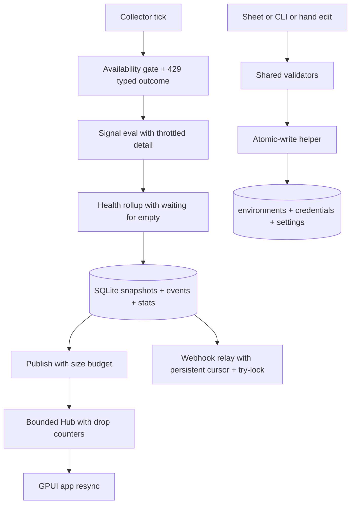

# FINDINGS Remediation - Plan

## Goal Capsule

- **Objective:** Operators see honest health during throttling and cold start, lose no dashboard or webhook updates silently, and keep config, credentials, and events durable on a single-operator host.
- **Means:** Apply the preferred options from FINDINGS.md in dependency order across collection, publish, file writes, webhook, scheduler, validation, and docs (KTD1).
- **Authority:** FINDINGS.md active records shape what changes; CONTEXT.md plus ADRs plus `docs/agents/git-workflow.md` constrain how it lands; this plan constrains unit order and done signals.
- **Stop conditions:** Stop after every Now plus Next item in the FINDINGS roadmap has a landed unit with tests, `bun run check` exits 0, and Later items are either landed or explicitly deferred with reason.
- **Execution profile:** Code change across `crates/daku-core`, `crates/daku-daemon`, `crates/daku-protocol`, `crates/daku-client`, and `src`; additive SQLite migrations only; trunk-based landing on `main` with no PR per repo workflow.
- **Tail ownership:** Land directly on `main` with local verification; no PR body and no CI babysit apply in this repo.

---

## Product Contract

### Summary

This plan remediates every actionable record in FINDINGS.md without changing product scope.
Throttling becomes visible instead of healthy-empty.
Cold start reports waiting instead of healthy.
Dashboard publish bounds queues and wire size instead of dropping silently.
File writes share one hardened helper.
Webhook delivery persists its cursor and skips poison events.
Collector refreshes host state and reports all errors.
Sheet validation matches daemon load.
Docs, tests, trends, paths, bind order, and egress warnings land as small hardening steps.
Tick telemetry provides the measurement basis for future scaling.

### Problem Frame

The codebase is a small single-operator macOS console with sound separation between protocol, core, daemon, client, and desktop.
The review found no broad architectural failure.
Risk clusters around silent handling in collection and publish paths, volatile webhook state, copied atomic-write logic, stale scheduler state, and docs drift.
Each gap is small in isolation but together they let operators trust healthy badges, empty drill-ins, or flat trends that the system never observed.
The remedy is a sequenced hardening pass that makes pressure, absence, loss, and misconfiguration explicit.

### Requirements

#### Collection honesty

- R1. Sustained ServiceNow 429 after the retry budget surfaces as visible throttled or degraded detail in every affected signal, never as empty healthy rows (COR-001).
- R2. Availability gating agrees with signal detail on throttling instead of disagreeing within one tick (COR-001).
- R3. Empty signal sets and missing availability report waiting or skipped, never healthy; Asleep stays healthy per current product rule (COR-002).

#### Publish reliability

- R4. Slow or disconnected dashboard subscribers apply bounded queues with drop counters and one-time logging instead of silent loss or unbounded growth (REL-001).
- R5. Oversize publishes enforce a size budget with deterministic trim or chunking plus a resumable resync instead of per-tick disconnect storms (REL-001).

#### File durability

- R6. One shared atomic-write helper owns unique tmp names, 0600 tmp and target modes, file plus dir fsync, atomic rename, and per-path serialization for environments, credentials, and settings (IMP-002, DAT-001).
- R7. Secret-adjacent parent directories enforce owner-only mode with repair plus a doctor warning for lax custom paths (SEC-002).

#### Webhook durability

- R8. Webhook cursor persists across restarts in SQLite and seeds at current time on first upgrade to avoid an initial burst (REL-002, FEAT-001, ALT-001 Option A).
- R9. Per-event failures skip with bounded retry and dead-letter accounting instead of head-of-line blocking; overlapping tick runs serialize via try-lock (REL-002, FEAT-001).
- R10. Doctor reports webhook delivery status including cursor lag and dead-letter count (FEAT-001).

#### Scheduler correctness

- R11. Collector refreshes offline host state on config reload instead of using a build-time snapshot (ARC-001, IMP-001 Option A).
- R12. Per-environment collection aggregates per-signal errors into a bounded list instead of keeping only the first error (ARC-001).
- R13. Tick shares one StateStore handle or bounded pool per tick instead of one connection per collector (ARC-001, IMP-001).

#### Validation and schema

- R14. Sheet validation and daemon load share platform URL, auth method, threshold unknown-key, and duplicate-id checks with identical messages (FEAT-002).
- R15. Top-level `EnvironmentConfig` rejects unknown fields with a message naming the bad key, matching the existing threshold strictness (MNT-001).

#### Paths, bind, egress, events

- R16. Missing home fails fast with guidance or uses an explicit override only; daemon log honors the same home resolver as DB and config (OPS-001).
- R17. Daemon parses and authorizes the bind address before creating any socket so refused non-loopback binds create no socket (SEC-001).
- R18. Operator https webhook policy documents intranet versus public intent and warns on link-local or metadata-like targets without breaking existing public uses (SEC-003).
- R19. Health and signal events distinguish same-second distinct transitions and prune on startup plus a slow timer in addition to publish paths (DAT-002).

#### Trends, tests, docs

- R20. Trend gaps render as breaks or explicit gap markers, window captions match the selected range, and status pairs color with text or distinct shape (UX-001).
- R21. Payload contract harness reports unknown endpoints with a descriptive missing-mapping message and derives expected counts from the signal registry (TST-001).
- R22. Retention docs state one rule everywhere: 24 hour raw samples plus 90 day hourly rollups and events plus 500 per-environment event cap with ADR-0012 as authority (DOC-001).

#### Telemetry and preservation

- R23. Ticks record duration, per-environment duration, 429 counts, and publish bytes for doctor and diagnostics use; no scheduler redesign ships on anecdotes (FEAT-004, IMP-001).
- R24. Keychain-first credentials with secret-file-only ingress, no-echo shape errors, and redacted diagnostics stay invariant; hardening only touches parent modes and tmp handling (FEAT-003, POS-002).
- R25. Daemon hello keeps constant-time compare, layered caps, mandatory token, and env cleanup; migrations stay append-only with gapless checks and idempotent writers (POS-001, POS-003).

### Scope Boundaries

- In scope: all items above mapped to FINDINGS active records SEC-001 through FEAT-004 excluding keeps that need no code.
- Deferred to follow-up work: dedicated webhook outbox worker (ALT-001 Option B) until FEAT-001 cursor data shows flap-driven need.
- Deferred to follow-up work: per-host time budgets with deadline propagation and queryable overrun table beyond structured tick logging (IMP-001 Option B) until FEAT-004 data shows systemic overruns.
- Deferred to follow-up work: event-driven collection and worker-pool scheduler redesign; polling matches the ServiceNow domain.
- Non-goals: hosted secret management, new auth methods, env-var or argv secret paths, external queueing, exactly-once webhook delivery, payload signing, multi-user auth, container or CI work.

### Success Criteria

- Operators can distinguish throttled, waiting, healthy, and down states in dashboard, drill-ins, and doctor output without reading logs.
- Concurrent saves, restarts, poison webhook events, slow subscribers, and oversize publishes have regression tests that fail before and pass after.
- `bun run check` exits 0 on `main` after landing.

---

## Planning Contract

### Key Technical Decisions

- KTD1. Sequence foundation before hot paths: land 429 mapping plus atomic-write helper plus validation parity first, then publish bounds, then webhook cursor plus collector hardening, then low-risk hardening and docs.
- KTD2. Map exhausted 429 to a typed transient outcome at the ServiceNow client boundary and render it as throttled detail in tolerant callers; keep retry budget and sleep caps unchanged per R1 and R2.
- KTD3. Emit waiting for empty health inputs at the rollup layer and require explicit availability before reachable; keep Asleep as healthy per R3.
- KTD4. Bound per-subscriber Hub queues with drop counters plus a publish size budget with deterministic rollup trim; keep message shapes unchanged and flag trimmed payloads per R4 and R5.
- KTD5. Add one `atomic_write` helper in core owning parent mode repair, random tmp suffix, 0600 modes, file plus dir fsync, rename, and per-path locking; swap credential, environments, and settings writers to it per R6 and R7.
- KTD6. Persist webhook cursor plus dead letters in new additive tables with try-lock serialization and per-event skip; seed cursor at current time on migration per R8 through R10.
- KTD7. Refresh poll hosts on config reload, aggregate per-signal errors, and share one StateStore handle per tick; keep per-group scoped threads per R11 through R13.
- KTD8. Share validators between protocol, sheet, and daemon load so messages match verbatim; add `deny_unknown_fields` or equivalent unknown-key check at the top level per R14 and R15.
- KTD9. Use additive forward-only migrations for cursor, tick stats, and event tiebreaker columns; old binaries ignore new columns and new binaries read old rows per R8, R19, and R23.
- KTD10. Collect tick telemetry as structured log plus additive stats table with existing retention caps; expose via doctor and diagnostics bundle per R23.
- KTD11. Keep credential model, hello auth, and migration discipline unchanged; hardening touches only file parents, tmp handling, and log redaction per R24 and R25.

### High-Level Technical Design

The change follows the existing tick and write paths without new services.

State changes are additive tables for webhook cursor, dead letters, and tick stats plus a tiebreaker column for events.
File changes replace three copied writers with one helper.
No wire or payload shape change except explicit trimmed flags and new detail strings.

### Assumptions

- Environment count stays small and throttling stays rare, so Option A hardening suffices until FEAT-004 data says otherwise.
- Intranet https webhooks exist, so SEC-003 ships as warning plus docs rather than a block.
- Operator-owned JSON files can adopt strict top-level parsing without forward-compat need; automation uses the same example shapes.
- Temp-dir fallback state needs no automatic migration; guidance to move it suffices.

### Sequencing

- Phase A foundation: U1 plus U2 plus U4.
- Phase B hot path: U3 after U1 so throttled detail flows through bounded publish.
- Phase C reliability: U5 plus U6 after the helper lands.
- Phase D parity and hardening: U7 plus U8 plus U9 in any order once foundation merges.
- Telemetry U9 starts early in the Next window and informs whether Option B work ever schedules.

### Risks & Dependencies

- Publish bound changes touch the hot path; rollback reverts to capped defaults with prior shapes intact.
- Collector error aggregation plus handle sharing touches concurrent tick code; keep diffs narrow and cover with multi-error and contention tests.
- Event-key migration is the only schema step needing forward-only care; keep writers idempotent.
- Stricter validation may refuse previously ignored files; messages must name the bad key and point at the example.

---

## Implementation Units

| U-ID | Title | Files touched | Depends on |
|---|---|---|---|
| U1 | Throttled 429 mapping | `crates/daku-core/src/servicenow.rs`, `crates/daku-core/src/signal_eval.rs`, signal callers, dashboard copy | None |
| U2 | Waiting for empty health | `crates/daku-core/src/health.rs`, `src/dashboard_state.rs`, tests | None |
| U3 | Bounded publish | `crates/daku-core/src/server.rs`, `crates/daku-core/src/health.rs`, `crates/daku-client/src/` | U1, U2 |
| U4 | Atomic-write helper | `crates/daku-core/src/config.rs`, `crates/daku-core/src/environments.rs`, `crates/daku-core/src/settings.rs`, diagnostics dir | None |
| U5 | Webhook cursor and skip | `crates/daku-core/src/webhook.rs`, `crates/daku-core/src/persistence.rs`, `crates/daku-core/src/collector.rs`, doctor output, migrations | U4 |
| U6 | Collector refresh and errors | `crates/daku-core/src/collector.rs`, persistence handle sharing, doctor output | U1 |
| U7 | Validation parity and strictness | `crates/daku-protocol/src/environment.rs`, `src/env_sheet.rs`, `crates/daku-core/src/config.rs`, `crates/daku-core/src/environments.rs`, example JSON | None |
| U8 | Low-risk hardening sweep | daemon bind, webhook policy, event keys, home and log paths, trends, contract harness, docs | U4 |
| U9 | Tick telemetry | `crates/daku-core/src/collector.rs`, persistence stats, doctor output, diagnostics bundle | U6 |
| U10 | Preservation guards | credential, hello, migration tests and docs | U4 |

### U1. Throttled 429 mapping

- **Goal:** Make sustained throttling visible in every affected signal with consistent availability agreement.
- **Requirements:** R1, R2.
- **Dependencies:** None.
- **Files:** `crates/daku-core/src/servicenow.rs`, `crates/daku-core/src/signal_eval.rs`, per-signal detail strings, dashboard throttled copy, `crates/daku-core/tests/` contract tests.
- **Approach:**
  1. Return a typed rate-limited outcome from the ServiceNow send path when the retry budget exhausts.
  2. Map that outcome to degraded or skipped with a throttled detail string in tolerant and bailing fetch helpers.
  3. Align availability gating with the same outcome so one tick never disagrees with itself.
- **Patterns to follow:** Existing retry count and sleep-cap tests in `servicenow.rs`; shared validation without secret echo.
- **Test scenarios:**
  - Single 429 then success records success with no throttled flag.
  - Sustained 429 after budget records throttled detail in tolerant fetch instead of empty healthy rows.
  - Mixed 429 plus success across signals shows throttled only on affected signals.
  - Availability and signal detail agree on throttled hosts.
- **Verification:** Contract tests for the mapping pass; dashboard snapshot assertions show throttled detail; `bun run check` exits 0.

### U2. Waiting for empty health

- **Goal:** Report waiting for cold start instead of healthy-before-observation.
- **Requirements:** R3.
- **Dependencies:** None.
- **Files:** `crates/daku-core/src/health.rs`, `src/dashboard_state.rs`, health and dashboard tests.
- **Approach:**
  1. Change the missing-availability default from reachable to unknown or waiting.
  2. Change the empty-vote rollup branch from healthy to waiting while keeping Asleep as healthy.
  3. Update publish summary mapping and dashboard waiting copy.
- **Patterns to follow:** Existing desktop waiting card wording; health rollup tests.
- **Test scenarios:**
  - Empty snapshot slice decides waiting, not healthy.
  - Reachable with empty votes rolls up to waiting.
  - Missing availability never defaults to reachable.
  - Malformed payload and unknown state map to waiting or skipped without panic.
- **Verification:** Updated unit tests pass; dashboard cold-start test shows waiting; `bun run check` exits 0.

### U3. Bounded publish

- **Goal:** Bound broadcast queues and wire size with observable drops and resync.
- **Requirements:** R4, R5.
- **Dependencies:** U1, U2.
- **Files:** `crates/daku-core/src/server.rs`, `crates/daku-core/src/health.rs`, `crates/daku-client/src/`, dashboard loading states, Hub tests.
- **Approach:**
  1. Bound per-subscriber channels with drop counters and one-time disconnect logging.
  2. Add publish size accounting with deterministic rollup trim or chunking plus an explicit trimmed flag.
  3. Keep message shapes unchanged and handle reconnect resync on the client.
- **Patterns to follow:** Existing Hub fan-out tests; layered message caps in server auth.
- **Test scenarios:**
  - Slow receiver that never drains triggers bounded drop with counter instead of unbounded growth.
  - Disconnected subscriber logs once and does not lose data for live subscribers.
  - Oversize snapshot set trims deterministically without per-tick disconnect storm.
  - Reconnect after trim resyncs to current state with loading indication.
- **Verification:** Slow-subscriber and oversize integration tests pass; manual sleep-wake shows no storm; `bun run check` exits 0.

### U4. Atomic-write helper

- **Goal:** Replace three copied writers with one hardened helper and strict parents.
- **Requirements:** R6, R7.
- **Dependencies:** None.
- **Files:** `crates/daku-core/src/config.rs`, `crates/daku-core/src/environments.rs`, `crates/daku-core/src/settings.rs`, new or existing fs helper module, diagnostics output dir, doctor checks.
- **Approach:**
  1. Add one helper taking target path, bytes, parent mode, and file mode owning unique tmp, 0600 tmp, fsync on file and dir, rename, and per-path locking.
  2. Swap credential, environments, and settings writers to the helper.
  3. Enforce 0700 parent repair for secret-adjacent paths and add a doctor warning for lax custom parents.
- **Patterns to follow:** Same-directory rename atomicity; existing 0600 target assertions.
- **Test scenarios:**
  - Fresh custom parent gains owner-only mode after write.
  - Existing lax parent repairs to owner-only with warning.
  - Concurrent saves to one path do not lose updates and use distinct tmp names.
  - Modes stay 0600 on tmp and target after rename.
- **Verification:** Concurrency and permission tests pass; manual custom-path doctor run warns correctly; `bun run check` exits 0.

### U5. Webhook cursor and skip

- **Goal:** Persist delivery state with per-event skip and serialized runs.
- **Requirements:** R8, R9, R10.
- **Dependencies:** U4.
- **Files:** `crates/daku-core/src/webhook.rs`, `crates/daku-core/src/persistence.rs`, `crates/daku-core/src/collector.rs`, new migration for cursor and dead letters, doctor output, docs.
- **Approach:**
  1. Add additive cursor and dead-letter tables seeded at current time on upgrade.
  2. Advance cursor per event with bounded retry and poison-head skip to dead letters.
  3. Serialize overlapping tick runs with a try-lock or generation counter.
- **Patterns to follow:** Append-only migrations with gapless checks; redacted webhook logging.
- **Test scenarios:**
  - Restart resumes from persisted cursor without full repost.
  - Poison head skips to dead letters while newer events still deliver.
  - Backfill stays bounded by existing caps.
  - Overlapping runs coalesce instead of piling threads.
- **Verification:** Restart, poison-skip, and backfill tests pass; flapping-endpoint integration shows no starvation; `bun run check` exits 0.

### U6. Collector refresh and errors

- **Goal:** Refresh host state, surface all signal errors, and share persistence handles.
- **Requirements:** R11, R12, R13.
- **Dependencies:** U1.
- **Files:** `crates/daku-core/src/collector.rs`, persistence open sites, doctor output, collector tests.
- **Approach:**
  1. Refresh offline poll hosts on config reload instead of reusing the build-time set.
  2. Collect per-signal errors into a bounded list with preserved isolation.
  3. Share one StateStore handle or bounded pool per tick.
- **Patterns to follow:** Per-group scoped threads; per-environment failure isolation.
- **Test scenarios:**
  - Config change mid-run refreshes gating on the next tick.
  - Two failing signals in one collect both surface with signal identity.
  - Multi-environment tick shares handles without busy-timeout failure.
  - Overrun logs carry duration and environment count.
- **Verification:** Host-refresh, multi-error, and contention tests pass; manual multi-environment tick shows fuller errors; `bun run check` exits 0.

### U7. Validation parity and strictness

- **Goal:** Unify sheet and daemon validation with fail-fast typos.
- **Requirements:** R14, R15.
- **Dependencies:** None.
- **Files:** `crates/daku-protocol/src/environment.rs`, `src/env_sheet.rs`, `crates/daku-core/src/config.rs`, `crates/daku-core/src/environments.rs`, `environments.example.json`, validation tests.
- **Approach:**
  1. Share platform URL, auth method, threshold unknown-key, and duplicate-id checks across sheet, CLI setup, and daemon load.
  2. Add top-level unknown-field rejection with messages naming the bad key.
  3. Align sheet per-field errors verbatim with daemon messages.
- **Patterns to follow:** Shared URL helper in protocol; existing threshold typo rejection test.
- **Test scenarios:**
  - GitHub shape, platform mismatch, duplicate id, and threshold typo agree across sheet and load.
  - Top-level typo names the unknown key instead of loading silently.
  - Valid files still load through every entry point.
  - Hand-edit with misspelled optional key fails fast with fix guidance.
- **Verification:** Parity corpus passes; example docs match strictness; `bun run check` exits 0.

### U8. Low-risk hardening sweep

- **Goal:** Land small independent hardening steps in one pass without behavior risk.
- **Requirements:** R16, R17, R18, R19, R20, R21, R22.
- **Dependencies:** U4.
- **Files:** `crates/daku-daemon/src/main.rs`, `crates/daku-core/src/webhook.rs`, `crates/daku-protocol/src/settings.rs`, `crates/daku-core/src/persistence.rs`, `crates/daku-client/src/process.rs`, `crates/daku-core/src/config.rs`, `src/app.rs`, `src/dashboard_state.rs`, `crates/daku-core/src/payload_contract.rs`, `crates/daku-core/src/platform_registry.rs`, `db/schema.ts`, `docs/adr/0007-local-sqlite-storage.md`, `docs/spec/v1.md`.
- **Approach:**
  1. Parse and authorize bind address before socket creation with no-socket-on-refusal test.
  2. Document webhook egress intent and warn on link-local or metadata-like https targets.
  3. Add event tiebreaker plus startup and timer prune via additive migration.
  4. Unify home and log path resolution with fail-fast missing-home guidance.
  5. Render trend gaps as breaks with correct captions and text-paired status.
  6. Replace contract panics with descriptive missing-mapping errors and registry-derived counts.
  7. Sweep retention docs to the 24 hour plus 90 day plus 500-cap rule with superseded banners.
- **Patterns to follow:** Append-only migration discipline; redacted logging; presentation-only trend changes.
- **Test scenarios:**
  - Refused bind creates no socket for loopback, unspecified, and DNS forms.
  - Policy tests cover public, intranet, and link-local webhook hosts.
  - Same-second distinct events both persist; stalled rows prune on startup.
  - Missing home and override parity cases pass.
  - Gap rendering, caption per window, and status text presence pass.
  - Unknown endpoint yields a helpful missing-mapping message.
  - Stale-claim grep finds no 30-day promise after the sweep.
- **Verification:** Each sub-area test passes; docs diff preserves ADR history; `bun run check` exits 0.
- **Execution note:** Keep each sub-change as a separate atomic commit so one revert never takes the whole sweep.

### U9. Tick telemetry

- **Goal:** Measure tick pressure before any scheduler redesign.
- **Requirements:** R23.
- **Dependencies:** U6.
- **Files:** `crates/daku-core/src/collector.rs`, persistence stats helper, new additive stats table, doctor output, diagnostics bundle, docs.
- **Approach:**
  1. Record per-tick duration, per-environment duration, 429 counts, and publish bytes after publish.
  2. Expose distributions via doctor and include a redacted tail in diagnostics.
  3. Bound stats with existing retention caps.
- **Patterns to follow:** Existing eprintln overrun lines become structured records; doctor census patterns.
- **Test scenarios:**
  - Stats row records after a normal tick with expected fields.
  - Throttled tick increments 429 counts without changing scheduling.
  - Old binaries ignore the new table and new binaries treat absent stats as unknown.
  - Prune keeps stats bounded.
- **Verification:** Stats and prune tests pass; manual multi-environment run shows overrun and throttle distributions; `bun run check` exits 0.

### U10. Preservation guards

- **Goal:** Lock the safe invariants every other unit must not weaken.
- **Requirements:** R24, R25.
- **Dependencies:** U4.
- **Files:** Credential store and rotation tests, hello handshake tests, migration gapless assertions, doctor redaction tests, docs notes.
- **Approach:**
  1. Keep Keychain default, file opt-in, secret-file-only ingress, and no-echo errors untouched.
  2. Keep constant-time compare, layered caps, mandatory token, and env cleanup untouched.
  3. Keep append-only migrations with idempotent writers untouched.
- **Test scenarios:**
  - Shape errors carry no secret values.
  - Failed rotation preserves the old credential.
  - Diagnostics never opens credential files.
  - Handshake rejection and bind classification stay green.
- **Verification:** Existing shape, rotation, handshake, and migration tests stay green; release notes call out parent hardening only; `bun run check` exits 0.
- **Test expectation:** None new beyond existing guards -- this unit adds no behavior change.

---

## Verification Contract

| Command | Applies to | Proves |
|---|---|---|
| `bun run check` | All units | fmt check plus `cargo clippy --workspace --all-targets -- -D warnings` plus `cargo test --workspace` plus oxlint plus tsconfig coverage plus `tsc --noEmit` all exit 0 before landing on `main` |
| `cargo test -p daku-core servicenow` | U1 | Retry and throttled-mapping assertions hold |
| `cargo test -p daku-core health` | U2 | Empty-means-waiting assertions hold |
| `cargo test -p daku-core server` | U3 | Hub fan-out plus slow and oversize cases hold |
| `cargo test -p daku-core config` | U4, U7, U10 | Atomic-write modes plus strictness plus credential shape hold |
| `cargo test -p daku-core webhook` | U5 | Resume, poison-skip, and backfill bounds hold |
| `cargo test -p daku-core collector` | U6, U9 | Host refresh, multi-error, handle sharing, and stats hold |
| `rg -n "30d|30-day|30 day" db docs crates --glob '!target'` | U8 | No stale retention promise remains outside quoted history |
| Manual custom-path doctor run | U4 | Lax parent warning appears with fix guidance |
| Manual sleep-wake client test | U3 | No reconnect storm after oversize trim |

Do not add `#[allow]` to pass clippy without a comment saying why.
A new `.ts` file outside `tsconfig.json` include is silently unchecked, so keep docs-only TypeScript changes inside covered paths.

---

## Definition of Done

- Global: every unit above lands on `main` with tests, `bun run check` exits 0, no `#[allow]` without reason, no wire or payload break except explicit trimmed flags and new detail strings, and abandoned-attempt code is removed from the diff.
- U1 done when sustained 429 shows throttled detail consistently and availability agrees.
- U2 done when cold start shows waiting and Asleep still shows healthy.
- U3 done when slow and oversize publishes stay bounded with counters and resync.
- U4 done when concurrent saves keep modes and content without loss.
- U5 done when restart resumes and poison head no longer starves newer events.
- U6 done when host refresh and multi-error tests pass with shared handles.
- U7 done when sheet and daemon agree on the valid plus invalid fixture corpus.
- U8 done when each hardening sub-test passes and docs sweep preserves ADR history.
- U9 done when doctor reports tick distributions that decide whether Option B work ever schedules.
- U10 done when credential, hello, and migration guards stay green with no model change.

---

## Appendix

### FINDINGS traceability

Every active record maps to at least one unit: SEC-001 to U8, SEC-002 to U4, SEC-003 to U8, COR-001 to U1, COR-002 to U2, REL-001 to U3, REL-002 to U5, DAT-001 to U4, DAT-002 to U8, ARC-001 to U6, OPS-001 to U8, UX-001 to U8, TST-001 to U8, MNT-001 to U7, DOC-001 to U8, IMP-001 to U6 and U9, IMP-002 to U4, ALT-001 Option A to U5, FEAT-001 to U5, FEAT-002 to U7, FEAT-003 to U10, FEAT-004 to U9, POS-001 through POS-003 to U10.

### Product Contract preservation

Product Contract is new from FINDINGS preferred options via `ce-plan-bootstrap`; no upstream brainstorm exists to preserve.

### Sources

- `FINDINGS.md` sections 5 through 8 and 14 through 15 for scope, options, and sequence.
- `crates/daku-core/src/servicenow.rs`, `crates/daku-core/src/signal_eval.rs`, `crates/daku-core/src/health.rs`, `crates/daku-core/src/server.rs`, `crates/daku-core/src/webhook.rs`, `crates/daku-core/src/collector.rs`, `crates/daku-core/src/config.rs`, `crates/daku-core/src/environments.rs`, `crates/daku-core/src/settings.rs`, `crates/daku-core/src/persistence.rs`, `crates/daku-daemon/src/main.rs` for load-bearing paths.
- `crates/daku-protocol/src/environment.rs`, `crates/daku-protocol/src/settings.rs`, `src/env_sheet.rs`, `src/dashboard_state.rs`, `src/app.rs` for validation and presentation seams.
- `docs/agents/git-workflow.md` for trunk-based landing with no PR.
