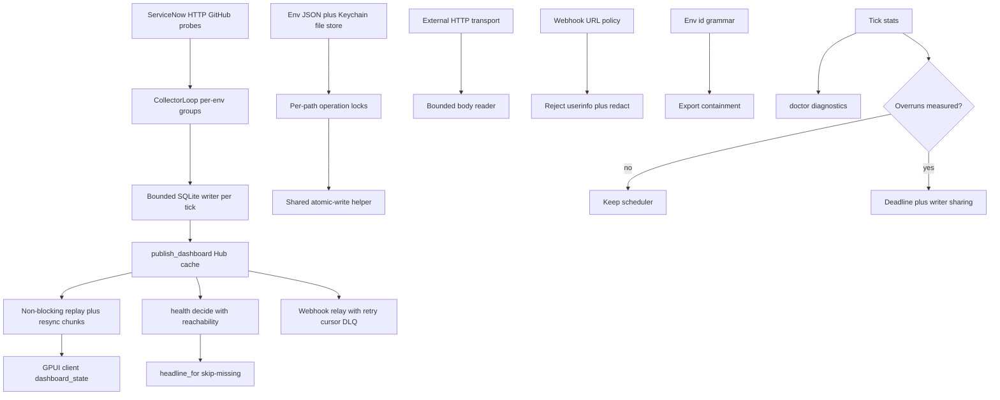

# FINDINGS Remediation Active Records - Plan

## Goal Capsule

- **Objective:** Operators get honest health during throttling and outages, lose no dashboard state or webhook events silently, and keep config, credentials, and history durable on a single-operator macOS host.
- **Means:** Apply the preferred options from FINDINGS.md in dependency order across transport, collection, publish, file state, webhook, scheduler, validation, operations, UI, and docs (KTD1).
- **Authority:** FINDINGS.md active records define what changes; CONTEXT.md, ADRs, and `docs/agents/git-workflow.md` constrain how it lands; this plan constrains unit order and done signals.
- **Stop conditions:** Stop after every active defect, risk, and Next-priority feature has a landed unit with tests, `bun run check` exits 0, and Later and Investigate items are either landed or explicitly deferred with reason.
- **Execution profile:** Code change across `crates/daku-core`, `crates/daku-protocol`, `crates/daku-client`, `crates/daku-daemon`, and `src`; additive SQLite migrations only; trunk-based landing on `main` with no pull requests per repo workflow.
- **Tail ownership:** Land directly on `main` with local verification; no PR body and no CI babysit apply in this repo.

---

## Product Contract

### Summary

This plan remediates all 29 active FINDINGS.md records without changing product scope.
Throttling stays visible in drill-ins.
Platform outages roll up to down.
Missing snapshots do not erase notification reasons.
Webhook URLs reject userinfo and exports reject path-unsafe ids.
External bodies are bounded.
Config updates do not lose races.
Dashboard replay never blocks and oversize state has a resync path.
Events and webhook cursors survive same-second crashes.
Collector pressure is measured before scheduler or writer redesign.
Readiness, home resolution, and logs fail closed and stay bounded.
Trends show gaps and freshness respects cadence.
Docs state current 90-day and three-platform scope.
Keychain-first credentials stay unchanged.

### Problem Frame

The codebase is a coherent local-first Rust daemon and macOS client with sound separation between protocol, core, daemon, client, and desktop.
The review found no broad architectural failure.
Risk clusters around silent handling in collection and publish paths, unserialized file read-modify-write, timestamp-only event and cursor identity, unbounded external input and replay, early readiness, and docs drift.
Each gap is small alone but together they let operators trust healthy badges, empty drill-ins, flat trends, or ready lines the system never earned.
The remedy is a sequenced hardening pass that makes pressure, absence, loss, and misconfiguration explicit.

### Requirements

#### Collection honesty

- R1. Sustained ServiceNow 429 after the retry budget surfaces as visible throttled detail in every tolerant signal while preserving the aggregate count and state (COR-001).
- R2. HTTP and GitHub probe failures that mean the endpoint is unreachable roll the environment to down, while answered-but-unhealthy stays degraded (COR-003).
- R3. Missing snapshots are skipped when selecting a notification headline so the first observed degraded or down signal supplies the reason (COR-004).

#### Trust boundaries

- R4. Webhook URLs with userinfo are rejected and no authority credentials appear in logs, errors, or diagnostics bundles (SEC-004).
- R5. Environment ids use a path-safe grammar enforced before persistence and export stays inside the export root (SEC-005).
- R6. External HTTP response bodies and webhook error bodies are read through bounded readers with a clear size-limit error (PER-001).
- R7. Keychain-first credentials with secret-file ingress keep current behavior with no secrets in argv, JSON, SQLite, logs, or diagnostics (FEAT-003).

#### Publish and delivery reliability

- R8. Dashboard replay never blocks on a bounded queue and oversize state has a bounded resync or chunk path with drop and resync visibility (REL-003).
- R9. Webhook delivery retries transient failures with backoff, keeps an unambiguous order across same-second events, retains bounded dead letters, and exposes lag and counts in doctor (REL-004, FEAT-001).
- R10. Event identity distinguishes distinct same-second transitions and every event table has an independent bounded retention path including Signal-only startup prune (DAT-002).

#### File durability

- R11. Config and file-credential read-modify-write operations are serialized per target so concurrent saves do not lose updates (DAT-003).
- R12. Desktop preferences use the same unique-temp, mode, fsync, and path policy as daemon JSON state (DAT-001, IMP-002).

#### Scheduler and operations

- R13. Collector records bounded per-tick and per-environment timing, throttle counts, publish size, and delivery summaries for doctor and diagnostics before any scheduler or writer redesign (FEAT-004).
- R14. Per-signal SQLite writer contention is measured, then probe work and persistence are split so one bounded writer serves a tick while probes stay concurrent (ARC-002, IMP-001).
- R15. Daemon readiness is announced only after storage, settings, and the accept path are ready (OPS-003).
- R16. Missing home fails with guidance unless an explicit home override is present; daemon logs rotate by size and diagnostics reads a bounded tail (OPS-002, OPS-004).

#### Validation and UI honesty

- R17. Sheet, CLI, and daemon share one validation contract for URLs, platforms, ids, thresholds, and credentials with the same field errors (FEAT-002).
- R18. Trends preserve timestamps and break lines across cadence-aware gaps instead of connecting missing intervals (UX-002).
- R19. Freshness derives from effective poll cadence with a bounded product minimum, or the fixed thresholds are documented as intentional (UX-003).

#### Documentation

- R20. Current docs state 24-hour raw samples, 90-day rollups, and event bounds with historical ADR passages marked superseded (DOC-001).
- R21. Accepted spec and schema docs state the shipped three-platform scope and runtime telemetry tables with current authority links (DOC-002).

### Scope Boundaries

- In scope: all active COR, SEC, REL, DAT, ARC, OPS, PER, UX, DOC, IMP, ALT, FEAT records listed above.
- Out of scope: plugin system for platforms, hosted queue or external forwarder, event-driven push collection, hosted secret management, multi-user webhook administration, payload signing, cloud telemetry.
- Deferred to follow-up work: dedicated per-environment scheduler with priority queues (IMP-001 Option C); durable outbox worker (ALT-001 Option B) unless FEAT-004 delivery evidence justifies it; content-addressed local state.

### Outstanding Questions

- Blocking: none. The plan proceeds on FINDINGS.md preferred options.
- Deferred: supported environment count and maximum rollup payload for REL-003 budgets; whether webhook delivery is convenience or operational dependency for ALT-001; whether `DAKU_HOME` covers desktop preferences; whether remote attach must accept `TestEnvironment` credentials; accepted v1 spec immutability. Each routes to Assumptions or FEAT-004 measurement.

---

## Planning Contract

### Key Technical Decisions

- KTD1. Apply FINDINGS.md preferred options in Suggested Implementation Sequence order: security and correctness foundation, then file locks, then replay budget, then health and event migration, then measurement-gated scheduler work, then operations and docs.
- KTD2. Propagate a typed throttled detail while preserving aggregate results for COR-001 rather than marking the whole signal down or extending row retries.
- KTD3. Carry platform-neutral reachability with every primary probe and use it only as the environment reachability input for COR-003.
- KTD4. Reject webhook userinfo and keep host-only redaction for SEC-004; enforce safe ids plus export-root containment for SEC-005.
- KTD5. Bound external bodies at the transport boundary with endpoint-specific limits for PER-001.
- KTD6. Serialize logical file updates with per-path operation locks plus compare-and-swap retry, separate from atomic replacement, for DAT-003; extend one file-state helper across client and daemon for IMP-002 and DAT-001.
- KTD7. Add a versioned snapshot and resync path with chunked messages and non-blocking replay for REL-003; keep small-message compatibility during a window.
- KTD8. Use a stable event sequence or `(observed_at, kind)` cursor with bounded retry and dead-letter prune and requeue for REL-004 and FEAT-001; add event sequence identity with table-specific startup pruning for DAT-002 in one additive migration.
- KTD9. Measure first with FEAT-004 dimensions, then share one write connection or bounded writer per tick for ARC-002; add per-environment deadlines only on measured overruns for IMP-001.
- KTD10. Move readiness after initialization with a bound record only if the bind API needs it for OPS-003; fail closed on missing home for OPS-002; rotate by size with bounded tail reads for OPS-004.
- KTD11. Preserve timestamps to the renderer and break segments across gaps for UX-002; publish effective cadence and derive bounded stale thresholds for UX-003.
- KTD12. Keep polling daemon, local SQLite, compiled-in registry, and Keychain-first model; defer worker, queue, and plugin work per ALT-001 and Do Not Pursue.

### High-Level Technical Design

### Assumptions

- Local installs are small; queue bound 512 and 48 MiB wire cap hold until FEAT-004 measures otherwise.
- Webhook delivery is convenience until doctor counts prove operational need.
- `DAKU_HOME` promise covers daemon-owned paths; desktop preference coverage needs doc confirmation.
- Remote and non-loopback support stays outside v1 until TLS and authorization are explicit.
- `docs/platforms.md`, CONTEXT.md, and ADR-0011 describe shipped behavior for DOC-002 scope notes.
- Existing path-safe ids remain unchanged; unsafe ids get a clear rename error.
- Large valid payloads above the new bound become down with documented limits.

### Sequencing

Phase A units U1 through U4 are independent and land first. U5 follows and owns file-write policy. U6 redesigns replay before protocol-dependent UI changes. U7 and U8 share the event and cursor migration decision and land together. U9 measures before U6 thresholds harden and before any writer or scheduler refactor. U10 and U11 land last. POS-001 through POS-003 invariants hold throughout.

---

## Implementation Units

### Unit Index

| U-ID | Title | Files touched | Depends on |
|---|---|---|---|
| U1 | Webhook userinfo and redaction | crates/daku-core/src/webhook.rs, settings_backend.rs, diagnostics.rs | none |
| U2 | Safe ids and shared validation | crates/daku-protocol/src/protocol.rs, crates/daku-core/src/environments.rs, config.rs, src/env_sheet.rs, src/app.rs | none |
| U3 | Bounded external bodies | crates/daku-core/src/servicenow.rs, webhook.rs, http_probe.rs, github.rs | none |
| U4 | Throttled drill-ins | crates/daku-core/src/signal_eval.rs, jobs.rs, syslog.rs, outbound.rs, flow.rs, email.rs | U3 |
| U5 | File-write locks and helper | crates/daku-core/src/atomic_write.rs, environments.rs, config.rs, crates/daku-client/src/persistence.rs | U2 |
| U6 | Bounded replay and resync | crates/daku-core/src/server.rs, crates/daku-protocol/src/protocol.rs, crates/daku-client | U9 |
| U7 | Platform health and headlines | crates/daku-core/src/health.rs, http_probe.rs, github.rs, collector.rs, src/dashboard_state.rs | U4 |
| U8 | Events and webhook delivery | crates/daku-core/src/persistence.rs, webhook.rs, collector.rs, crates/daku-daemon/src/main.rs, db/* | U5 |
| U9 | Tick pressure telemetry | crates/daku-core/src/collector.rs, persistence.rs, crates/daku-daemon/src/main.rs | none |
| U10 | Readiness home and logs | crates/daku-daemon/src/main.rs, crates/daku-core/src/config.rs, diagnostics.rs, crates/daku-client/src/process.rs | U9 |
| U11 | Trends freshness and docs | src/dashboard_state.rs, src/app.rs, docs/spec/v1.md, docs/adr/*, docs/signals.md | U6, U7, U9 |

### U1. Webhook userinfo and redaction

**Goal:** Reject credential-bearing webhook URLs and redact authority before any log or bundle.
**Requirements:** R4.
**Dependencies:** none.
**Files:** `crates/daku-core/src/webhook.rs`, `crates/daku-core/src/settings_backend.rs`, `crates/daku-core/src/diagnostics.rs`; tests in `crates/daku-core` webhook, settings, and diagnostics test modules.
**Approach:** Centralize URL parsing for webhook settings. Reject `@` in authority. Keep HTTPS or loopback HTTP policy. Strip userinfo, query, fragment, and path before logging or bundling. Update settings errors with a clear migration message.
**Patterns to follow:** Protocol URL rules in `crates/daku-protocol/src/protocol.rs`; credential no-echo errors in `crates/daku-core/src/environment.rs`; diagnostics redaction tests.
**Test scenarios:**
- HTTPS URL with `user:secret` userinfo is rejected with a clear error and no secret in the message.
- Query, fragment, and path tokens are redacted in warnings and bundles.
- Malformed authority is rejected without panic.
- Valid public HTTPS webhook URL stays accepted.
- Diagnostics bundle with a userinfo canary contains no credential.
**Verification:** Webhook, settings, and diagnostics unit tests pass; bundle output inspected for canary absence.

### U2. Safe ids and shared validation

**Goal:** Enforce path-safe environment ids once and share validation across sheet, CLI, and daemon.
**Requirements:** R5, R17.
**Dependencies:** none.
**Files:** `crates/daku-protocol/src/protocol.rs`, `crates/daku-core/src/environments.rs`, `crates/daku-core/src/config.rs`, `src/env_sheet.rs`, `src/app.rs`; tests in protocol validation, environments loader, and desktop export path tests.
**Approach:** Define a conservative id grammar in the shared validator. Enforce it before persistence in loader, saver, sheet, and CLI. Add export-root containment assertion in the desktop export path. Map structured field errors to the existing sheet without changing JSON format. Preserve POS-002 no-echo behavior.
**Patterns to follow:** Shared URL checks in `crates/daku-protocol/src/protocol.rs`; sheet validation in `src/env_sheet.rs`.
**Test scenarios:**
- Slash, dot-dot, absolute-like, control-character, overlong, and Unicode ids are rejected with field errors.
- Valid ids round-trip unchanged.
- Export path for `../review-export` stays inside the export root or is refused.
- Same invalid corpus returns the same reason at sheet, CLI, and daemon load.
- Credential errors never echo values.
**Verification:** Shared corpus passes at every entry point; export containment test passes.

### U3. Bounded external bodies

**Goal:** Stop unbounded memory allocation from external endpoints.
**Requirements:** R6.
**Dependencies:** none.
**Files:** `crates/daku-core/src/servicenow.rs`, `crates/daku-core/src/webhook.rs`, `crates/daku-core/src/http_probe.rs`, `crates/daku-core/src/github.rs`; transport helper plus tests.
**Approach:** Add bounded body helpers at the transport boundary. Apply endpoint-specific limits with a smaller cap for OAuth and webhook error bodies. Return a clear size-limit error that maps to down with redacted diagnostics.
**Patterns to follow:** Existing 30-second timeout handling; webhook error truncation after read becomes before-read bound.
**Test scenarios:**
- Response larger than the limit returns a size-limit error and is not fully retained.
- Boundary-size body just under the limit succeeds.
- Webhook large error page is bounded and redacted.
- Malformed response after truncation classifies cleanly.
**Verification:** Boundary, timeout, malformed, and webhook error tests pass.

### U4. Throttled drill-ins

**Goal:** Preserve aggregate results and add visible throttled detail when row fetches hit 429.
**Requirements:** R1.
**Dependencies:** U3.
**Files:** `crates/daku-core/src/signal_eval.rs`, `crates/daku-core/src/jobs.rs`, `crates/daku-core/src/syslog.rs`, `crates/daku-core/src/outbound.rs`, `crates/daku-core/src/flow.rs`, `crates/daku-core/src/email.rs`; payload fixtures and dashboard detail formatting in `src/dashboard_state.rs`.
**Approach:** Switch the five tolerant adapters to `fetch_table_rows_with_throttle`. Preserve count and state. Add a bounded throttled detail per the existing `THROTTLED_DETAIL` contract. Keep the wire shape additive. Update payload fixtures.
**Patterns to follow:** Existing generic 429 helper and detail convention.
**Test scenarios:**
- Normal jobs aggregate followed by three 429 row responses yields degraded state with preserved count and throttled detail.
- Same pattern for syslog, outbound, flow, and email adapters.
- Aggregate-only healthy reads are unaffected.
- Dashboard renders the detail visibly.
**Verification:** Adapter-level 429 tests pass; payload contract regenerates; dashboard assertion passes.

### U5. File-write locks and helper

**Goal:** Make logical file updates race-resistant under one reviewed policy.
**Requirements:** R11, R12.
**Dependencies:** U2.
**Files:** `crates/daku-core/src/atomic_write.rs`, `crates/daku-core/src/environments.rs`, `crates/daku-core/src/config.rs`, `crates/daku-client/src/persistence.rs`; concurrency and mode tests.
**Approach:** Keep JSON and Keychain ownership unchanged. Add per-path operation locks around full read-modify-write for `save_environment`, delete, and file-store set and delete. Share or duplicate the narrowly scoped helper across the client boundary with unique temp, 0600, file and directory sync, and parent repair. Keep lock scope out of network probes. Execution note: add concurrency tests first for the losing-update shape, then harden.
**Patterns to follow:** Core helper in `crates/daku-core/src/atomic_write.rs`; client mutex discipline.
**Test scenarios:**
- Two concurrent saves for different ids both survive.
- Same-id concurrent saves serialize with one winner and no corrupt JSON.
- Save and delete overlap leaves a valid state with clear error handling.
- Two concurrent file-store credential updates preserve both logical updates.
- Client preference concurrent writes preserve mode and durability.
- `DAKU_HOME` path parity holds where documented.
**Verification:** Concurrency, failure-injection, mode, and home-override tests pass.

### U6. Bounded replay and resync

**Goal:** Make reconnect reliable for large or slow subscribers.
**Requirements:** R8.
**Dependencies:** U9.
**Files:** `crates/daku-core/src/server.rs`, `crates/daku-protocol/src/protocol.rs`, `crates/daku-client` WebSocket client and reconnect state, `src/dashboard_state.rs` loading state.
**Approach:** Replace blocking replay `send` with `try_send`. Add a versioned snapshot and resync command with size-aware chunks. U9 measurement informs thresholds. Expose drop and resync counters to the client. Preserve existing message types during a compatibility window and bump protocol for new types. Keep live queues bounded.
**Patterns to follow:** Existing `SUBSCRIBER_QUEUE_BOUND` and 48 MiB cap; Hub cache-key design.
**Test scenarios:**
- Replay with more than 512 cached messages never blocks and reports drops with a resync path.
- Single oversize rollup message is chunked or served by resync instead of log-only.
- Client that drops state reconnects to a complete bounded state.
- Small-state replay keeps current behavior.
- Serialized message budgets hold under a property test.
**Verification:** Bounded replay, oversize payload, reconnect-after-drop, and budget property tests pass.

### U7. Platform health and headlines

**Goal:** Report outages at the right severity with an available reason.
**Requirements:** R2, R3.
**Dependencies:** U4.
**Files:** `crates/daku-core/src/health.rs`, `crates/daku-core/src/http_probe.rs`, `crates/daku-core/src/github.rs`, `crates/daku-core/src/collector.rs`, `src/dashboard_state.rs`; notification fixtures.
**Approach:** Carry platform-neutral reachability from every primary probe into `decide` without changing ServiceNow ACL semantics. Replace the early `?` return in `headline_for` with skip-missing iteration. Update notification fixtures.
**Patterns to follow:** Availability signal handling in `crates/daku-core/src/health.rs`; explainer skip-missing behavior.
**Test scenarios:**
- HTTP 503 with no availability snapshot yields environment down.
- HTTP transport failure and GitHub 401 map to the documented severity.
- ServiceNow non-availability signal failure keeps current semantics.
- Partial snapshot map with missing first signal still returns the degraded headline.
- Reconnect with partial state does not emit a false recovery headline.
**Verification:** Platform health integration tests and partial-snapshot notification tests pass.

### U8. Events and webhook delivery

**Goal:** Preserve history and delivery across same-second crashes with operator recovery.
**Requirements:** R9, R10.
**Dependencies:** U5.
**Files:** `db/schema.ts`, `db/*` new migration, `crates/daku-core/src/persistence.rs`, `crates/daku-core/src/webhook.rs`, `crates/daku-core/src/collector.rs`, `crates/daku-daemon/src/main.rs` doctor and CLI, docs for webhook operations.
**Approach:** Add one additive migration for event sequence identity and cursor tie-breaker. Enumerate each event table for startup pruning. Add bounded retry with backoff, attempt metadata, dead-letter prune and requeue, and doctor lag and count fields. Keep webhook body stable and accept one duplicate boundary event over silent loss. Preserve POS-003 append-only and idempotent-writer invariants. Execution note: cover migration from a prior-version database before changing writers.
**Patterns to follow:** Migration build script gapless checks; durable cursor seeding.
**Test scenarios:**
- Two distinct same-second transitions do not collapse.
- Signal-only database prunes at startup.
- Same-second crash timeline resumes without skipping the sibling event.
- Transient endpoint failure retries and then succeeds without permanent loss.
- Poison event dead-letters with bounded retention and requeue works.
- Doctor shows cursor lag and dead-letter counts.
- Prior-version migration keeps old timestamp-only rows readable.
**Verification:** Migration, same-second, prune, retry, cap, restart, requeue, and redaction tests pass.

### U9. Tick pressure telemetry

**Goal:** Measure collector pressure before scaling work.
**Requirements:** R13.
**Dependencies:** none.
**Files:** `crates/daku-core/src/collector.rs`, `crates/daku-core/src/persistence.rs`, `crates/daku-daemon/src/main.rs` doctor output, diagnostics.
**Approach:** Record bounded per-tick and per-environment timing, throttle counts, publish bytes, and delivery summaries with bounded retention. Expose them in doctor and diagnostics without URLs or credentials. Split probe execution from persistence behind a write context only after data shows routine overruns. Gate ARC-002 writer sharing and IMP-001 deadlines on this evidence.
**Patterns to follow:** Existing aggregate tick stats; additive stats table discipline.
**Test scenarios:**
- Per-environment duration and 429 pressure appear after a mixed tick.
- Publish size and webhook lag appear without secrets.
- Absent data renders cleanly.
- Retention prunes old stats by age and count.
**Verification:** Stats recording, prune, absent-data, and no-secret tests pass; doctor output reviewed.

### U10. Readiness home and logs

**Goal:** Make supervision and support paths explicit and bounded.
**Requirements:** R15, R16.
**Dependencies:** U9.
**Files:** `crates/daku-daemon/src/main.rs`, `crates/daku-core/src/config.rs`, `crates/daku-core/src/diagnostics.rs`, `crates/daku-client/src/process.rs`; process and path tests.
**Approach:** Move the readiness print after storage, settings, and serve-path setup, or add an explicit bound record plus ready handshake with bounded client retry. Fail closed on missing home unless an explicit override is present. Rotate daemon logs by size with a small retained set at 0600 and read only a bounded tail in diagnostics.
**Patterns to follow:** Supervisor handshake in `crates/daku-client/src/process.rs`; file mode discipline.
**Test scenarios:**
- DB or settings failure after bind emits no ready record.
- Delayed startup integration passes with bounded retry.
- Missing home with no override errors with guidance across daemon, log, doctor, and diagnostics paths.
- Large log rotates and diagnostics completes without reading the full file.
- Rotation preserves redaction and permissions.
**Verification:** Readiness-failure, delayed-startup, missing-home, rotation, and bounded-tail tests pass.

### U11. Trends freshness and docs

**Goal:** Show honest time gaps and current scope.
**Requirements:** R18, R19, R20, R21, R7, R17 remainder.
**Dependencies:** U6, U7, U9.
**Files:** `src/dashboard_state.rs`, `src/app.rs`, `crates/daku-protocol/src/protocol.rs`, `docs/spec/v1.md`, `docs/adr/0007-local-sqlite-storage.md`, `docs/adr/0009-v1-1-attention-history-thresholds.md`, `docs/signals.md`, `docs/platforms.md`.
**Approach:** Carry timestamp and value pairs to the sparkline painter and break segments across a cadence-aware gap. Publish effective cadence in a non-secret summary or document fixed thresholds as intentional with a bounded product minimum. Sweep retention and scope docs with superseded markers and current-authority links. Finish FEAT-002 error mapping and preserve FEAT-003 Keychain-first invariants. No wire or storage change except an additive optional cadence field.
**Patterns to follow:** Existing wire points with timestamps; payload fixture coupling.
**Test scenarios:**
- Internal time gap breaks the sparkline instead of connecting.
- Leading `None` still does not convert to zero.
- Freshness at 30, 120, and 600 second cadences marks stale at the derived bound.
- Stale-term search finds no live 30-day promise outside quoted history.
- Scope docs link current platform and table authority.
- Cross-entry-point validation corpus stays green.
**Verification:** Gap fixture, freshness units, docs contradiction sweep, and corpus tests pass.

---

## Verification Contract

| Gate | Command | Applies to |
|---|---|---|
| Format and metadata | `git diff --check`, `cargo fmt --all --check` | all units |
| Rust tests | `cargo test --workspace --offline` scoped to `daku-core`, `daku-protocol`, `daku-client`, `daku-daemon` during development, full workspace before landing | U1 through U10 |
| Lints | `cargo clippy --workspace --all-targets -- -D warnings` | all code units |
| Type and lint | `bun run typecheck`, `bun run lint` | U2, U6, U7, U11 desktop changes |
| Full gate | `bun run check` exits 0 before committing to `main` | all units at landing |
| Migration | Prior-version database upgrade test plus dual-read boundary check | U8 |
| Load bounds | Replay-capacity, oversize-payload, body-limit, and large-log diagnostics tests | U3, U6, U10 |
| Docs sweep | Stale-term search excluding quoted history plus reviewer check | U11 |

Root GPUI package clippy and build require the large macOS toolchain; run when available and record the limitation otherwise.

---

## Definition of Done

- Global: every active FINDINGS.md record has a landed change or an explicit deferral with reason; `bun run check` exits 0; no `#[allow]` added to pass clippy without a comment; POS-001 constant-time handshake, POS-002 no-echo validation, and POS-003 append-only migrations hold.
- U1: userinfo rejected and canary-free logs and bundles proven.
- U2: unsafe ids rejected everywhere and export containment proven.
- U3: oversize bodies bounded at transport with limit tests.
- U4: all five adapters show throttled detail with preserved counts.
- U5: concurrent save and credential tests preserve logical updates; client uses one helper policy.
- U6: replay never blocks and oversize state resyncs with client loading state.
- U7: platform down and partial-headline tests pass.
- U8: same-second, retry, prune, requeue, and migration tests pass; doctor shows delivery state.
- U9: doctor and diagnostics report bounded dimensions with retention.
- U10: no false ready line; missing home fails closed; logs rotate with bounded reads.
- U11: gap and cadence tests pass; docs sweep clean.
- Cleanup: abandoned-attempt code removed; FINDINGS.md registry fingerprints and statuses updated for resolved records.

---

## Appendix

### Sources and research

- FINDINGS.md active records COR-001, COR-003, COR-004, SEC-004, SEC-005, REL-003, REL-004, DAT-001 through DAT-003, ARC-002, OPS-002 through OPS-004, PER-001, UX-002, UX-003, DOC-001, DOC-002, IMP-001, IMP-002, ALT-001, FEAT-001 through FEAT-004, POS-001 through POS-003.
- Code truth in `crates/daku-core/src/signal_eval.rs`, `jobs.rs`, `syslog.rs`, `outbound.rs`, `flow.rs`, `email.rs`, `http_probe.rs`, `github.rs`, `health.rs`, `webhook.rs`, `persistence.rs`, `collector.rs`, `server.rs`, `config.rs`, `environments.rs`, `diagnostics.rs`, `atomic_write.rs`, `platform_registry.rs`, `crates/daku-protocol/src/protocol.rs`, `crates/daku-client/src/persistence.rs`, `crates/daku-client/src/process.rs`, `crates/daku-daemon/src/main.rs`, `src/dashboard_state.rs`, `src/app.rs`, `src/env_sheet.rs`, `db/schema.ts`.
- Prior plan `docs/plans/2026-09-09-1027-fix-findings-remediation-plan.md` is stale because it targets retired REL-001, REL-002, ARC-001, OPS-001, UX-001, COR-002, SEC-001 through SEC-003, TST-001, and MNT-001 scope; this plan supersedes it for current active records.
- External research: none. Local patterns are strong and FINDINGS.md preferred options already fix the approach.

### Risks

- Health and notification severity changes surprise operators; mitigate with fixtures and explicit rollout notes.
- Safe-id grammar rejects previously accepted files; mitigate with clear rename guidance.
- Body limits turn large valid payloads down; mitigate with documented bounds and fixture evidence.
- Protocol resync changes reconnect behavior; mitigate with small-state fallback and compatibility window.
- Event and cursor migration affects replay; mitigate with additive schema and duplicate-over-loss seeding.

### Super-review registry

This plan does not itself resolve FINDINGS.md records. The implementer updates the registry block on landing per record status.
