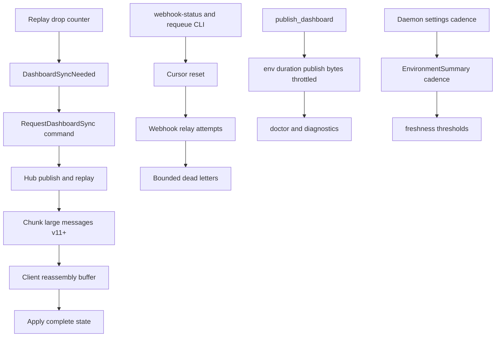

# Deferred Findings Scope Follow-Up - Plan

## Goal Capsule

- **Objective:** Operators on large or flaky setups get complete dashboard state after reconnects, recoverable webhook delivery with visible lag, measurable per-environment pressure, and freshness cues that respect their configured poll cadence.
- **Means:** Add a versioned chunked snapshot transfer with a resync handshake, webhook requeue and delivery-status commands, publish-time pressure dimensions, and cadence-aware freshness thresholds (KTD1).
- **Authority:** The prior remediation plan `docs/plans/2026-09-09-1136-fix-findings-active-records-plan.md` defines the deferred scope; FINDINGS.md preferred options constrain the approach; CONTEXT.md, ADRs, and `docs/agents/git-workflow.md` constrain how it lands; this plan constrains unit order and done signals.
- **Stop conditions:** Stop after U1 through U5 land with tests, `bun run check` exits 0, and the ALT-001 worker decision carries explicit adoption criteria instead of a build.
- **Execution profile:** Code change across `crates/daku-protocol`, `crates/daku-core`, `crates/daku-client`, `crates/daku-daemon`, and `src`; additive protocol version 11 with a version-gated fallback; additive SQLite columns and tables only; trunk-based landing on `main` with no pull requests per repo workflow.
- **Tail ownership:** Land directly on `main` with local verification; no PR body and no CI babysit apply in this repo.

---

## Product Contract

### Summary

This plan finishes the five deferred items from the prior remediation run without changing product scope.
Large dashboard state crosses the wire as versioned chunks that old clients never see.
A client that missed replay asks for a full resync instead of staying stale.
Webhook dead letters become inspectable and requeueable from the CLI, with lag and counts in doctor.
Each tick records per-environment duration, publish bytes, and throttled-signal pressure for doctor and diagnostics.
Freshness derives from the daemon's effective cadence while keeping current default behavior.
The dedicated webhook worker stays unbuilt behind explicit adoption criteria fed by the new telemetry.

### Problem Frame

The prior run made replay non-blocking, oversize cache entries droppable, webhook delivery retrying, tick counts visible, and trends gap-aware.
What remains is the complete form of each: chunks instead of drops for large state, operator recovery instead of dead-letter inspection by SQL, dimensions instead of single counters, and cadence-derived thresholds instead of fixed ones.
Each item is independently shippable and ordered so the protocol change lands before its consumers.

### Requirements

#### Chunked snapshot transfer

- R1. Sample, rollup, and snapshot payloads larger than the chunk budget cross the wire as sequenced chunks that the client reassembles into one state update (REL-003).
- R2. Version mismatches keep the established exact-match rejection with a clear version message; the desktop and daemon ship version-locked, so no dual-version wire path is needed (REL-003).

#### Resync handshake

- R3. A client whose replay dropped messages learns about it and can request a full chunked resync that converges to complete state (REL-003).

#### Webhook operations

- R4. Operators list dead letters, see per-environment lag and dead-letter counts in doctor, and requeue dead letters for redelivery without editing the database (REL-004, FEAT-001).

#### Pressure telemetry

- R5. Each tick records per-environment duration, serialized publish bytes, and throttled-signal counts with bounded retention, visible in doctor and diagnostics without secrets (FEAT-004, ARC-002, IMP-001).
- R6. The dedicated outbox worker is adopted only when measured delivery failure meets explicit criteria; until then the hardened relay stays canonical (ALT-001).

#### Cadence-aware freshness

- R7. Freshness stale and critical thresholds derive from the daemon's effective poll cadence with product-minimum floors that preserve current default behavior (UX-003).

### Scope Boundaries

- In scope: chunk envelope and reassembly, resync request and status, webhook list and requeue CLI plus doctor delivery fields, tick and per-environment dimensions, cadence field and derived thresholds, worker adoption criteria.
- Out of scope: plugin platform system, hosted queue or external forwarder, payload signing, multi-user webhook administration, scheduler replacement, per-signal deadline plumbing inside probes.
- Deferred to follow-up work: the ALT-001 outbox worker itself until the R6 criteria trip; exact chunk-size tuning beyond the initial 256 KiB budget from measured payloads.

### Outstanding Questions

- Blocking: none. The plan proceeds on FINDINGS.md preferred options and the prior plan's KTDs.
- Deferred: supported environment count for chunk sizing, which stays at the conservative budget until FEAT-004 data says otherwise.

---

## Planning Contract

### Key Technical Decisions

- KTD1. Land in dependency order: chunk transfer, then resync handshake, then webhook operations, then telemetry dimensions, then freshness.
- KTD2. Chunk at send time in the Hub for the three large variants only, with an explicit chunk envelope carrying transfer id, index, and count; the cache keeps whole messages and the client reassembles before applying.
- KTD3. Bump the protocol to 11 with chunk variants and keep the exact-match hello contract: mismatched clients are rejected with a clear message and the version-locked pair upgrades together, so no per-connection version state is needed.
- KTD4. Route the resync request as a new `Command` intercepted by the serve loop before backend dispatch, since the Hub owns replay state and backends do not.
- KTD5. Implement webhook requeue as cursor reset to the oldest dead-letter boundary plus dead-letter deletion, so redelivery reuses the existing relay path instead of a second sender.
- KTD6. Derive throttle pressure at publish time by scanning persisted snapshot payloads for the throttled flag, avoiding probe-interface plumbing.
- KTD7. Extend `tick_stats` with additive nullable columns and add one bounded per-environment table, following the existing `ALTER TABLE` additive pattern.
- KTD8. Carry effective cadence as an additive optional summary field populated from the collector's settings input, with client fallback to current constants when absent.
- KTD9. Keep the hardened relay canonical; the worker decision reads dead-letter growth and lag from the new doctor fields against explicit numeric criteria.

### High-Level Technical Design

### Assumptions

- A 256 KiB serialized chunk budget fits comfortably inside the 48 MiB wire cap with headroom for framing.
- Protocol 10 clients in the field are local and few; legacy fallback keeps them working without resync benefits.
- Health events needed for requeue redelivery usually survive inside retention; when pruned, requeue reports what could not redeliver.
- Default poll cadence stays 120 s; the freshness floors preserve its current labels exactly.
- No operator webhook usage evidence exists yet, so the worker stays a gated decision.

### Sequencing

U1 chunks before U2 resync, since the handshake replays through chunks. U3 webhook operations build on the existing relay and dead-letter tables. U4 dimensions build on the tick-stats pattern and feed the ALT-001 criteria. U5 freshness builds on the summary path U1 touches but is otherwise independent and may land in parallel with U3 once U1 merges.

---

## Implementation Units

### U1. Chunked snapshot transfer

**Goal:** Large dashboard messages cross the wire as versioned chunks.
**Requirements:** R1, R2.
**Dependencies:** none.
**Files:** `crates/daku-protocol/src/protocol.rs`, `crates/daku-core/src/server.rs`, `crates/daku-client/src/client.rs`, `src/dashboard_state.rs`; tests in protocol round-trip, server hub, client forward, and dashboard apply modules.
**Approach:** Add chunk envelope variants for samples, rollups, and snapshots with transfer id, index, and count plus a 256 KiB serialized budget. Chunk at Hub send time for both live and replay paths; keep whole messages in the cache. Bump protocol to 11 under the existing exact-match hello contract, so no per-connection version state exists. The client reassembles chunks per transfer in its reader thread and forwards only complete messages, discarding stale transfers by id. Execution note: add the wire round-trip test first, then the Hub chunking.
**Patterns to follow:** Existing `dashboard_cache_key` ordering; hello version negotiation in `crates/daku-client/src/client.rs`; non-blocking `try_send` delivery.
**Test scenarios:**
- A rollup payload over budget arrives as sequenced chunks and applies as one complete point set.
- Interleaved transfers for two environments assemble independently without cross-talk.
- A mismatched hello is rejected with a clear version message naming both versions.
- A missing middle chunk never applies partial state; the next full publish converges.
- Serialized chunks stay under the budget in a property test.
**Verification:** Chunk round-trip, version-gate, reassembly, convergence, and budget tests pass.

### U2. Resync handshake and drop visibility

**Goal:** A client that missed state can ask for it and converge.
**Requirements:** R3.
**Dependencies:** U1.
**Files:** `crates/daku-protocol/src/protocol.rs`, `crates/daku-core/src/server.rs`, `crates/daku-client/src/client.rs`, `src/dashboard_state.rs` loading state.
**Approach:** Add a small sync-needed notification carrying the replay drop count, sent after a lossy replay to version 11 and above clients. Add a resync request command intercepted by the serve loop before backend dispatch, triggering a full-cache chunked replay to the requesting connection. The client auto-requests one resync per connection; dashboard state records the drop count and surfaces it in the export text. Keep the path connection-scoped so one slow client never disturbs others.
**Patterns to follow:** Serve-loop connection handling; Hub drop counters; client loading-state conventions.
**Test scenarios:**
- A bounded-queue replay that drops sends sync-needed with the drop count.
- A resync request replays the full cache as chunks that reassemble to current state.
- Mismatched clients are rejected before subscribing, so sync-needed only exists on version 11 connections.
- Two connections resync independently.
**Verification:** Drop-notification, resync-convergence, version-gate, and isolation tests pass.

### U3. Webhook delivery operations

**Goal:** Operators inspect and recover webhook delivery without SQL.
**Requirements:** R4.
**Dependencies:** none.
**Files:** `crates/daku-core/src/persistence.rs`, `crates/daku-core/src/webhook.rs`, `crates/daku-core/src/collector.rs`, `crates/daku-daemon/src/main.rs`; CLI, doctor, and persistence tests.
**Approach:** Add dead-letter listing and a requeue operation that resets the environment cursor to the oldest dead-letter boundary and deletes those dead letters, so the existing relay reposts surviving events on the next tick. Add `webhook-status` and `webhook-requeue --env ID` CLI commands following the existing hand-rolled argument style. Extend the doctor report and printout with per-environment lag and dead-letter counts, reading cursors and tables read-only. Report unrecoverable pruned events instead of silently skipping them.
**Patterns to follow:** Existing CLI command dispatch in `crates/daku-daemon/src/main.rs`; read-only doctor posture; bounded dead-letter retention.
**Test scenarios:**
- Failed posts appear in the dead-letter listing with environment, timestamp, kind, and error.
- Requeue resets the cursor and the next relay tick reposts surviving events.
- Requeue past pruned events reports what could not redeliver.
- Doctor shows lag and dead-letter counts with no secrets.
- CLI argument errors name the missing flag without a stack trace.
**Verification:** Listing, requeue-redelivery, prune-report, doctor-output, and CLI-parse tests pass.

### U4. Pressure dimensions and worker decision

**Goal:** Measure per-environment pressure and settle the worker question on evidence.
**Requirements:** R5, R6.
**Dependencies:** U3.
**Files:** `crates/daku-core/src/persistence.rs`, `crates/daku-core/src/collector.rs`, `crates/daku-core/src/health.rs`, `crates/daku-daemon/src/main.rs`, `README.md` (webhook section: worker-adoption criteria).
**Approach:** Time each per-environment group in the collector loop and record it in a new bounded per-environment table. Sum serialized publish bytes and count throttled-flag payloads inside `publish_dashboard` and record them on the tick row via additive columns. Surface per-environment slow groups, publish bytes, throttle counts, and webhook lag in doctor and diagnostics with age and count bounds. Record numeric worker-adoption criteria (sustained dead-letter growth plus lag across releases) in the operator docs; build no worker. Execution note: cover the additive migration from a pre-existing tick-stats table before changing writers.
**Patterns to follow:** Existing tick-stats bounded retention and `ALTER TABLE` additive pattern; read-only doctor posture.
**Test scenarios:**
- A slow environment group records its duration without changing snapshot semantics.
- A tick with throttled payloads records the count.
- Publish bytes reflect serialized output within tolerance.
- Pre-existing tick-stats tables migrate additively with old rows readable.
- Doctor renders the new dimensions with absent data reading cleanly.
**Verification:** Timing, throttle-count, byte, migration, absent-data, and no-secret tests pass.

### U5. Cadence-derived freshness

**Goal:** Freshness cues follow configured cadence without changing default labels.
**Requirements:** R7.
**Dependencies:** U1.
**Files:** `crates/daku-protocol/src/protocol.rs`, `crates/daku-core/src/health.rs`, `crates/daku-core/src/collector.rs`, `src/dashboard_state.rs`.
**Approach:** Add an additive optional effective-cadence field to the environment summary, populated from the collector settings input at publish time with a 120 s fallback. Derive stale as the maximum of 300 s and two-and-a-half cadences, and critical as the maximum of 3600 s and thirty cadences, preserving every current default label exactly. Keep client fallback to constants when the field is absent. Update the freshness tests to cover 30, 120, and 600 s cadences.
**Patterns to follow:** Existing additive optional protocol fields; dashboard freshness label tests.
**Test scenarios:**
- At 120 s cadence every current label and threshold is byte-identical.
- At 600 s cadence a 400 s old observation reads fresh.
- At 30 s cadence the 300 s floor still applies.
- Absent cadence falls back to current constants.
**Verification:** Cadence unit tests and label-parity tests pass.

---

## Verification Contract

| Gate | Command | Applies to |
|---|---|---|
| Format and metadata | `git diff --check`, `cargo fmt --all --check` | all units |
| Rust tests | `cargo test --workspace --offline` during development, full `bun run check` before landing | U1 through U5 |
| Lints | `cargo clippy --workspace --all-targets -- -D warnings` | all code units |
| Type and lint | `bun run typecheck`, `bun run lint` | U1, U2, U5 desktop changes |
| Full gate | `bun run check` exits 0 before committing to `main` | all units at landing |
| Migration | Pre-existing table upgrade test plus old-row readability | U4 |
| Wire compat | Mismatched hello is rejected with named versions; version 11 round-trips chunks | U1, U2 |

---

## Definition of Done

- Global: every requirement has a landed change or an explicit deferral with reason; `bun run check` exits 0; no `#[allow]` added to pass clippy without a comment; POS-001 constant-time handshake, POS-002 no-echo validation, and POS-003 append-only migrations hold.
- U1: oversize payloads never cross the wire as whole messages; mismatched clients get a clear rejection.
- U2: lossy replay is signaled and a resync request converges to complete state.
- U3: dead letters are listable and requeueable from the CLI with doctor visibility and no secrets.
- U4: per-environment durations, publish bytes, and throttle counts appear in doctor with bounded retention; worker criteria documented.
- U5: default freshness labels byte-identical; off-default cadences derive correctly.
- Cleanup: abandoned-attempt code removed; mismatched-version rejection still names both versions.

---

## Appendix

### Sources and research

- Prior plan `docs/plans/2026-09-09-1136-fix-findings-active-records-plan.md` and its deferred scope: REL-003 chunk protocol, FEAT-001 requeue and status, FEAT-004 dimensions, UX-003 cadence, ALT-001 worker gate.
- Code truth in `crates/daku-protocol/src/protocol.rs` (`PROTOCOL_VERSION` 10, `ClientMessage`, `Command`, `ServerMessage`, 48 MiB cap), `crates/daku-core/src/server.rs` (Hub cache, `SUBSCRIBER_QUEUE_BOUND`, non-blocking replay), `crates/daku-client/src/client.rs` (dashboard variant forwarding), `crates/daku-core/src/webhook.rs` (retry, dead letters, cap 500), `crates/daku-core/src/persistence.rs` (webhook tables, tick stats with `env_count`), `crates/daku-core/src/collector.rs` (`poll_interval_secs` floor 30, doctor report), `crates/daku-daemon/src/main.rs` (hand-rolled CLI, doctor printout), `crates/daku-core/src/health.rs` (summary construction), `src/dashboard_state.rs` (freshness constants 300 and 3600, gap-aware sparklines).
- External research: none. Local patterns are strong and FINDINGS.md preferred options already fix the approach.

### Risks

- Protocol version bump splits client behavior; mitigate with hello gating and legacy fallback tests.
- Resync interception in the serve loop touches connection handling; mitigate with connection-scoped tests.
- Requeue past retention cannot redeliver; mitigate by reporting the gap explicitly.
- Cadence derivation changes operator-visible cues; mitigate with byte-identical default labels.
