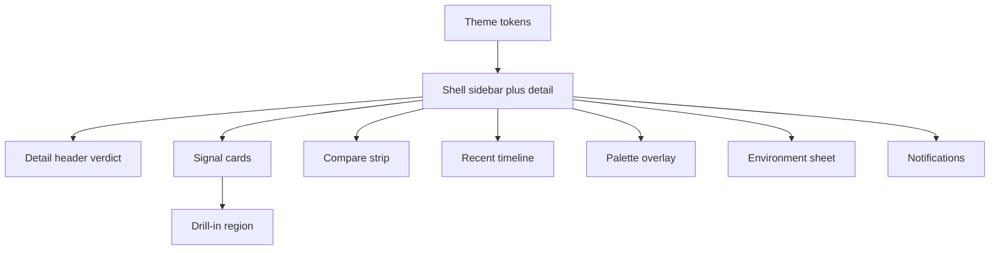

# Application Visual Overhaul - Plan

## Goal Capsule

- **Objective:** Operators read Environment health faster in the native macOS console with a calmer visual language that keeps every current workflow intact.
- **Means:** Rework theme tokens, type and spacing, Signal cards with drill-in, sidebar with compare strip and timeline, plus palette, sheet, and notification polish in place (KTD1).
- **Authority:** CONTEXT.md domain terms, docs/spec/v1.md product shape, ADR-0001 native GPUI with Rust daemon, ADR-0005 sidebar plus detail, ADR-0008 gpui-component shell, and docs/agents/git-workflow.md trunk landing govern the work. This plan governs unit order and done signals.
- **Stop conditions:** Stop after U1 through U6 land on main with tests and `bun run check` exits 0.
- **Execution profile:** Code change in `src/` only. No protocol, daemon, storage, or packaging change. Additive theme module plus in-place render edits. Trunk-based landing on `main`.
- **Tail ownership:** Land directly on `main` with local verification. No PR body and no CI babysit apply in this repo.

---

## Product Contract

### Summary

This plan overhauls the look and feel of the desktop console without moving its structure. Health, Signal cards, drill-in, compare strip, timeline, palette, sheet, and notifications stay where operators expect them. Color, type, spacing, density, focus, and motion become consistent across light and dark mode.

### Problem Frame

The console grew feature by feature. Health dots, Signal cards, drill-in rows, compare strip, timeline, palette, and sheets each read well alone. Together they use mixed radii, mixed text sizes, mixed dividers, and uneven density. Light and dark mode drift apart. Focus and reduced-motion behavior is implicit. A full visual pass is now cheaper than another round of local fixes.

### Requirements

**Visual foundation**

- R1. One token set drives layout spacing and sidebar width in both system modes. Color, radius, type, and shadow stay on the installed component theme, which is the single owner for both modes.
- R2. The component text scale applies consistently across sidebar, detail, cards, and sheets. No second type system is introduced.
- R3. Light and dark mode keep the same hierarchy and meet WCAG AA for body text.

**Layout and density**

- R4. The home screen keeps sidebar plus Environment detail with Signal cards, compare strip, drill-in, and Recent timeline in their current positions.
- R5. Signal cards show state, one-line summary, and diagnostic detail with consistent density and no empty tiles.
- R6. Compare strip and timeline stay compact and scannable for three or more Environments.

**Interaction and access**

- R7. Keyboard paths keep working: ⌘R reload, ⌘1-9 switching, ⌘⇧C copy, ⌘⇧E export, ⌘K palette, plus palette mute and switch rows.
- R8. Focus is always visible by keyboard. Reduced motion collapses animation to instant.
- R9. Loading, empty, and error states exist for detail, drill-in, timeline, palette, and sheet.

**Copy and safety**

- R10. Visible strings use plain functional wording with the CONTEXT.md terms Environment, Signal, Signal card, Environment detail, Compare strip, and Drill-in.
- R11. No daemon, protocol, storage, credential, polling, notification-rule, or packaging behavior changes in this plan.

### Success Criteria

- An operator names the selected Environment and its rolled-up health within one glance in fixture mode.
- A reviewer sees one radius family, one accent use, and one text scale across five consecutive screens.
- `bun run check` exits 0 and fixture review in both modes shows no white-on-white control and no clipped focus ring.

### Scope Boundaries

- In scope: theme tokens, shell layout styling, sidebar, detail header, Signal cards, drill-in, compare strip, timeline, palette overlay, Environment sheet, notification banners and menus, copy wording, fixture review.
- Out of scope: new Signals, threshold logic, daemon polling, protocol versions, SQLite schema, auth and Keychain handling, Sparkle and Homebrew packaging, matrix view, second Platform seam.
- Deferred to follow-up work: menu-bar icon redraw, Dock badge shape change, sound design, onboarding tour, saved views.

---

## Planning Contract

### Design read and dials

Reading this as: native operator console for a platform owner, with a calm trust-first language, leaning toward Apple HIG plus the installed gpui-component shell.

- `DESIGN_VARIANCE: 4`
- `MOTION_INTENSITY: 3`
- `VISUAL_DENSITY: 6`

Variance stays low so health reads the same every launch. Motion stays low so polling updates never distract. Density sits above marketing level because Signal detail is the product.

The design-taste-frontend web defaults do not apply here. This is a dense desktop product surface, which that skill places out of scope. The plan keeps its portable discipline: one accent, one radius family, real hierarchy before decoration, full interactive states, contrast checks, copy audit, and one theme across the window. It does not adopt Tailwind, Motion, Next.js, shadcn, or web glass and marquee devices. One system per window: gpui-component plus Apple HIG.

Redesign mode is overhaul. Visual language is new. Information architecture, Signal content, keyboard map, and copy voice are preserved.

### Key Technical Decisions

- KTD1. Restyle in place on the gpui-component shell. Rejected full shell replacement: it would churn focus, menu, and window behavior for no operator gain.
- KTD2. Own a small theme module that maps to `ActiveTheme`. Rejected scattered color literals: they caused the current light and dark drift.
- KTD3. Use dividers and spacing for hierarchy first and reserve elevated cards for drill-in detail. Rejected uniform card boxes: they add noise at density 6.
- KTD4. Keep motion to opacity and transform with instant reduced-motion fallback. Rejected spring and scroll-hijack motion: it fights a monitoring surface.
- KTD5. Lock one accent for health-adjacent action and keep health color semantics fixed. Rejected per-section accents: they confuse degraded and down states.
- KTD6. Keep all rendering in GPUI. Rejected web preview or image-generation placeholders: the fixture path already gives real pixels.

### High-Level Technical Design

The approach is directional guidance, not implementation specification.

Token change flows one way into shell render code. Card and drill-in share density rules. Palette, sheet, and notifications share focus and state rules. No daemon or protocol node is touched.

### Amendment (implementation, 2026-09-09)

Execution evidence narrowed two requirements. Render code already reads color, radius, type, and shadow from the installed component theme at every call site, so a second token set for those roles would duplicate the system instead of owning it. `src/theme.rs` therefore owns layout spacing and sidebar width only, and no new type scale is introduced. Sidebar width stays pinned at 220.0. The Definition of Done rows below are adjusted to match. Nothing else in this plan changes.

### Assumptions

- Inferred bets stay labeled here because this run had no synchronous confirmation.
- The installed gpui-component revision stays fixed. No dependency bump is planned.
- Health semantics stay healthy, degraded, and down with muted excluded from ambient surfaces.
- Current shortcuts, mute durations, quiet-hours presets, and weekly digest toggle stay as defined.
- `DAKU_UI_FIXTURE=1` remains the visual review path without ServiceNow calls.
- Sidebar width near 220 px remains acceptable; change comes from spacing and type, not a new nav model.

### Sequencing

U1 lands first and every later unit builds on its tokens. U2 follows with type and spacing. U3 and U4 recompose detail surfaces in parallel order with U3 before U4. U5 polishes overlay surfaces. U6 closes with motion, focus, contrast, and copy verification.

---

## Implementation Units

### U1. Theme tokens with light and dark parity

- **Goal:** One token source removes color drift between modes.
- **Requirements:** R1, R3.
- **Dependencies:** None.
- **Files:** `src/theme.rs`, `src/app.rs`, `src/lib.rs`.
- **Approach:**
  1. Add a theme module that exposes surface, text, accent, health, divider, radius, and shadow values for both modes.
  2. Map the module onto the installed `ActiveTheme` values used by the shell.
  3. Replace literals in shell render paths with token reads.
- **Patterns to follow:** `src/app.rs` shell composition with `gpui-component` sidebar and `TitleBar`; `CONTEXT.md` health vocabulary.
- **Test scenarios:**
  - Token lookup returns a light value and a dark value for every surface role.
  - Fixture launch in light mode shows sidebar, detail, and cards with body contrast that meets AA.
  - Fixture launch in dark mode keeps the same hierarchy with no pure black field and no white-on-white control.
- **Verification:** Review fixture screens in both modes. Confirm no literal color remains in touched render code.

### U2. Type scale and spacing rhythm

- **Goal:** Text and spacing read as one system across the window.
- **Requirements:** R2, R4.
- **Dependencies:** U1.
- **Files:** `src/app.rs`, `src/theme.rs`.
- **Approach:**
  1. Fix display, title, body, caption, and mono roles with sizes, weights, and line heights.
  2. Apply one spacing rhythm to sidebar rows, detail header, card grid, and section gaps.
  3. Cap detail headline length so verdict lines wrap predictably.
- **Patterns to follow:** Existing `v_flex` and `h_flex` composition in `src/app.rs`; ADR-0005 sidebar plus detail positions.
- **Test scenarios:**
  - Sidebar row, header title, card title, and caption each use the assigned role in fixture review.
  - Long Environment label plus long verdict text wraps without pushing primary actions out of view.
  - `cargo test --workspace` passes for touched pure helpers.
- **Verification:** Screenshot comparison of sidebar and detail in both modes shows one scale and one rhythm.

### U3. Signal cards with drill-in recomposition

- **Goal:** Cards scan fast and drill-in detail stays attached to its card.
- **Requirements:** R4, R5, R9.
- **Dependencies:** U1, U2.
- **Files:** `src/app.rs`, `src/dashboard_state.rs`.
- **Approach:**
  1. Normalize card grid density, divider use, and selected-card treatment.
  2. Keep drill-in directly under the cards with a stable header and close path.
  3. Add loading, empty, and error compositions for card detail without new behavior.
- **Patterns to follow:** `src/dashboard_state.rs` card and drill-in state; `signal_label` and voting-signal helpers.
- **Test scenarios:**
  - Selecting each voting Signal opens its drill-in with the matching rows in fixture mode.
  - Deselecting closes drill-in and returns focus to the card grid.
  - Empty drill-in shows a composed empty state with a next action.
  - Skipped tick leaves streak display unchanged per existing semantics.
- **Verification:** Keyboard walk through every card in fixture mode shows one focus ring and no layout jump.

### U4. Sidebar with compare strip and timeline clarity

- **Goal:** Navigation, cross-Environment comparison, and recent history stay compact.
- **Requirements:** R4, R6, R9.
- **Dependencies:** U1, U2.
- **Files:** `src/app.rs`, `src/dashboard_state.rs`.
- **Approach:**
  1. Normalize health dot, label, mute mark, and selected-row treatment in the sidebar.
  2. Tighten compare strip to build, drift, and last-clone with one divider rule.
  3. Clarify Recent timeline rows, filter input, and annotation entry without changing event semantics.
- **Patterns to follow:** Sidebar menu construction in `src/app.rs`; health event and annotation handling in `src/dashboard_state.rs`.
- **Test scenarios:**
  - Muted Environment shows its mute mark and stays out of ambient badge counts.
  - Compare strip aligns across three Environments with expected drift noted as counts.
  - Timeline filter narrows rows and empty filter shows a composed empty state.
  - Annotation save keeps one operator note on the selected health event.
- **Verification:** Fixture review with three Environments shows aligned strip and scannable timeline.

### U5. Palette plus sheet plus notification polish

- **Goal:** Overlays and interruptions feel part of the same console.
- **Requirements:** R7, R9, R10.
- **Dependencies:** U1, U2.
- **Files:** `src/app.rs`, `src/palette.rs`, `src/env_sheet.rs`, `src/notifications.rs`.
- **Approach:**
  1. Restyle palette rows, hints, and empty query state while keeping entry order and filter behavior.
  2. Align Environment sheet labels above inputs with helper and error placement kept consistent.
  3. Unify notification banner grouping, menu switches, and digest toggle wording.
- **Patterns to follow:** `src/palette.rs` pure entry construction and filtering; `src/env_sheet.rs` validation and save path; `src/notifications.rs` grouped banner body.
- **Test scenarios:**
  - Palette filter matches title, hint, and identifier case-insensitively and empty query returns ordered rows.
  - Palette with no selection hides selection-scoped mute and open rows.
  - Sheet rejects malformed URL and bad threshold input before any write.
  - Notification banner groups every voting Signal instead of only the worst line.
- **Verification:** `cargo test -p daku` covers palette and sheet helpers. Manual palette, sheet, and banner review passes in both modes.

### U6. Motion restraint with access and copy pass

- **Goal:** The overhaul ships calm, keyboard-complete, and plainly worded.
- **Requirements:** R3, R8, R10, R11.
- **Dependencies:** U1, U2, U3, U4, U5.
- **Files:** `src/app.rs`, `src/palette.rs`, `src/env_sheet.rs`, `src/notifications.rs`.
- **Approach:**
  1. Limit animation to opacity and transform and collapse to instant under reduced motion.
  2. Audit focus rings, contrast, touch targets, and sidebar plus card keyboard order.
  3. Rewrite visible strings against CONTEXT.md terms and remove filler verbs and invented precision.
- **Patterns to follow:** Apple HIG focus and contrast expectations; repo copy voice in `docs/spec/v1.md`.
- **Test scenarios:**
  - Reduced-motion setting removes palette, banner, and drill-in transitions without losing state.
  - Full keyboard pass reaches sidebar, cards, drill-in, timeline, palette, sheet, and menus with a visible ring at each stop.
  - Copy audit finds no placeholder names, no invented percentages, and no em-dash in new strings.
  - No file in this unit touches daemon, protocol, storage, or packaging paths.
- **Verification:** Accessibility pass plus fixture review in both modes. `bun run check` exits 0.

---

## Verification Contract

| Command | Scope | Signal |
|---|---|---|
| `bun run check` | fmt plus clippy plus cargo test plus oxlint plus tsc coverage | exit 0, required before landing |
| `cargo fmt --all --check` | formatting | exit 0 |
| `cargo clippy --workspace --all-targets -- -D warnings` | lints | exit 0 |
| `cargo test --workspace` | unit behavior including palette and dashboard state | exit 0 |
| `oxlint -c oxlint.config.ts .` | JS and TS lint | exit 0 |
| `bun ./scripts/check-tsconfig-coverage.ts && tsc --noEmit` | type coverage | exit 0 |
| `DAKU_UI_FIXTURE=1 bun run dev` | fixture review in light and dark mode | readable health, cards, drill-in, strip, timeline, palette, sheet |

---

## Definition of Done

- Global: U1 through U6 land on `main`. `bun run check` exits 0. Fixture review passes in light and dark mode. No protocol, daemon, storage, credential, or packaging diff remains. Abandoned-attempt and experimental code from approaches that did not land is removed, not left in the diff.
- U1: Token module owns sidebar width and spacing scale with both modes riding the component theme. No touched render path introduces a second color, radius, or type system.
- U2: One spacing rhythm covers sidebar, detail, cards, and sheets gaps and padding. Type roles stay on the component scale.
- U3: Every Signal card opens correct drill-in detail with loading, empty, and error compositions.
- U4: Sidebar, compare strip, and timeline align and filter cleanly for three or more Environments.
- U5: Palette, sheet, and notifications keep behavior and gain consistent focus and state design.
- U6: Reduced motion, keyboard order, contrast, and copy audit all pass and review notes are closed.

---

## Appendix

- Sources: `src/app.rs`, `src/dashboard_state.rs`, `src/palette.rs`, `src/env_sheet.rs`, `src/notifications.rs`, `src/lib.rs`, `CONTEXT.md`, `docs/spec/v1.md`, `docs/adr/0001-native-gpui-rust-daemon.md`, `docs/adr/0005-environments-overview-layout.md`, `docs/adr/0008-gpui-component-shell.md`.
- Design-taste-frontend applied as discipline only. Web stack, marquee, glass, kinetic type, and generated imagery were held out because the target is a native monitoring surface.
