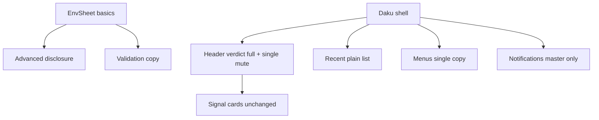

# Simplify UI/UX and Onboarding - Plan

## Goal Capsule

- **Objective:** Operators add the first Environment in under a minute and read health at a glance without learning thresholds, drift tuning, or secondary windows.
- **Means:** Cut the add/edit sheet to basics with advanced hidden, remove detached windows plus timeline search plus note editing plus verdict collapsing, consolidate copy/export actions, and simplify mute plus notifications to on/off defaults (KTD1-KTD6).
- **Authority:** CONTEXT.md domain terms, docs/spec/v1.md product shape, ADR-0001 native GPUI with Rust daemon, ADR-0005 sidebar plus detail, ADR-0008 gpui-component shell, and docs/agents/git-workflow.md trunk landing govern the work. This plan governs unit order and done signals.
- **Stop conditions:** Stop after U1 through U5 land on main with tests and `bun run check` exits 0.
- **Execution profile:** Code change in `src/` only (app shell plus sheet plus menus). No protocol, daemon, storage schema, polling, credential handling, or packaging change. In-place render edits plus dead-action removal. Trunk-based landing on `main`.
- **Tail ownership:** Land directly on `main` with local verification. No PR body and no CI babysit apply in this repo.

---

## Product Contract

### Summary

This plan makes daku simpler by asking less upfront and showing less chrome. Adding an Environment asks for name, URL, and Credential only. Thresholds, expected drift, and clone-source stay on defaults unless the Operator opens Advanced. The detail view shows one health verdict, one Mute toggle, Signal cards, compare strip, drill-in, and a plain Recent list. Secondary windows, timeline search, per-event notes, verdict collapsing, and duplicate copy/export entries go away.

### Problem Frame

Onboarding expects expert input: 17 threshold fields plus expected drift plus clone-source plus platform plus id plus auth plus secrets on one sheet. The main window carries parallel mechanisms for the same job: three copy/export actions, detached windows, timeline search, note editors, verdict expanders, per-Signal notify switches, quiet-hours custom windows, weekly digest, and 1h/4h/24h mutes. Each reads well alone. Together they raise the learning floor and hide the core job: is this Environment healthy.

### Requirements

**Onboarding asks less**

- R1. Add Environment asks for label, URL, auth method, and Credential secrets only. Platform defaults to ServiceNow. Id auto-derives from label (editable in Advanced).
- R2. Thresholds, expected drift, and clone-source live behind one Advanced disclosure, defaulting to current defaults. Empty still means default. Sheet validates basics before Advanced.
- R3. Plain functional errors name the field and the fix. No threshold jargon on the basic path.

**Detail shows less chrome**

- R4. Detail header shows the full health verdict always. No +N more expander.
- R5. One Mute/Unmute toggle per Environment (until unmuted). No 1h/4h/24h picker in header.
- R6. No detached single-Environment window and no Detach menu entry.
- R7. Recent timeline is a plain list. No search input and no per-event note editor. Existing annotations still render when present.

**One way to do secondary jobs**

- R8. One Copy summary action covers copy needs. Copy Agent Context and Export Snapshot entries are removed from menus and keybindings stay free of duplicates.
- R9. Notifications menu holds the master switch plus quiet-hours presets plus weekly digest only. Per-Signal notify switches are removed from UI (stored settings default to on and remain read-compatible).
- R10. Keyboard stays: ⌘R reload, ⌘1-9 switching, ⌘⇧C copy, ⌘K palette. No second binding for a removed action.

**Copy and safety**

- R11. Visible strings use plain functional wording with CONTEXT.md terms Environment, Signal, Signal card, Environment detail, Compare strip, Drill-in, Credential, Operator.
- R12. No daemon, protocol, storage, credential-store, polling, threshold-evaluation, or packaging behavior change in this plan.

### Success Criteria

- A new Operator completes Add Environment with label plus URL plus Credential and never opens Advanced.
- A reviewer counts one verdict block, one mute control, one copy action, and no detached window in fixture mode.
- `bun run check` exits 0 and fixture review in both modes shows no white-on-white control and no clipped focus ring.

### Scope Boundaries

- In scope: `src/env_sheet.rs` sheet layout and validation copy, `src/app.rs` header/verdict/mute/timeline/notes/detached/palette wiring, `src/lib.rs` actions/menus/keybindings, `src/notifications.rs` menu surface, copy wording, fixture review.
- Out of scope: new Signals, threshold logic, daemon polling, protocol versions, SQLite schema, auth and Keychain handling, Sparkle and Homebrew packaging, matrix view, second Platform seam, sound design.
- Deferred to follow-up work: guided first-run tour, saved views, menu-bar icon redraw.

---

## Planning Contract

### Design read and dials

Reading this as: native operator console for a platform owner, with a calm trust-first language, leaning toward Apple HIG plus the installed gpui-component shell.

- `DESIGN_VARIANCE: 4`
- `MOTION_INTENSITY: 3`
- `VISUAL_DENSITY: 6`

Variance stays low so health reads the same every launch. Motion stays low so polling updates never distract. Density stays at product level because Signal detail is the product.

The design-taste-frontend web defaults do not apply here. This is a dense desktop product surface, which that skill places out of scope. The plan keeps its portable discipline: one accent, one radius family, real hierarchy before decoration, full interactive states, contrast checks, copy audit, and one theme across the window. It does not adopt Tailwind, Motion, Next.js, shadcn, or web glass and marquee devices. One system per window: gpui-component plus Apple HIG.

Redesign mode is overhaul. Structure is simplified. Information architecture keeps sidebar plus Environment detail. Signal content, threshold defaults, and daemon behavior are preserved.

### Key Technical Decisions

- KTD1. Simplify in place on the gpui-component shell. Rejected full shell replacement: it would churn focus, menu, and window behavior for no operator gain.
- KTD2. Hide advanced config behind disclosure, do not delete fields or settings keys. Rejected schema or protocol change: defaults already work and stored overrides must keep loading.
- KTD3. Delete detached-window, note-edit, timeline-search, and verdict-expand state from `Daku`. Rejected hiding via flags: dead state rots and keeps dictating render branches.
- KTD4. Consolidate to one Copy summary path. Rejected keeping all three with new labels: duplicate intents are the tell this plan removes.
- KTD5. Keep motion to opacity and transform with instant reduced-motion fallback. Rejected spring and scroll-hijack motion: it fights a monitoring surface.
- KTD6. Lock one accent for action and keep health color semantics fixed. Rejected per-section accents: they confuse degraded and down states.

### High-Level Technical Design

The approach is directional guidance, not implementation specification.

Sheet change flows into the same save path with the same RPC shape. Shell change removes state fields and their render branches. Cards, compare strip, drill-in, and daemon nodes are untouched.

### Units

**U1. Sheet asks basics first**

- Files: `src/env_sheet.rs`, plus sheet tests in `src/` or `crates/daku-core` where validation lives.
- Steps: move id derivation to auto from label with Advanced override; default platform ServiceNow; group the 17 threshold entities plus expected drift plus clone-source behind one Advanced disclosure defaulting collapsed; keep empty-means-default parsing unchanged; rewrite basic-path errors to name field plus fix; keep `build_config`, `validate_credential`, and save RPC shapes unchanged.
- Done: Add path shows label, URL, auth, secrets only; Advanced collapsed by default; existing overrides still load and save; `bun run check` green.

**U2. Header shows full verdict plus one mute**

- Files: `src/app.rs`, `src/theme.rs` if spacing shifts.
- Steps: remove `verdict_expanded` and always render all voting lines; replace `MUTE_OPTIONS` 1h/4h/24h picker with one Mute/Unmute toggle writing until-unmuted; drop Detach handling (`detached`, `DetachSelectedEnvironment`, pinned selection, tombstone branch) and its menu entry; keep ⌘R, ⌘1-9, ⌘⇧C, ⌘K.
- Done: no +N more toggle in fixture; one mute control; no detached window code path; `bun run check` green.

**U3. Timeline becomes a plain list**

- Files: `src/app.rs`.
- Steps: remove `timeline_filter` input entity and its filter branch; remove `note_target` plus `note_input` editor flow while still rendering any stored annotation text; keep event rows, health plus Signal merging, and empty state.
- Done: no search box and no note editor in fixture; stored notes still display; `bun run check` green.

**U4. One copy path and a smaller notifications menu**

- Files: `src/lib.rs`, `src/app.rs`, `src/notifications.rs`.
- Steps: keep `CopySummary` on ⌘⇧C, remove `CopyAgentContext` and `ExportSnapshot` menu entries and their duplicate handlers (keep underlying helpers only when tests need them); trim Notifications menu to master switch plus quiet-hours presets plus weekly digest; remove per-Signal `ToggleSignalNotify` rows from UI while keeping the stored key read-compatible defaulting to on.
- Done: one copy entry; no per-Signal switches in UI; keybindings unique; `bun run check` green.

**U5. Deslop, copy audit, and fixture pass**

- Files: `src/app.rs`, `src/env_sheet.rs`, `src/notifications.rs`, `src/palette.rs` as touched.
- Steps: apply deslop pass on the touched diff only: drop redundant comments, collapse nested branches with early returns, remove dead defensive checks on trusted paths, no `any` casts to bypass types; rewrite touched strings to plain functional wording per CONTEXT.md terms; run fixture in both modes for contrast, focus, loading, empty, and error states.
- Done: diff shows no unrelated churn; copy reads plain; `bun run check` exits 0.

### Dependencies

U1 first (sheet is the onboarding win). U2 and U3 after U1, in either order, both touch `src/app.rs` so land sequentially. U4 after U2. U5 last as the pass over the full diff.

### Verification

- `cargo fmt --all --check` plus `cargo clippy --workspace --all-targets -- -D warnings` plus `cargo test --workspace` plus oxlint plus `tsc --noEmit` via `bun run check` exits 0.
- Fixture review `DAKU_UI_FIXTURE=1` in light and dark: add sheet basics-only, full verdict, single mute, plain Recent list, one copy entry, master notifications.
- No protocol, daemon, storage, or packaging diff unless a test demands it.

### Definition of Done

- U1 shows basics only with Advanced collapsed and unchanged save shape.
- U2 shows the full verdict with one Mute toggle and no detached path.
- U3 shows a plain Recent list with no search and no note editor.
- U4 shows one copy action and master-only notifications UI with read-compatible settings.
- U5 deslop plus copy audit complete with no unrelated churn.
- `bun run check` exits 0.

### Risks

- Removing UI for stored settings confuses operators who set per-Signal switches: mitigate by keeping keys readable and defaulting absent to on, noted in release notes.
- Auto id from label collides: mitigate by keeping Advanced id editable with uniqueness validation unchanged.
- Single mute until-unmuted annoys timed-mute users: mitigate by documenting manual unmute beside the toggle; timed mutes return only on operator request.
