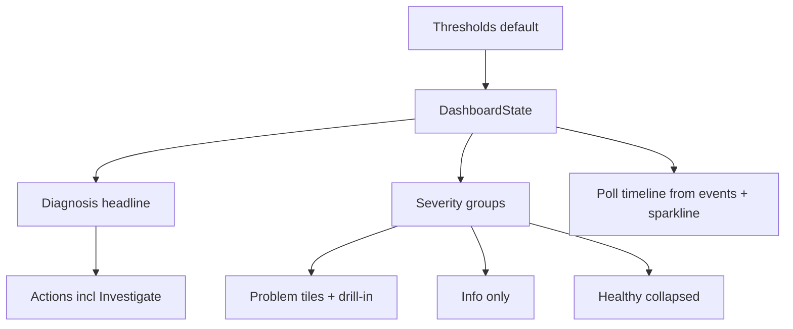

# Environment Detail Diagnosis-First Rework - Plan

## Goal Capsule

- **Objective:** Operators opening a degraded Environment see what is wrong, why it is likely wrong, and where to look next within one glance.
- **Means:** Compose the detail around a diagnosis headline from existing state, group tiles by severity with drill-ins, give numbers context, unify empty and time styles, add a legend, slim the single-group sidebar, reuse poll history as a timeline, and make a 10-second response degrade by default (KTD1-KTD10).
- **Authority:** CONTEXT.md domain terms, docs/spec/v1.md product shape, ADR-0001 native GPUI with Rust daemon, ADR-0005 sidebar plus detail, ADR-0008 gpui-component shell, and docs/agents/git-workflow.md trunk landing govern the work. This plan governs unit order and done signals.
- **Stop conditions:** Stop after U1 through U6 land on main with tests and `bun run check` exits 0.
- **Execution profile:** Render work in `src/` plus one daemon default in `crates/daku-protocol` with core evaluation tests. No protocol wire-shape change, no SQLite change, no polling change, no credential or packaging change. Trunk-based landing on `main`.
- **Tail ownership:** Land directly on `main` with local verification. No PR body and no CI babysit apply in this repo.

---

## Product Contract

### Summary

This plan reshapes the Environment detail screen around the diagnosis it already computes. The top names the degraded state, the suspect build, the probable cause, and the affected-signal count. Tiles group by severity with a drill-in on each problem. Numbers name what they measure. Empty states, time labels, and status encodings each use one style with a legend. The sidebar narrows when it holds one group, and the freed vertical space carries a poll timeline from already-collected samples.

### Problem Frame

The screen shows data but not what to do, and the most important information sits in the smallest text. The Environment name repeats three times, the verdict banner repeats the yellow tiles word for word, and the root cause hides in small grey type. Twelve uniform tiles give good and bad signals equal weight. A 10-second availability response shows green because the response-time ceiling defaults to off. Bare numbers name no subject, long identifiers clip without ellipsis, and empty states mix three styles and two cases while time labels mix four formats. Status dots and colors have no legend, one section speaks daemon jargon, a single sidebar group takes a seventh of the window, and two-thirds of the window sits empty while actions stay small and far from the problem.

### Requirements

**Diagnosis first**

- R1. The detail top shows one diagnosis headline when degraded: health state, degraded-since build when the clone/upgrade correlation fires, possible cause, and affected-signal count. When unreachable, the headline names reachability with no cause claim.
- R2. The banner stops repeating tile text. Tiles keep per-signal detail while the headline carries the synthesis. Headline synthesis repeats no tile summary verbatim; repeated labels for units, legend entries, and subjects are allowed.
- R3. The Environment name appears once in the header.

**Severity-grouped tiles**

- R4. Tiles group by severity in order: problems, info-only context, healthy collapsed behind one expand control. With zero problems the healthy group defaults expanded.
- R5. Each problem tile links to its drill-in through the existing open mechanism.

**Honest numbers and colors**

- R6. Availability response time degrades by default ceiling, so a 10-second response never renders healthy. The ceiling stays per-Environment tunable with off still available.
- R7. Tile numbers name what they measure: response time, average, and finding counts each carry their subject.

**One style per thing**

- R8. Long identifiers truncate with an ellipsis. The full build name sits in a tooltip and the filename renders once as a short label.
- R9. Empty states share one style and one case.
- R10. Time labels share one relative format across the detail.
- R11. A legend explains dots and colors on the detail.
- R12. The context-signal section reads "Info only".

**Layout and action**

- R13. The sidebar narrows when it holds a single group.
- R14. The vertical space carries a timeline of recent polls from already-collected samples and rollups. No new collection.
- R15. Problem-adjacent actions include Investigate, which opens the first degraded-or-down voting drill-in in signal order and names that signal as the lead example. Actions sit beside the diagnosis. Each drill-in surfaces the existing deep link and hint.

### Success Criteria

- An operator names the cause and the affected-signal count within one glance in fixture mode, and fixture unit tests assert the headline text.
- No headline string repeats a tile summary verbatim; repeated labels for units, legend entries, and subjects are allowed.
- A 10-second availability response renders degraded, and the legend decodes every dot and color shown.
- `bun run check` exits 0 with fixture review clean in both modes.

### Scope Boundaries

- In scope: detail header and verdict render, tile grouping and drill-in links, summary and hint copy, availability default ceiling plus evaluation tests, empty-state and time-label unification, legend, sidebar width rule, poll timeline from events and the availability sparkline, Investigate action, fixture review.
- Out of scope: new Signals, polling cadence, protocol wire shape, SQLite schema, auth and Keychain handling, per-Signal notification UI, Sparkle and Homebrew packaging, matrix view.
- Deferred to follow-up work: guided first-run tour, saved views, menu-bar icon redraw.

---

## Planning Contract

### Design read and dials

Reading this as: native operator console for a platform owner, with a calm trust-first language, leaning toward Apple HIG plus the installed gpui-component shell.

- `DESIGN_VARIANCE: 4`
- `MOTION_INTENSITY: 3`
- `VISUAL_DENSITY: 6`

The diagnosis headline is the one bold element; everything around it stays quiet. Structure encodes severity, copy speaks the operator's language, and motion stays at polling-update level with instant reduced-motion fallback.

The frontend-design web defaults do not apply here. This is a dense desktop product surface. The plan keeps its portable discipline: hierarchy before decoration, restraint with one memorable element, plain end-user verbs, structural devices that encode information, and empty states written as invitations to act. It does not adopt web type, web layout, or web motion devices. One system per window: gpui-component plus Apple HIG.

Redesign mode is overhaul of one screen. Information architecture, Signal content, keyboard map, and daemon behavior are preserved except the availability default ceiling.

### Key Technical Decisions

- KTD1. Compose the headline from `health_explain` plus `correlation_build` plus the degraded count already in state. The headline synthesizes (count plus cause clause plus lead-signal example) and never embeds full per-signal lines. Rejected new daemon plumbing: every input the headline needs already reaches the client.
- KTD2. Group tiles in the render layer over the existing card order. Rejected reordering `SIGNAL_IDS`: evaluation order feeds notifications and menus.
- KTD3. Drill-ins reuse the existing open-card and select-Environment mechanism. Rejected new navigation: one take-me-there primitive already exists.
- KTD4. Set the availability degraded default to 5000 ms in `Thresholds::default` with evaluation untouched. Rejected a UI-only tint override: color must follow state or the legend lies.
- KTD5. Carry number context in the summary and detail text layer with payload shapes unchanged. Rejected payload enrichment: copy belongs to the text layer.
- KTD6. Truncate with ellipsis plus the existing Tooltip component and render the build name once as a short label. Rejected new tooltip infrastructure: a tooltip already exists.
- KTD7. Unify on muted sentence-case empty states and one relative time format, updating the pinned tests that lock current strings. Rejected per-signal bespoke strings: they caused the drift.
- KTD8. Narrow the single-group sidebar through the theme width rule and build the timeline from health and signal events plus the availability sparkline. Rejected new collection: events, samples, and rollups already arrive.
- KTD9. Investigate opens the first degraded-or-down voting drill-in beside the diagnosis. Rejected linking out: the operator stays in the console.
- KTD10. Restyle the verdict block and the legend for AA contrast against status colors inside the warning hue family. Rejected a new accent: the one-accent lock holds.

### High-Level Technical Design

State stays the single source. Render composes headline, groups, timeline, and actions from it. The threshold default flows through existing evaluation into state.

### Assumptions

- A1. Availability degraded default is 5000 ms. A 10-second response clearly degrades, healthy probes answer well under 2 seconds, and the operator retunes per Environment.
- A2. Healthy tiles collapse by default behind one expand control.
- A3. Investigate opens the first degraded-or-down voting drill-in.
- A4. The timeline combines health and signal events (which include failed and unreachable transitions) with the availability response-time sparkline for reachable polls, rendered with gaps for missing periods. No new daemon collection.
- A5. The single time format extends the existing relative tiers consistently.
- A6. External research was skipped: local-only GPUI surface with strong local patterns and no external contract. No matching entries exist under `docs/solutions/`.

### Risks & Dependencies

- The new availability default flips previously healthy slow Environments to degraded, which also fires notifications for them. This is the requested behavior; it lands with a release-note line, `doctor` shows the effective ceiling, and it stays tunable per Environment.
- The sidebar width test pins 220. U5 updates the test with the new single-group rule.
- String changes touch pinned dashboard-state tests. U4 updates them with the unified wording.
- Accepted premise risk: no operator baseline observation backs the glance-failure claim, so success rests on the fixture tests plus review.
- Signal order is not causal priority: the first degraded-or-down drill-in may not be the true cause on multi-signal degradations.

### System-Wide Impact

- The threshold default changes daemon evaluation for every Environment without an explicit ceiling, including notifications and the menu-bar dot. No wire, schema, or polling change.

### Sources / Research

- `src/app.rs` detail render: header, verdict block, tile grids, compare strip, recent list, mute controls, palette overlay.
- `src/dashboard_state.rs`: `health_explain`, `correlation_build`, `summarize_value`, `card_hint`, `timeline`, `compare_rows`, `signal_url`, `age_phrase`.
- `crates/daku-protocol/src/environment.rs`: `Thresholds::default` with the response-time ceiling off.
- `crates/daku-core/src/availability.rs`: `apply_rtt_threshold` disables on `None`.
- `src/theme.rs`: pinned sidebar width and spacing scale.

---

## Implementation Units

### U1. Availability threshold default and colors

- **Goal:** A slow reachable Environment degrades instead of showing green.
- **Requirements:** R6.
- **Dependencies:** None.
- **Files:** `crates/daku-protocol/src/environment.rs`, `crates/daku-core/src/availability.rs`, `crates/daku-core/src/config.rs`, `src/env_sheet.rs`.
- **Approach:**
  1. Set the availability degraded default to 5000 ms per A1 with evaluation logic untouched.
  2. Encode three states for the availability ceiling only: empty field means the default, the literal `off` means never degrades (`Some(u64::MAX)`, mirroring the count fields), and a stored missing ceiling follows the default at evaluation via `unwrap_or`. Transaction and probe ceilings keep empty-means-off with their `None` defaults.
  3. Render `Some(u64::MAX)` as `off` in the sheet and the effective-values summary; a missing availability ceiling renders as the default with a default marker.
  4. Execution note: this is mostly threshold config plus evaluation proof; lead with the failing boundary test.
- **Patterns to follow:** Existing `apply_rtt_threshold` tests and the `Thresholds::default` doc comment naming each default.
- **Test scenarios:**
  - Default ceiling equals 5000 ms.
  - Reachable 10087 ms observation degrades with the ceiling in the error string.
  - Reachable 1200 ms observation stays healthy.
  - Observation exactly at the ceiling stays healthy.
  - Empty threshold field keeps the 5000 ms default while the literal `off` disables the check.
  - Legacy stored missing ceilings follow the new default at evaluation.
  - Stored explicit numeric ceilings survive the default change.
- **Verification:** New boundary tests pass, `doctor` shows the effective ceiling, and the card renders degraded for the slow case in fixture review.

### U2. Diagnosis headline and banner dedupe

- **Goal:** The detail top answers what is wrong and why in one block.
- **Requirements:** R1, R2, R3.
- **Dependencies:** U1.
- **Files:** `src/app.rs`, `src/dashboard_state.rs`.
- **Approach:**
  1. Compose the headline from the degraded count, the suspect build, and the cause per KTD1: count plus cause clause plus lead-signal example, never full per-signal lines.
  2. Remove the per-line verdict repetition so tiles own detail per R2.
  3. Render the Environment name once per R3. Unreachable renders reachability with no cause or build clause.
- **Patterns to follow:** Existing `health_explain` line shape and the correlation sentence.
- **Test scenarios:**
  - Degraded fixture composes state, build, cause, and count in the headline, asserted as headline text.
  - Healthy Environment shows no headline block.
  - Unreachable Environment shows reachability without a cause claim.
  - No headline string repeats a tile summary verbatim.
  - Missing build correlation omits the build clause without breaking the headline.
- **Verification:** Fixture review shows the headline first in both modes with no headline string repeating a tile summary verbatim; repeated labels for units, legend entries, and subjects are allowed.

### U3. Severity-grouped tiles with drill-ins

- **Goal:** Problems read first and each opens its detail.
- **Requirements:** R4, R5.
- **Dependencies:** U2.
- **Files:** `src/app.rs`.
- **Approach:**
  1. Partition rendered cards into problems (degraded or down voting), info-only (context signals plus skipped with reason plus waiting or unknown), and healthy (verified healthy only) per KTD2.
  2. Link each problem tile to its drill-in per KTD3.
  3. Collapse healthy tiles behind one labeled expand control per A2: the label names the count, collapsed tiles leave keyboard order, and expanding restores tile order.
- **Patterns to follow:** Existing card selection and drill-in open flow.
- **Test scenarios:**
  - Degraded signals render before info and healthy groups.
  - Waiting, skipped, and unknown cards land in info-only, never in collapsed healthy.
  - Healthy group collapses by default and expands on demand.
  - Each problem tile activates its own drill-in.
  - Fully healthy Environment shows the healthy group expanded with no problem section.
  - Keyboard selection still reaches every tile, and collapsed tiles stay out of keyboard order until expanded.
  - The expand control names the healthy count in its label.
- **Verification:** Fixture review shows bad tiles first, collapsed healthy group beside problems (expanded when zero problems), and working drill-ins.

### U4. Copy pass: numbers, truncation, empty states, time, legend

- **Goal:** Every string names its subject in one consistent voice.
- **Requirements:** R7, R8, R9, R10, R11, R12.
- **Dependencies:** U1.
- **Files:** `src/dashboard_state.rs`, `src/app.rs`.
- **Approach:**
  1. Name measurement subjects in summaries and details per KTD5.
  2. Truncate long identifiers with ellipsis plus tooltip and single short build label per KTD6, mirroring full names into the accessible name.
  3. Unify empty-state style and case, time format, and the jargon hint per KTD7.
  4. Add the dot and color legend beside the detail with a fixed entry set covering every shown state.
- **Patterns to follow:** Existing Tooltip use and the muted-foreground caption style.
- **Test scenarios:**
  - Availability summary names response time with its milliseconds.
  - Slow-transaction average names its subject and window.
  - Scan findings name P1 and P2 findings.
  - Overlong identifier truncates with the full text in the tooltip and the accessible name.
  - Absolute timestamps survive in tooltips and accessible names behind the relative primary.
  - Each empty state renders muted sentence case.
  - Upgrade, freshness, and timeline ages share one relative format.
  - Clone-source hint no longer shows raw config keys.
- **Verification:** Pinned string tests updated and fixture copy audit shows no jargon and no clipped text.

### U5. Sidebar, timeline, and Investigate action

- **Goal:** The window spends its space on the problem and its history.
- **Requirements:** R13, R14, R15.
- **Dependencies:** U2.
- **Files:** `src/app.rs`, `src/theme.rs`, `src/dashboard_state.rs`.
- **Approach:**
  1. Narrow the single-group sidebar through the theme rule per KTD8 and update the pinned width test.
  2. Render the poll timeline from health and signal events plus the availability sparkline per A4.
  3. Place Investigate beside the diagnosis per KTD9 and hide it when healthy or when no degraded-or-down voting target exists, keeping Mute and Edit beside the diagnosis.
- **Patterns to follow:** Existing sparkline point rendering and the theme spacing scale.
- **Test scenarios:**
  - Single-group sidebar renders narrower than the multi-group width.
  - Multi-group sidebar keeps the current width.
  - Timeline shows recent polls from events and the availability sparkline with gaps for missing periods and no new collection call. Points reuse the existing sparkline tooltip pattern with keyboard focus and a text alternative.
  - Empty history omits the timeline without an empty box.
  - Investigate opens the first degraded-or-down drill-in and hides when healthy or without a voting target.
  - With zero problems the healthy group defaults expanded.
  - Timeline honors reduced-motion with a static render.
  - Mute and edit actions sit beside the diagnosis.
- **Verification:** Fixture review fills the vertical space with history and keeps actions beside the problem.

### U6. Deslop, contrast, and fixture pass

- **Goal:** The diff stays minimal with AA contrast in both modes.
- **Requirements:** R1-R15 as a pass over the U1-U5 diff.
- **Dependencies:** U1, U2, U3, U4, U5.
- **Files:** Touched files from U1-U5 only.
- **Approach:**
  1. Remove redundant comments, collapse nested branches with early returns, and keep behavior unchanged outside the Rs.
  2. Verify banner and legend contrast against status colors in both modes per KTD10.
  3. Execution note: prefer fixture and unit proof over new coverage here.
- **Patterns to follow:** Surrounding file style and the one-accent lock.
- **Test expectation:** none -- styling and cleanup pass over already-tested units.
- **Verification:** `bun run check` exits 0 with no unrelated churn.

---

## Verification Contract

| Gate | Command or check | Applies to |
|---|---|---|
| Format | `cargo fmt --all --check` via `bun run check` | U1-U6 |
| Lint | `cargo clippy --workspace --all-targets -- -D warnings` via `bun run check` | U1-U6 |
| Tests | `cargo test --workspace` via `bun run check` | U1-U6 |
| JS lint and types | oxlint plus `tsc --noEmit` via `bun run check` | U1-U6 |
| Fixture review | `DAKU_UI_FIXTURE=1` in light and dark modes | U1-U6 |

---

## Definition of Done

- U1 degrades slow availability by default with boundary tests green.
- U2 shows the diagnosis headline once with no headline string repeating a tile summary verbatim.
- U3 groups tiles by severity with working drill-ins and collapsed healthy tiles.
- U4 ships unified copy with legend and no clipped or jargon text.
- U5 narrows the single-group sidebar, shows poll history, and places Investigate by the problem.
- U6 leaves no unrelated churn with `bun run check` exiting 0.
- Abandoned-attempt code is removed from the diff.
